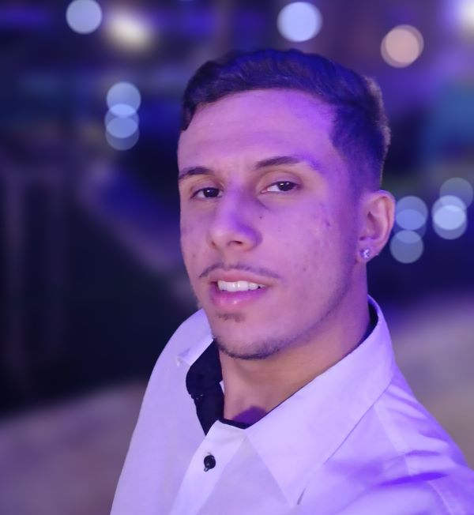

# Olá! Me chamo Lucas!

## Sobre mim

---

* **Nome**: Lucas Rafael Ferreira Laurindo
* **Localização**: (ZL)São Paulo - SP - Brasil
* **Instituição de Ensino**: Universidade Paulista - Campus Tatuapé
* **Curso**: Ciência  da Computação
* **Semestre Atual**: 5° Semestre
* **Experiência**: Possuo experiência em desenvolvimento de solucões para projetos acadêmicos.
* **Conhecimento**: *Python*, SQL, *Java*, HTML5.
* **Hobbies**: Jogar videogame, sair com os amigos, tocar violão e viajar.
---
## Dev em construção...
Sou um estudante de Ciência da Computação, apaixonado por tecnologia e desde que me entendo por gente possuo aptidão para solucionar problemas. 
Ao ser apresentado a programação percebi que era o caminho correto a seguir, pois se baseia principalmente nesse conceito.

Desde então, minha trajetória tem sido buscar aprender e me aprofundar cada vez mais a este mundo, adquirindo especializações, criando projetos e pesquisando sobre oportunidades. 

A oportunidade de participar do programa de bolsas da Compass UOL chega no momento
mais oportuno possível, pois estou numa fase fundamental em que procuro aplicar na prática as habilidades adquiridas até agora, é a ocasião perfeita! Almejo extrair o máximo de experiência e aprendizado do programa, dos participantes e das pessoas que me possibilitaram essa chance.
## Sprints

* [Sprint 1](./Sprint%201/)
* [Sprint 2](./Sprint%202/)
* [Sprint 3](./Sprint%203/)
* [Sprint 4](./Sprint%204/)
* Sprint 5
* Sprint 6
* Sprint 7
* Sprint 8
