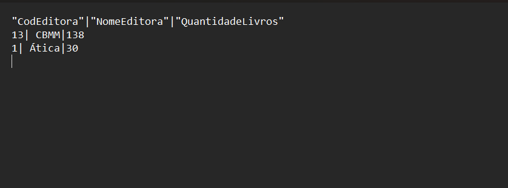

# Resumo
Durante a **Sprint 1** eu pude aprender conceitos sobre a metodologia Scrum para utilizar na gestão e desenvolvimento de projetos, pude aprender também aplicar os métodos de versionamento de códigos, projetos e hospedagem com o uso do **Git**/**Git Hub**. Além disso, foi possível ampliar meus conhecimentos em análise de dados com **SQL** utilizando diferentes SGBD para a aplicação de soluções e resolução de exercícios.

# Desafio
* Os arquivos desenvolvidos e utilizados para a conclusão do desafio da **Sprint 1** estão disponíveis na pasta **Desafio**  e a documentação do mesmo sendo apresentada no README.md do Desafio:
    
    * [Pasta Desafio](./Desafio/)
    * [README.md do Desafio](./Desafio/README.md)

# Exercícios
*  Nos links a seguir, estão apresentadas as listas com as soluções dos exercícios realizados durante a sprint e logo em seguida estão suas respectivas evidências:
    ### Lista de Exercícios I
    1. Resposta do Exercício 1:

        * [Exercício 1](./Exercicios/ExerciciosI_Biblioteca/ex1.sql)

    2. Resposta do Exercício 2:
        
        * [Exercício 2](./Exercicios/ExerciciosI_Biblioteca/ex2.sql)
    
    3. Resposta do Exercício 3:

        * [Exercício 3](./Exercicios/ExerciciosI_Biblioteca/ex3.sql)

    4. Resposta do Exercício 4:

        * [Exercício 4](./Exercicios/ExerciciosI_Biblioteca/ex4.sql)

    5. Resposta do Exercício 5:

        * [Exercício 5](./Exercicios/ExerciciosI_Biblioteca/ex5.sql)

    6. Resposta do Exercício 6:

        * [Exercício 6](./Exercicios/ExerciciosI_Biblioteca/ex6.sql)

    7. Resposta do Exercício 7:

        * [Exercício 7](./Exercicios/ExerciciosI_Biblioteca/ex7.sql)

    8. Resposta do Exercício 8:

        * [Exercício 8](./Exercicios/ExerciciosI_Loja/ex8.sql)

    9. Resposta do Exercício 9:

        * [Exercício 9](./Exercicios/ExerciciosI_Loja/ex9.sql)

    10. Resposta do Exercício 10:

        * [Exercício 10](./Exercicios/ExerciciosI_Loja/ex10.sql)

    11. Resposta do Exercício 11:

        * [Exercício 11](./Exercicios/ExerciciosI_Loja/ex11.sql)

    12. Resposta do Exercício 12:

        * [Exercício 12](./Exercicios/ExerciciosI_Loja/ex12.sql)

    13. Resposta do Exercício 13:

        * [Exercício 13](./Exercicios/ExerciciosI_Loja/ex13.sql)

    14. Resposta do Exercício 14:

        * [Exercício 14](./Exercicios/ExerciciosI_Loja/ex14.sql)

    15. Resposta do Exercício 15:

        * [Exercício 15](./Exercicios/ExerciciosI_Loja/ex15.sql)

    16. Resposta do Exercício 16:

        * [Exercício 16](./Exercicios/ExerciciosI_Loja/ex16.sql)
    
    ### Lista de Exercícios II
    1. Resposta do Exercício 1:

        * [Exercício 1 - Arquivo CSV](./Exercicios/ExerciciosII_Exportação_de_Dados/Etapa1-ExercicioII.csv)
        * [Exercício 1 - Arquivo SQL](./Exercicios/ExerciciosII_Exportação_de_Dados/etapa1.sql)
    
    2. Resposta do Exercício 2:

        * [Exercício 2 - Arquivo CSV](./Exercicios/ExerciciosII_Exportação_de_Dados/Etapa2-ExercicioII.csv)
        * [Exercício 2 - Arquivo SQL](./Exercicios/ExerciciosII_Exportação_de_Dados/etapa2.sql)

# Evidências
* A seguir serão apresentadas as evidências dos exercícios realizados durante essa sprint:
    ### Lista de Exercícios I
    * Ao executar o código do exercício 1, obtive como saída todos os livros publicados após 2014:

    

     * Ao executar o código do exercício 2, obtive como saída os 10 livros mais caros:

    

     * Ao executar o código do exercício 3, obtive como saída as 5 editoras com mais livros na biblioteca: 

    

     * Ao executar o código do exercício 4, obtive como saída a quantidade de livros publicada por cada autor:

    

     * Ao executar o código do exercício 5, obtive como saída o nome dos autores que publicaram livros através de editoras que não estão na região sul do Brasil:

    

     * Ao executar o código do exercício 6, obtive como saída o autor com maior número de livros publicados:

    

     * Ao executar o código do exercício 7, obtive como saída o nome dos autores que não possuem nenhuma publicação:

    

     * Ao executar o código do exercício 8, obtive como saída o codigo e o nome do vendedor com o maior número de vendas:

    

     * Ao executar o código do exercício 9, obtive como saída o código e o nome do produto mais vendido entre 2014 e 2018:

    

     * Ao executar o código do exercício 10, obtive como saída o cálculo da comissão de todos os vendedores considerando as vendas concluídas:

    

     * Ao executar o código do exercício 11, obtive como saída o código e nome do cliente com maior gasto na loja:

    

     * Ao executar o código do exercício 12, obtive como saída o código, nome e data de nascimento dos dependentes do vendedor com menor valor total de vendas:

    

     * Ao executar o código do exercício 13, obtive como saída os 10 produtos menos vendidos pelos canais de E-Commerce ou Matriz:

    

     * Ao executar o código do exercício 14, obtive como saída o gasto médio por estado:

    

     * Ao executar o código do exercício 15, obtive como saída os códigos das vendas identificadas como deletadas:

    

     * Ao executar o código do exercício 16, obtive como saída a quantidade média vendida de cada produto agrupado por estado:

    

    ### Lista de Exercícios II
    * Ao executar a exportação da Etapa 1, obtive como resultado:

    
    
    * Essa exportação veio como resultado dessa consulta:

     

    * Ao executar a exportação da Etapa 2, obtive como resultado:

    
    
    * Essa exportação veio como resultado dessa consulta:

     
