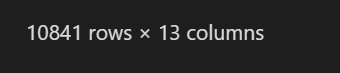
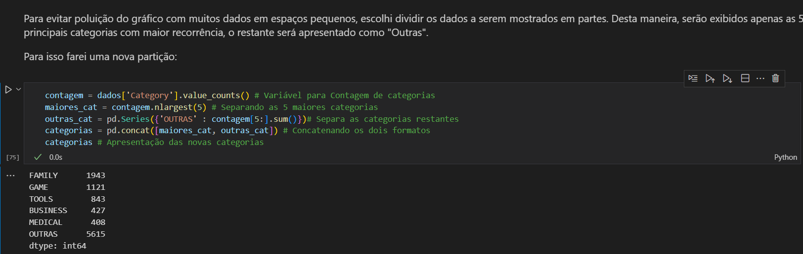

# Desafio 
Nesta Sprint, o desafio consistiu em fazer leitura e a análise de dados de um arquivo de estatísticas da Loja do Google(arquivo *.csv*), processando e gerando gráficos, com a utilização do *Jupyter* como notebook e das bibliotecas **Pandas** e **Matplotlib**.

## Etapas
Abaixo consta o passo a passo de como foram aplicadas as etapas de atividades sobre o dataset com parte da explicação feita por meio do próprio Markdown do *Jupyter*.

1. O primeiro passo foi a preparação do ambiente com a instalação do *Jupyter* no *VSCode* e o download do arquivo "[*googleplaystore.csv*](./Arquivos/googleplaystore.csv)". 

2. Em seguida realizei a abertura do arquivo *.csv* para identificar com o que estava lidando.

    

    * É uma base de dados com mais de 10 mil linhas de informação.
3. Logo depois criei o arquivo notebook "[*analise_dados.ipynb*](./Arquivos/analise_dados.ipynb)" para implementar as atividades solicitadas:
    
    

4. Antes de iniciar o processamento dos dados foi efetuada a importação das bibliotecas **Pandas** e **Matplotlib**:

    

5. E também efetuo a leitura dos dados do *dataset* por meio do Notebook nomeando a variável em que manusearei os dados da tabela como *dados*:

    

    * Com uma breve análise prévia, é possível identificar algumas situações que podem interferir no tratamento de dados utilizando a linguagem Python, como vírgulas em grandes números e o sinal de '+' no final conforme mostrado na coluna *Installs* por exemplo, o que significa que essa coluna pode estar sendo tratada como *string* e não como numérica'\.

    * Percebe-se também que o *dataset* possui exatamente 10841 linhas de dados com 13 colunas:
    

6. Iniciando as atividades com a primeira etapa:

    

7. Com o *duplicated* verificamos que havia algumas duplicações e as removemos com *drop_duplicates*:

    

8. Com a remoção realizada com sucesso, é possível notar que o *dataset* é retornado com menos dados :

    

9. Partindo para a segunda etapa, separei em algumas partes:

    

    * Nessa parte introduzo o tratamento de dados especificamente na coluna *Installs*, removendo as vírgulas entre os números e o sinal de '+', além de transformar os dados da coluna de *string* para *int* e executo o código.

    

    * O código retorna um erro na conversão, pois há um item que não é possível de ser convertido por não ser um número válido que no caso é o **"Free"**:

    

10. Identifico o causador do problema:

    

    * Verifico que a linha inconsistente possuía o indice 10472. Segue verificação dos valores no arquivo *.csv*:

    

    * Com a separação por cores do *VS Code* facilitando o reconhecimento, vejo que há dados em falta na linha.

11. Segue a solução escolhida para a situação:

    

    * Obs: utilizo o *drop* especificamente para a linha como no passo 7 para as duplicatas.

12. Excluída a linha, posso concluir a transformação de *string* em *int* repetindo o código agora funcionando corretamente.

    

13. Continuando:

    

    * É feita a filtragem dos 5 primeiros aplicativos com mais instalações utilizando o *sort_values* em ordem decrescente com o retorno da tabela.

    * Posso constatar que o app **Google Drive** aparece mais de uma vez, o  que pode interferir no resultado da criação do gráfico de forma equivocada:

    

14. Para não atrapalhar na criação, aumentei um valor do *head*(de 5 para 6) na filtragem, o que evitaria a repetição no gráfico:

    

15. Seguimos para a geração do gráfico, utilizando *plt* como variável para identificar as funções do **Matplotlib**:

    

    * Desta maneira, se completa essa etapa, com a implantação da dimensão de tamanho do gráfico, do título, da cor, dos tópicos a serem mostrados e do layout justificado antes de apresentar o gráfico por completo.

16. Avançando para a etapa 3, devo criar um gráfico de pizza com os dados das categorias:

    

    * Inicio a etapa com a implementação da contagem por meio da função *value_counts* referenciando a coluna **'Category'**.

17. Com os dados levantados, segue para o passo seguinte:

    

    * Para essa divisão, nomeei cada parte da separação para facilitar o entendimento e conclusão desta parte.

    * Obs: Uso do *pd.Series* para criar o índice **'OUTRAS'** e do *pd.concat* para juntar as duas partes da lista.

18. Completada a separação, efetuo a geração do novo gráfico:

    

    * Obs: Desta vez utilizando uma variável específica para as cores e as propriedades necessárias para o modelo *pie*.

19. Já na etapa 4, aplico o mesmo processo de tratamento de dados do passo 9, dessa vez para a coluna **'Price'**:

    

20. Utilizo também o método semelhante para transformação de *string*, entretanto desta vez para *float* e não *int*, se concluindo corretamente.

    

21. Em seguida obtenho o retorno do aplicativo mais caro, por meio de uma simples ordenação decrescente.

    

22. Finalizada a etapa, sucedendo a etapa 5 do desafio que também pode ser solucionada de uma forma simples:

    

    * Recebo o retorno da quantidade o número 447, tendo pesquisado o resultado na coluna **Content Rating**.

23. Antes de finalizar a etapa, realizo a conferência do resultado a partir de uma contagem da lista de classificações, confirmando que a quantidade está correta:
    
    

24. Dando prosseguimento ao desafio, alcanço a 6ª etapa que se equivale a etapa 2 no que é solicitado, sendo necessária a transformação dos dados por sua vez na coluna **Reviews** por via de conferência:

    

25. Elaboro novamente uma filtragem para ordenar a lista das *reviews*:

    
    
    * É possível observar que novamente há duplicatas no retorno, repetindo nomes de aplicativos.

26. A solução para este problema foi implantada com o acréscimo de novas funções de busca:

    

    * Fiz a aplicação do *max* e do *groupby* com o intuito de agrupar os resultados somente pelos que estavam com mais reviews, para que não houvesse mais repetições.

27. Com a conclusão, seguimos para a criação dos cálculos da etapa 7:

    

    *Obs: processo de conversão repetido nessa ocasião para a coluna **Rating**, que possui as notas dadas nas avaliações.

28. Repetido o processo, passamos para a filtragem dos valores retornando os seguintes dados:
    
    

29. Após o término da filtragem e consequentemente do primeiro cálculo, passamos para o segundo, que se consiste apenas na filtragem de um único valor:

    

    * Simplesmente faço a criação da variável e aplico filtragem semelhante às etapas anteriores.

30. Finalizando esta parte, alcançamos a última etapa. Essa etapa final consiste em escolher entre 2 das etapas e criar gráficos para os algoritmos apresentados nos retornos.

    

    * Nesta oportunidade, gerei um gráfico de barras horizontais para os aplicativos com mais reviews, acrescentando a propriedade *ticklabel_format* modificando a forma como apareceria a quantidade de *reviews* para dezenas(milhões).

31. Como último passo da etapa e encerramento do desafio, efetuo a geração do gráfico dos apps com maior nota de avaliação, também com barras horizontais:

    

    * Obs: Foi utilizada a função *invert_xaxis*, invertendo o eixo X do gráfico para a apresentação.

32. Desta maneira, chegamos ao fim do **Desafio da Sprint 2**. Agradeço por acompanharem o guia passo a passo do projeto que foi desenvolvido para aplicar os conhecimentos adquiridos na *sprint*. Estou aberto a sugestões de melhoria e feedback, contribuirá muito para meu desenvolvimento profissional.