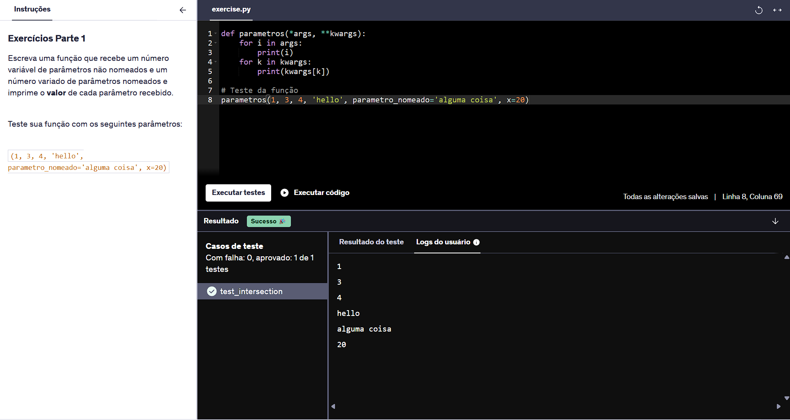
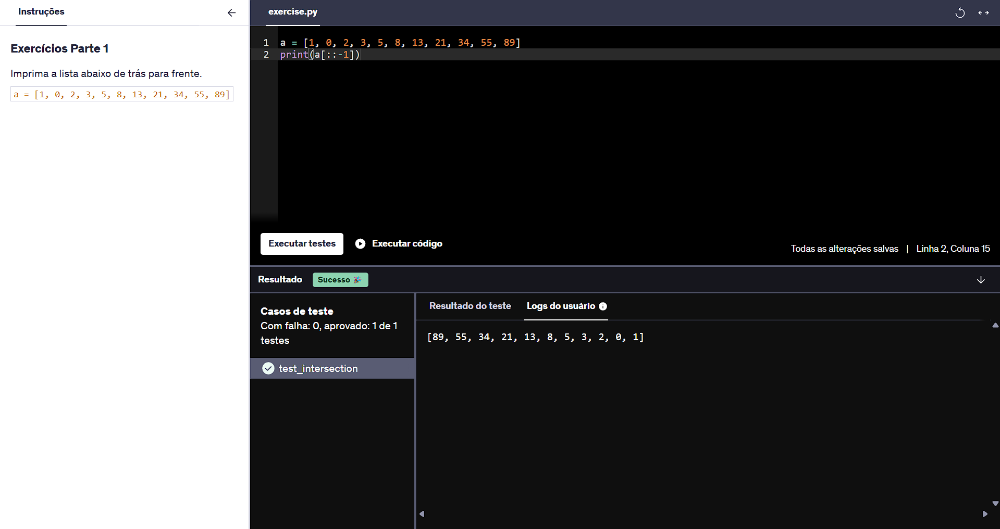

# Resumo
Durante a **Sprint 2** pude aprender conceitos de Python: suas principais características, sintaxe e aplicação no tratamento e processamento de dados. Também vi como funciona a utilização de notebooks pelo Jupyter. Em conjunto, obtive conhecimentos em Ciência de Dados, ETL e a importação das bibliotecas Panda, Numpy e Matplotlib, possuindo funções consideráveis para hipóteses de análise de dados.

# Desafio
* Os arquivos desenvolvidos e utilizados para a conclusão do desafio da **Sprint 2** estão disponíveis na pasta **Desafio**  e a documentação do mesmo sendo apresentada no README.md do Desafio:
    
    * [Pasta Desafio](./Desafio/)
    * [README.md do Desafio](./Desafio/README.md)

# Exercícios
*  Nos links a seguir, estão apresentadas as listas com as soluções dos exercícios realizados durante a sprint e logo em seguida estão suas respectivas evidências:
    ### Exercícios Python - Básico
    1. Resposta do Exercício 1:

        * [Exercício 1](./Exercicios/Exercicios_Basicos/ex01.py)

    2. Resposta do Exercício 2:
        
        * [Exercício 2](./Exercicios/Exercicios_Basicos/ex02.py)
    
    3. Resposta do Exercício 3:

        * [Exercício 3](./Exercicios/Exercicios_Basicos/ex03.py)

    4. Resposta do Exercício 4:

        * [Exercício 4](./Exercicios/Exercicios_Basicos/ex04.py)

    5. Resposta do Exercício 5:

        * [Exercício 5](./Exercicios/Exercicios_Basicos/ex05.py)

    6. Resposta do Exercício 6:

        * [Exercício 6](./Exercicios/Exercicios_Basicos/ex06.py)

    7. Resposta do Exercício 7:

        * [Exercício 7](./Exercicios/Exercicios_Basicos/ex07.py)

    8. Resposta do Exercício 8:

        * [Exercício 8](./Exercicios/Exercicios_Basicos/ex08.py)

    9. Resposta do Exercício 9:

        * [Exercício 9](./Exercicios/Exercicios_Basicos/ex09.py)

    10. Resposta do Exercício 10:

        * [Exercício 10](./Exercicios/Exercicios_Basicos/ex10.py)

    11. Resposta do Exercício 11:

        * [Exercício 11](./Exercicios/Exercicios_Basicos/ex11.py)

    12. Resposta do Exercício 12:

        * [Exercício 12](./Exercicios/Exercicios_Basicos/ex12.py)

    13. Resposta do Exercício 13:

        * [Exercício 13](./Exercicios/Exercicios_Basicos/ex13.py)

    14. Resposta do Exercício 14:

        * [Exercício 14](./Exercicios/Exercicios_Basicos/ex14.py)

    ### Exercícios Python - Avançado I

    15. Resposta do Exercício 15:

        * [Exercício 15](./Exercicios/Exercicios_Avancados_I/ex15.py)

    16. Resposta do Exercício 16:

        * [Exercício 16](./Exercicios/Exercicios_Avancados_I/ex16.py)

    17. Resposta do Exercício 17:

        * [Exercício 17](./Exercicios/Exercicios_Avancados_I/ex17.py)

    18. Resposta do Exercício 18:

        * [Exercício 18](./Exercicios/Exercicios_Avancados_I/ex18.py)

    19. Resposta do Exercício 19:

        * [Exercício 19](./Exercicios/Exercicios_Avancados_I/ex19.py)
    
    ### Exercícios Python - Avançado II

    20. Resposta do Exercício 20:

        * [Exercício 20](./Exercicios/Exercicios_Avancados_II/ex20.py)

    21. Resposta do Exercício 21:

        * [Exercício 21](./Exercicios/Exercicios_Avancados_II/ex21.py)

    22. Resposta do Exercício 22:

        * [Exercício 22](./Exercicios/Exercicios_Avancados_II/ex22.py)

    23. Resposta do Exercício 23:

        * [Exercício 23](./Exercicios/Exercicios_Avancados_II/ex23.py)

    24. Resposta do Exercício 24:

        * [Exercício 24](./Exercicios/Exercicios_Avancados_II/ex24.py)
    
    25. Resposta do Exercício 25:

        * [Exercício 25](./Exercicios/Exercicios_Avancados_II/ex25.py)

    26. Resposta do Exercício 26:

        * [Exercício 26](./Exercicios/Exercicios_Avancados_II/ex26.py)

    ### Exercício Python - ETL
    * Script de Solucão:

        * [Exercício ETL - Arquivo Py](./Exercicios/Exercicios_ETL/etl.py)
    
    1. Resposta da Etapa 1:

        * [Exercício ETL - Etapa 1](./Exercicios/Exercicios_ETL/etapa-1.txt)

    2. Resposta da Etapa 2:

        * [Exercício ETL - Etapa 2](./Exercicios/Exercicios_ETL/etapa-2.txt)

    3. Resposta da Etapa 3:

        * [Exercício ETL - Etapa 3](./Exercicios/Exercicios_ETL/etapa-3.txt)

    4. Resposta da Etapa 4:

        * [Exercício ETL - Etapa 4](./Exercicios/Exercicios_ETL/etapa-4.txt)

    5. Resposta da Etapa 5:

        * [Exercício ETL - Etapa 5](./Exercicios/Exercicios_ETL/etapa-5.txt)

# Evidências
* A seguir serão apresentadas as evidências dos exercícios realizados durante essa sprint:
    ### Exercícios Python - Básico
    * Ao executar o código do exercício 1, obtive como saída a nova lista contendo apenas números ímpares:

    

     * Ao executar o código do exercício 2, obtive como saída as palavras que são ou não palídromos:

    

     * Ao executar o código do exercício 3, obtive como saída os índices com nome, sobrenome e idade da lista: 

    

     * Ao executar o código do exercício 4, obtive como saída a lista sem elementos duplicados:

    

     * Ao executar o código do exercício 5, obtive como saída o conteúdo do arquivo *json*:

    

     * Ao executar o código do exercício 6, obtive como saída a aplicação da função na lista:

    

     * Ao executar o código do exercício 7, obtive como saída o conteúdo do arquivo *txt*:

    

     * Ao executar o código do exercício 8, obtive como saída a impressão do valor dos parâmentros da função:

    

     * Ao executar o código do exercício 9, obtive como saída a implementação da classe **Lâmpada**:

    

     * Ao executar o código do exercício 10, obtive como saída função da soma dos valores da *string*:

    

     * Ao executar o código do exercício 11, obtive como saída a função de divisão das 3 listas em partes iguais:

    

     * Ao executar o código do exercício 12, obtive como saída a lista dos valores do dicionário sem valores duplicados:

    

     * Ao executar o código do exercício 13, obtive como saída o cálculo do valor mínimo, máximo, médio e a mediana da lista aleatória gerada:

    

     * Ao executar o código do exercício 14, obtive como saída uma lista de trás pra frente:

    

    ### Exercícios Python - Avançado I
     
     * Ao executar o código do exercício 15, obtive como saída a implementação das classes **Pato** e **Pardal**:

    

     * Ao executar o código do exercício 16, obtive como saída a implementação da classe **Pessoa** com atributos privados:

    

    * Ao executar o código do exercício 17, obtive como saída a implementação da classe **Calculo** com soma e subtração:

    

    * Ao executar o código do exercício 18, obtive como saída a implementação da classe **Ordenadora** ordenando listas em ordem crescente e decrescente:

    

    * Ao executar o código do exercício 19, obtive como saída a implementação da classe **Aviao** mostrando seus objetos:

    

    ### Exercícios Python - Avançado II

    * Ao executar o código do exercício 20, obtive como saída uma lista dos 5 maiores números pares e soma deles:

    

    * Ao executar o código do exercício 21, obtive como saída a contagem das vogais presentes num conteúdo:

    

    * Ao executar o código do exercício 22, obtive como saída a soma dos créditos e subtração dos  débitos da função *calcula_saldo*:

    

    OBS: Obtive um erro no exercício 22 antes de chegar na solução pedida na plataforma da Udemy. A lista solicitada no enunciado é diferente da solicitada no resultado do log de teste.

    
    
    * Ao executar o código do exercício 23, obtive como saída o cálculo do valor máximo entre dois parâmetros:

    

    * Ao executar o código do exercício 24, obtive como saída uma lista com os nomes, as 3 maiores notas com a média dessas notas:

    

    OBS: Obtive um erro no exercício 24 antes de chegar na solução pedida na plataforma da Udemy. Mesmo não sendo solicitado no enunciado e não fazendo diferença na solução, o log de teste pede para manter as 3 maiores notas no formato *int* ao chegar no resultado da lista.

    

    * Ao executar o código do exercício 25, obtive como saída o filtro dos valores de uma lista que são superiores à sua média:

    

    * Ao executar o código do exercício 26, obtive como saída o *generator* para valores pares num determinado intervalo:

    

    ### Exercício Python - ETL
    * Para concluir as 5 etapas, elaborei um script em Python com as partes de *Extract*, *Transformation* e *Load*:

    * *Extract*:

    
    
    * *Transformation pt.1*:

    

    * *Transformation pt.2*:

    

    * *Load*:

    

    * A partir da implementação do código, obtive como resultado da Etapa 1:

     

    * Ao salvar a solução da Etapa 2, obtive como resultado:

    
    
    
    * Ao salvar a solução da Etapa 3, obtive como resultado:

    

    
    * Ao salvar a solução da Etapa 4, obtive como resultado:

    

    
    * Ao salvar a solução da Etapa 5 finalizando os exercícios, obtive como resultado:

    
