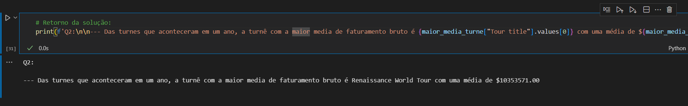
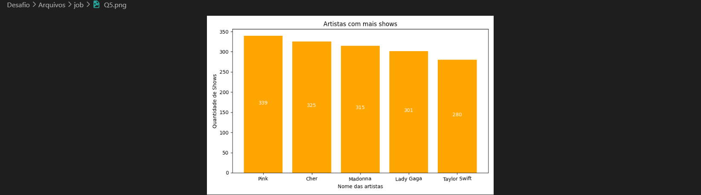

# Desafio 
Nesta Sprint, o desafio consistiu em combinar conhecimentos de *Python* e *Docker*, concluindo um processo de análise e limpeza de uma base de dados para a resolução de algumas questões com a utilização de scripts e *Jupyter* como notebook(se necessário), além das bibliotecas **Pandas**, **Matplotlib** e **REGEX** para manuseio e visualização dos dados, e consequentemente a orquestração de *containers* para este projeto.

## Etapas
Abaixo consta o passo a passo de como foram aplicadas as etapas de atividades sobre o projeto desde a limpeza do dataset, até a implantação de volumes para os *containeres* do projeto.

1. O primeiro passo foi o download do Rancher Desktop (para as funções de Docker). A escolha do Rancher se deve a questão de desempenho da máquina. 

2. Em seguida preparei o ambiente com os *VSCode* e realizei o download e a abertura do arquivo [*'concert_tours_by_women.csv'*](./Arquivos/etl/concert_tours_by_women.csv) para identificar com o que estava lidando.

    

    * É uma base de dados com 20 linhas de informação sobre turnês de artistas mulheres.

3. Após a abertura, criei o arquivo *Jupyter Notebook*    [*'etl_dados.ipynb'*](./Arquivos/etl/etl_dados.ipynb) para a organização das etapas, antes de implantá-las no script *Python*.

4. Para iniciar os processos de ETL da Etapa 1, que consta na limpeza do dataset, realizei a importação da biblioteca **Pandas**.

    

5. A seguir, foi efetuada a leitura dos dados do dataset:

    

6. Levando em consideração o resultado pedido no desafio, é possível observar que há muitos erros no dataset a serem transformados até chegar a este resultado:

    

    * Há colunas que não serão utilizadas, colunas com formatação errada, símbolos desnecessários e etc.  

7. Para iniciar a transformação destes dados, efetuo a exclusão das colunas desnecessárias que não aparecerão no estado final: 

    

    * Foram excluídas as colunas **Peak**, **All Time Peak** e **Ref.**

8. Em seguida, efetivo a remoção dos símbolos e letras das colunas numéricas que possuem valores em dinheiro, para o manuseio correto das informações:

    

    * Foram removidos símbolos como cifrões($), colchetes([ ]), vírgulas(,) e letras com a utilização do *replace* e de atributos de **REGEX**.

9. Para completar a limpeza das respectivas colunas, é feita a conversão dos dados de *string* para *float*:

    

10. Continuando a limpeza das próximas colunas, renomeio o título da coluna **Adjusted gross (in 2022 dollars)** que possui um espaço a menos do que o exigido no resultado:

    

11. Seguindo para a coluna **Tour title** que também possui símbolos e letras, utilizo o seguinte código que por consequência ocasiona num erro:

    

    * Após leitura e pesquisa descobri que não poderia deixar símbolos como asterísticos(*) soltos na expressão, pois servem como quantificadores na expressão do *Regex*.

12. Para solucionar o pequeno problema, adicionei um *r* antes da expressão e juntei os símbolos, letras e números dentro dos colchetes:

    

    * Foram removidos os símbolos e as letras/números de forma separada.

13. Para progredir com os processos, agora na coluna **Year(s)** é necessário separá-las em ano de início da turnê e ano de encerramento. Para isso, aplico a separação das colunas com o atributo *expand*: 

    

    * Na segunda linha, utilizo o *fillna* para completar as colunas possuem apenas um ano para iniciar e encerrar a turnê, inserindo o valor da **Start year** na **End year**.

14. Para concluir a limpeza destas colunas, realizo a conversão dos dados, desta vez de *string* para *int* e excluo a coluna **Year(s)** que não será mais aproveitada:

    

15. Encerrando a parte de transformação dos dados, efetivo a conversão da coluna **Shows** de *string* para *int*, me certificando de que os dados estão sendo tratados de forma correta:

    

16. Já para o carregamento dos dados, elaboro a exportação dos dados tratados, para um novo arquivo *csv_limpo.csv*:

    

17. Após a exportação, obtive como resultado no arquivo a nova base de dados:

    

18. Finalizados os processos de ETL, crio o script *Python* para migrar o algoritmo, desta maneira, encerrando a etapa 1 do desafio:
    
    * Primeira parte implantada:

    

    * Segunda parte implantada:
    
    

19. Partindo para etapa 2 do Desafio, onde é necessário realizar o processamento de dados para responder algumas questões, inicio criando outro arquivo *Jupyter* [*'job_dados.ipynb'*](./Arquivos/job/job_dados.ipynb) para a organização das etapas, assim como na etapa anterior.

20. Antes de implantar a solução das questões, executo a importação das bibliotecas **Pandas** e **Matplotlib**:

    

21. Efetuo a leitura do dataset no arquivo *CSV* que foi tratado na etapa anterior:

    

22. Iniciando a implantação das soluções das questões, vamos para a Questão 1:
    
    

    * Para encontrar a artista que mais aparece na lista, crio a variável para armazenar a contagem, utilizando *value_counts* para esse fim.

23. Em seguida, realizo o cálculo da média de faturamento das artistas e isolo a artista com a maior média, criando variáveis para ambos os processos.

    

    * Uso do *groupby* para agrupar o nome das artistas com seus valores, *mean* para a média, *sort_values* para ordenar e *ascending=False* para a forma decrescente.

24. Com os dados separados, podemos introduzir o retorno das soluções dessa questão: 

    
    
    * Obs: Utilização dos atributos *index*, *iloc* e *values*, para que os valores da variável sejam retornados de forma corretas na solução.

25. Finalizada a questão 1, avançamos para a segunda, em que é necessário separar as turnês que ocorreram em apenas um ano para a busca da conclusão:

    

26. Efetuada a separação, consigo encontrar a turnê com maior média:

    

27. Ao encontrá-la, ja é possível introduzir o retorno desta questão:

    

    * Obs: Busco os *values* por cada coluna como uma maneira de apresentar a solução no retorno.

28. Progredindo para a terceira questão, calculamos a divisão da renda ajustada pela quantidade de shows, para encontrar o valor unitário, criando uma nova coluna para o resultado:

    

    * Coluna foi criada com o nome **Gain per show**.

29. Com a criação da coluna, ordeno os dados dos shows com mais lucros:

    

30. E para implantar o retorno da solução, emprego um laço de repetição *for* para apresentar cada linha (*row*):

    

31. Dando continuidade, na questão 4 é preciso criar um gráfico para mostrar o faturamento por ano das turnês da artista com mais aparições:

    

    * Na imagem acima, realizo um agrupamento das artistas com a soma dos faturamentos nas turnês.

32. A seguir, separo a artista com maior faturamento numa variável própria para efeito de confirmação:
    
    

33. Depois, efetuo a divisão dos dados de cada turnê dessa artista:

    

34. Após a divisão, é gerada a separação dos valores de faturamento por ano de turnê, com a soma:

    

35. Com os dados delimitados, se torna viável implementar o gráfico como solução:

    

    * Utilizando os fundamentos de *grid* para criar uma visualização de grade no gráfico e *savefig* para salvar a imagem com solução da 4ª questão.

36. Passando para a 5ª questão, última da etapa, que consiste em demonstrar os artistas com mais shows numa visualização de gráfico:

    

    * É implantada numa variável a soma das quantidades de shows das artistas com a ordem decrescente.

37. Para finalizar as soluções das questões, implementamos o gráfico:

    

    * Com a finalidade de facilitar a visualização do gráfico, crio uma váriavel para as colunas do gráfico (*barras*), servindo para identificá-las na apresentação dos valores das colunas (*bar_label*).
    
    * Também é estabelecida uma rotação nos nomes das artistas do eixo X *(xticks)*.

38. Antes de completar a etapa 2 com a migração do algoritmo para o script *Python*, é necessário gerar um arquivo *txt* com as respostas das três primeiras questões. Para isso, emprego variáveis no retorno das soluções para cada resposta da seguinte maneira:
    
    * Para a resposta da Q1:

    

    * Para a resposta da Q2:

    

    * Para a resposta da Q3:

    

    * E escrevo as respostas na geração do arquivo *txt*:

    

39. Segue a conclusão com a migração para o script *Python*:

    * Primeira parte implantada:

    

    * Segunda parte implantada:

    

    * Terceira parte implantada: 

    

40. Posteriormente a conclusão destas etapas, chego a etapa 3 em que é solicitada a execução do script por meio de um arquivo Docker. Segue a estrutura do **Dockerfile** criada na pasta do ETL: 

    

41. A fim de executar o script, elaboro inicialmente o comando da *build* da imagem:

    

    * Nomeei a imagem como *desafio-etl*.

42. E realizo a execução do container:

    

    * Obs: Aplicação de um volume para persistir a criação do *csv_limpo.csv* no diretório, pós execução e encerramento do container.

43. Já na etapa 4, atendendo ao mesmo processo de criação do **Dockerfile**, desta vez na pasta *job*, segue a estrutura do arquivo:

    

    * Nesta ocasião, diferente da etapa anterior, os arquivos *job.py* e *csv_limpo.csv* são copiados da raiz de arquivos para que não ocorra problemas em encontrá-los durante a criação da imagem e execução do container.

44. Segue a criação da imagem com o nome de *desafio-job*:

    

45. Em seguida, efetuo a execução de mais um container:

    

    * Para que a mudança no passo 43 faça sentido, executo o container a partir da pasta Arquivos, com a montagem de dois volumes: um de escrita e um de saída. Esses volumes possibilitam a leitura correta do *csv* na pasta raiz, em conjunto com a escrita da cópia para a atual e a saída das respostas do script de maneira correta.

46. Segue a demonstração dos arquivo de solução criados com sucesso:

    * *respostas.txt*:

    

    * *Q4.png*

    

    * *Q5.png*

    

47. E deste modo fica o diretório após a conclusão e implantação das etapas 3 e 4, o mesmo sendo modificado na próxima etapa:

    

48. Avançando para a última etapa, inicio a elaboração do arquivo Compose com a finalidade de conectar os dois containers e rodar a aplicação completa:

    

    * Explicação: O arquivo consiste em dois serviços, um para o *etl* e outro para o *job*. Possui a implantação das builds com os contextos localizados em suas pastas específicas e os volumes com as saídas na pasta própria *'/volume'*. Ambos serviços possuem um comando para serem inicializados, com o serviço *job* dependendo do *etl* para tal feito.

49. Em seguida, utilizo o seguinte comando para rodar o Compose:

    

    * Obtendo o seguinte resultado:

    

    * Pode se observar que houve um erro no serviço *job* em que não reconheceu o arquivo *csv_limpo*.

50. Para solucionar o problema, emprego o comando para derrubar o Compose:

    

51. E no código do arquivo *job.py* como solução, insiro a pasta volume na leitura do *csv*:

    

52. Realizo o mesmo procedimento para as partes do algoritmo em que há  escrita de arquivos a fim de que estes fiquem localizados na pasta */volume* ao executar o Compose:

    * Exportação do *csv_limpo.csv* no ETL:

    

    * Exportação do *respostas.txt* no Job:

    

    * Exportação do *Q4.png*:

    
    
    * Exportação do *Q5.png*:

    

53. Consequentemente, para finalizar a etapa, inicializo novamente o comando do Compose, desta vez sendo executado com sucesso:

    

54. Segue a confirmação da criação das imagens com o Compose rodando normalmente:

    

55. Realizados todos os processos, o desafio é finalizado com o seguinte diretório:

    

56. Desta maneira, chegamos ao fim do **Desafio da Sprint 3**. Agradeço por acompanharem o guia passo a passo do projeto que foi desenvolvido para aplicar os conhecimentos adquiridos na *sprint*. Estou aberto a novas sugestões de melhoria e feedback, que contribuirão muito para meu desenvolvimento profissional.