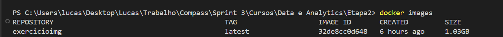
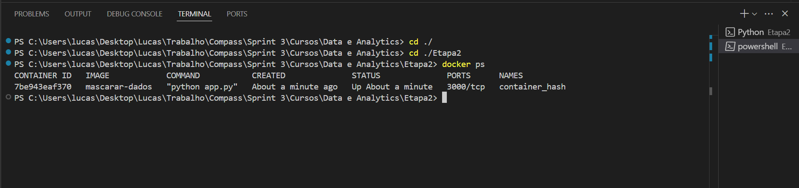

# Resumo
Durante a **Sprint 3** pude aprender conceitos sobre Docker, plataforma essencial para criação e orquestração de containers, que permite que serviços e aplicações possam ser desenvolvidos, testados e executados em qualquer ambiente. Foi possível também dar um ponto de partida no aprofundamento em serviços de computação em nuvem da plataforma da AWS.  

# Desafio
* Os arquivos desenvolvidos e utilizados para a conclusão do desafio da **Sprint 3** estão disponíveis na pasta **Desafio**  e a documentação do mesmo sendo apresentada no README.md do Desafio:
    
    * [Pasta Desafio](./Desafio/)
    * [README.md do Desafio](./Desafio/README.md)

# Exercícios
*  Nos links a seguir, estão apresentadas as listas com as soluções dos exercícios realizados durante a sprint e logo em seguida estão suas respectivas evidências:
    ### Exercício Etapa 1 - Carguru
    1. Script de solução *carguru.py*:

        * [Exercício Carguru - Arquivo Py](./Exercicios/Etapa1/carguru.py)

    2. Arquivo de solução Dockerfile:
        
        * [Exercício Carguru - Dockerfile](./Exercicios/Etapa1/Dockerfile)

    ### Exercício Etapa 2 - Mascarar Dados
    1. Script de solução *app.py*:
        
        * [Exercício Mascarar Dados - Arquivo Py](./Exercicios/Etapa2/app.py)

    2. Arquivo de solução Dockerfile:
        
        * [Exercício Mascarar Dados - Dockerfile](./Exercicios/Etapa2/Dockerfile)

# Evidências
* A seguir serão apresentadas as evidências dos exercícios realizados durante essa sprint:
    ### Exercício Etapa 1 - Carguru
    * Abaixo segue o código do arquivo carguru baixado:

    

    * Abaixo a implantação do código utilizado no Dockerfile com a criação da imagem :

    

    * O resultado após fazer a criação da imagem:

    

    * Conferindo se a imagem foi criada corretamente:

    

    * E ao rodar o container obtive o seguinte resultado funcionalmente:

    

    ### Exercício Etapa 2 - Mascarar Dados

    * Abaixo segue o código para mascarar dados com o passo a passo exigido:

    

    * Ao implantar o código do Dockerfile e criação da imagem, obtive o seguinte resultado:

    

    * Confiro se a imagem está criada corretamente :

    

    * E ao rodar o *container* obtive o seguinte resultado com a inserção dos inputs durante a execução:

    

    * Verifico o status do *Container*:

    

    * E finalizo a conexão do *Container*:

    