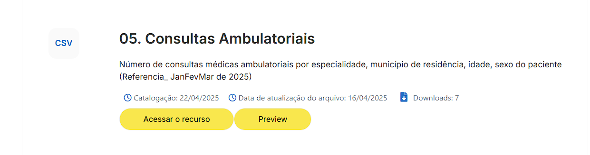
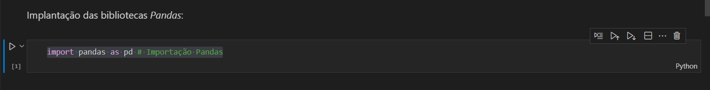
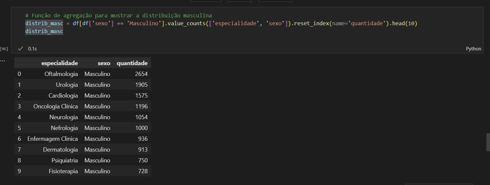

# Desafio 
Nesta Sprint, o desafio consistiu em concluir um processo de análise e limpeza de um conjunto de dados buscados no site do governo brasileiro para a resolução de alguns questionamentos com a utilização do *Jupyter* como notebook para a implantação em scripts, além das bibliotecas **Pandas** para manipulação dos dados e **Boto3** para conectar este projeto ao Bucket com o serviço S3 da Amazon Web Services(AWS).

## Etapas
Abaixo consta o passo a passo de como foram aplicadas as etapas de atividades sobre o projeto desde a análise e manipulação dos dados até o carregamento dos arquivos para o Bucket.

1. O primeiro passo do desafio foi realizar uma pesquisa no site [*dados.gov.br*](https://dados.gov.br/home) para que pudesse escolher o conjunto de dados a ser utilizado. 

2. Escolhi o conjunto de dados de [Consultas Ambulatoriais](https://dados.gov.br/dados/conjuntos-dados/05-consultas-ambulatoriais) do HUOL(Hospital Universitário Onófrio Lopes) no estado do Rio Grande do Norte, buscando como referência os dados do primeiro trimestre de 2025.

    

    * Optei por este conjunto pelo fato de haver tipos de dados numéricos, strings e data, possibilitando o uso de todas as funções solicitadas para a realização do desafio em eventuais questionamentos.

    * A base de dados abrange pacientes do hospital que vivem no Estado do Rio Grande do Norte, com mais de 53 mil consultas no trimestre. 

3. Pós escolha, baixei o arquivo CSV [*'Consultas_Ambulatoriais_(Referencia_JanFevMar_de_2025).csv'*](./Arquivos/Consultas_Ambulatoriais_(Referencia_JanFevMar_de_2025).csv) e efetuei a abertura para saber com que tipo de dataset estava lidando:
    
    

    * Já nessa tela, posso observar que há alguns problemas na visualização dos dados do dataset, alguns itens de textos não decodificados, data e hora da consulta na mesma coluna, como algumas das questões a serem tratadas na manipulação dos dados.

4. Após a abertura, criei o arquivo *Jupyter Notebook*    [*'etapa1_analise.ipynb'*](./Arquivos/etapa1_analise.ipynb) para a organização da etapa 1, antes de implantá-la a um script *Python*.

5. Para iniciar os processos da Etapa 1, que consta na primeira análise dos dados escolhidos e conexão com a AWS, realizei a importação da biblioteca **Pandas**.

    

6. A seguir, busquei executar a leitura do CSV pelo dataframe, ocasionando num erro:

    

    *  É possível identificar que o erro ocorre por conta da codificação padrão do *Pandas* que tenta efetuar a leitura do arquivo por meio do *'utf-8'*, mas por algum motivo não é capaz de obter a decodificação desta maneira.

7. Após uma pesquisa, constatei que muitos arquivos de documentação públicos nos portais brasileiros possuem um padrão antigo de codificação do próprio conteúdo, podendo ser padrão **ISO-8859-1** ou **Windows-1252** e não **UTF-8** do qual estamos acostumados nos sistemas atuais. Com base nisso, pude confirmar que o nosso arquivo com a base de dados possuia o padrão **ISO-8859-1** de codificação, realizando a leitura desta maneira:

    

    * Os dados estão sendo mostrados apenas numa coluna, mesmo com o ';'(ponto e vírgula) empregado para separá-las. Solucionarei este pequeno problema na etapa 2.

8. Como passo seguinte, defini os questionamentos a serem trazidos a partir destes dados, se baseando nas manipulações que serão necessárias na segunda etapa:

    

    * Decidi apresentar estas análises pensando estrategicamente em englobar todas as funções de manipulação solicitadas e levantar questões coerentes para cenários em que um hospital normalmente levantaria:

        1. Separando por faixa etária, quantas pessoas fizeram cirurgias durante o mês de janeiro?
            * Esta análise emprega todas as manipulações requisitadas: funções de conversão, função condicional, funções de string, função de data, cláusula com filtros lógicos e funções de agregação.

        2. Quais especialidades que registram o maior número de atendimentos para cada sexo? Separe 10 para cada.
            * Esta análise abrange funções de string, funções de conversão e funções de agregação com filtro lógico.

        3. Mostre as 10 cidades que possuem mais pacientes que realizaram atendimento psiquiátrico no hospital.
            * Esta análise inclui funções de string, funções de conversão e uma função de agregação com filtro lógico. 

9. No console da AWS, elaboro a criação do Bucket que utilizaremos para armazenar os arquivos CSV do desafio com o nome de *sprint4bucket*. 
    

10. Em seguida, para implementar a conexão com a AWS, efetuei a instalação das bibliotecas *dotenv* e *boto3*:

    * *dotenv* será utilizada para salvar as chaves de acesso a AWS num arquivo e mantê-las em segurança:

    

    * Já a *boto3* será utilizada para simplificar a interação entre o script Python e o serviço da AWS S3:

    

11. Esta instalação possibilita a conexão do script na máquina local com o Bucket:
    
    

    * *load_dotenv* requisita o arquivo com as credenciais de acesso à AWS que com a função do *boto3* realiza a conexão.

12. E com a função *upload_file*, carregamos o arquivo CSV original para o bucket na AWS com um novo nome para identificação:

    

13. Para confirmar que foi realizado o Upload do arquivo, recarrego a página da AWS, verificando que o código foi executado com sucesso, finalizando assim a primeira etapa: 

    

14. Iniciando os processos da etapa 2, crio o arquivo *Jupyter Notebook* [*'etapa2_execucao.ipynb'*](./Arquivos/etapa2_execucao.ipynb) para implantar as manipulações necessárias diretamente do Bucket no S3 e introduzo a importação das bibliotecas:

    

    * Importo as bibliotecas *Pandas*, *Boto3*, *OS*, *DotEnv* e *StringIO*, esta última sendo importante para a leitura do arquivo CSV original que será efetuada diretamente no Bucket reconheça o arquivo como texto, não causando problemas.

15. Posteriormente, utilizo um algoritmo para que o arquivo CSV seja reconhecido e lido pelo *dataframe* sendo buscado diretamente do Bucket na AWS:   

    

    * Implemento as variáveis *response* para buscar os objetos no S3 e *content* para mostrar como se deve ler o conteúdo do arquivo, com a aplicação habitual do *read_csv*, desta vez com o adendo do *StringIO* e com a identificação do ponto e vírgula como separador das colunas do dataset.

    * Com a leitura reparo que os problemas de leitura de alguns sinais foram anulados, porém identifico que a coluna *idade* está indicada como *float*.
    
16. Partindo para solução dos questionamentos e manipulação dos dados, iniciamos com o primeiro "Separando por faixa etária, quantas pessoas fizeram cirurgias durante o mês de janeiro?" que de imediato retorna um erro:

    

    * Buscando converter a coluna *idade* para *int*, é retornada uma falha de conversão, mostrando que há valores nulos na coluna que não podem ser convertidos para *int*.

17. Para resolução deste problema, emprego o *fillna*, para completar os valores nulos com o valor *0*:

    

    * Obs: valores zero na coluna representam recém-nascidos que ainda não completaram um ano.

18. Seguindo com a resolução, realizo a divisão das faixas etárias com a implementação de uma função condicional, dividindo entre Criança, Adolescente, Adulto, Idoso numa nova coluna:

    

19. Depois, executo uma função de *string* para subdividir os dados de data e hora em colunas diferentes:

    

20. Logo em seguida, após separadas, utilizo uma função de conversão para que a coluna ***data_consulta*** possa ser reconhecida como data pelo dataframe:

    

21. E então filtro as consultas do mês de janeiro empregando a função de data para verificar se a conversão realmente obteve sucesso:

    

    * Observando a consulta, identifico problemas nas colunas *sexo* e *município*: estão com dados que não foram informados por algum motivo, retornando NaN. Solucionarei a situação quando for necessário manipular essas colunas nas etapas seguintes.

22. Antes de filtrar o resultado final do questionamento, na coluna ***especialidade*** exerço uma outra função de *string* para capitalizar o texto da coluna, obtendo uma melhor visualização:

    

23. A seguir, emprego o filtro lógico para identificar as pessoas que fizeram cirurgia apenas no mês de janeiro separando por faixa etária:

    

24. Finalizando o primeiro questionamento, demonstro o resultado com a função de agregação empregada para realizar a contagem das cirurgias por faixa etária em ordem decrescente:

    

25. Prosseguindo para o segundo questionamento, devemos realizar a consulta: "Quais especialidades que registram o maior número de atendimentos para cada sexo? Separe 10 para cada."

    

    * Na coluna *sexo* opero mudanças para melhor visualização da tabela: Aplico a função de string *replace* que completa as siglas na coluna com as palavras completas, além de preencher os dados nulos 'NaN' com o texto 'Não informado' e confiro.

26. Para conferir se os dados nulos também foram corrigidos, consulto utilizando o filtro:

    

27. Em seguida, com a função de agregação, agrupo os dados de distribuição dos atendimentos de cada especialidade por sexo, inserindo uma coluna para mostrar a quantidade apenas nesta consulta específica, ocasionando numa nova inconsistência no *dataset*:

    

    * O conjunto de dados possui um dado de identificação na coluna *sexo* exibido com a sigla 'I'.

28. Com a finalidade de analisar a inconsistência mais a fundo, busco todos os dados que retornam 'I' na coluna:

    

    
29. Como não é possível distinguir qual identificação exata deveria ser retornada na coluna e há poucos itens com essa base, converto os itens em 'Não informado' com *replace* por acreditar que seja apenas uma inconsistência no conjunto de dados:

    

30. Agora, repetimos a consulta da distribuição com a base de dados melhor apresentada:

    

31. Logo depois, aplicamos a função de agregação com um filtro lógico para demonstrar previamente a distribuição das 10 especialidades com maior número de atendimentos, para o sexo masculino: 

    

32. E seguidamente encerrando o questionamento com a demonstração da distribuição similar para o sexo feminino:

    

33. Avançando para o terceiro questionamento "Mostre as 10 cidades que possuem mais pacientes que realizaram atendimento psiquiátrico no hospital", executo o processo semelhante ao da coluna *especialidade*, na coluna *município*, capitalizando o texto para aprimorar a visualização: 

    

34. Conforme observado em etapas anteriores, também era necessário preencher os dados vazios nesta coluna com a função de conversão:

    

35. Já conferindo a mudança:

    

36. E desta maneira, podemos aplicar a filtragem do resultado com a função de agregação, apresentando a contagem das cidades com mais pacientes em psiquiatria, finalizando assim a solução dos questionamentos:

    

37. Encerrando a Etapa 2, apresento o estado do DataFrame após todas as manipulações implantadas no desafio:

    

38. Partindo para a terceira e última etapa do desafio, é necessário salvar o arquivo resultante das manipulações e enviar para o Bucket: 

    

    * Primeiro realizo o salvamento do arquivo localmente com a decodificação em *'utf-8'* para depois executar o processo de envio para o Bucket com o *upload_file*(já repetido anteriormente).

39. Segue o arquivo CSV tratado depois de aberto:

    

40. E a confirmação do upload do arquivo para o Bucket no serviço S3:

    

41. Por último, gero a leitura do arquivo diretamente do Bucket, sendo concluída com sucesso:

    

42. Completando o desafio, migramos os scripts criados nos Notebooks para o arquivo Python:
    
    * Algoritmo Etapa 1:

    

    * Algoritmo Etapa 2 - parte 1:

    

    * Algoritmo Etapa 2 - parte 2:

    

    * Algoritmo Etapa 2 - parte final:

    

43. Finalizadas as explicações, chego ao fim do **Desafio da Sprint 4**. Agradeço por acompanharem o guia passo a passo do projeto que foi desenvolvido para aplicar os conhecimentos adquiridos nesta *sprint*. Estou aberto a novas sugestões de melhoria e feedback, que contribuirão muito para meu desenvolvimento profissional.