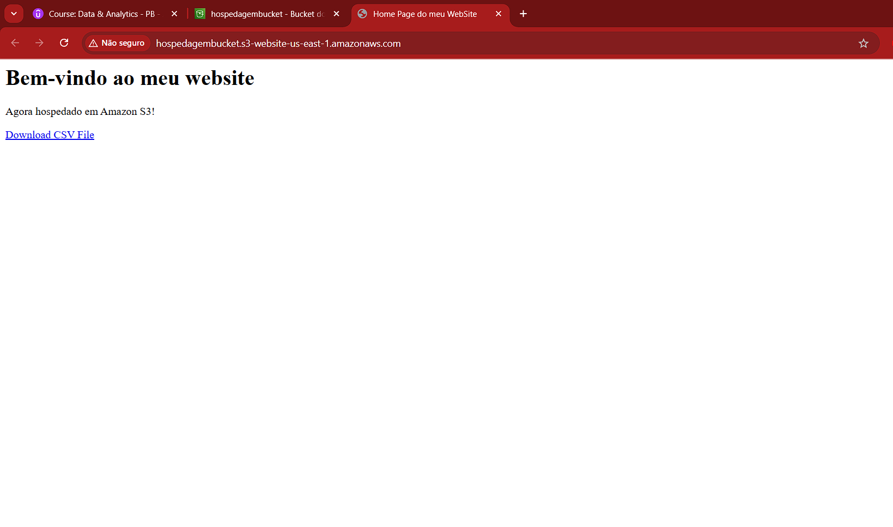
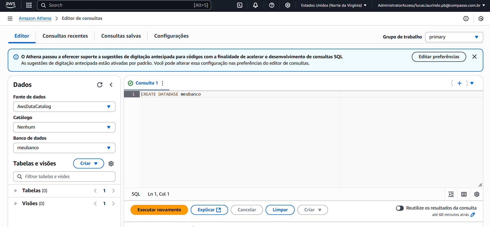

# Resumo
Durante a **Sprint 4** pude aprofundar o aprendizado nos conceitos de computação em nuvem com a plataforma da Amazon Web Services(AWS), que permite o desenvolvimento de serviços e aplicações de maneira flexível na plataforma. Obtive um foco em vendas e economias na AWS, além da prática de utilização dos serviços por meio do jogo Cloud Practitioner.  

# Desafio
* Os arquivos desenvolvidos e utilizados para a conclusão do desafio da **Sprint 4** estão disponíveis na pasta **Desafio**  e a documentação do mesmo sendo apresentada no README.md do Desafio:
    
    * [Pasta Desafio](./Desafio/)
    * [README.md do Desafio](./Desafio/README.md)

# Certificados
* Nos links abaixo se encontram os certificados em PDF relacionados aos cursos realizados na plataforma da AWS Skill Builder e a *url* pública da *badge* do Cloud Quest. Nesta sprint, foram concluídos os cursos **AWS Partner: Cloud Economics** e **AWS Partner: Sales Accreditation** e a experiência do **Cloud Quest: Cloud Practitioner**.

    * [AWS Partner: Cloud Economics](./Certificados/AWS_CloudEconomics.pdf)

    * [AWS Partner: Sales Accreditation](./Certificados/AWS_SalesAccreditation.pdf)

    * [Badge do Cloud Quest: Cloud Practitioner](https://www.credly.com/badges/f61ee9ea-7be8-4acb-9a12-17584b4b659c/public_url)

# Exercícios
*  Nos links a seguir, estão apresentadas as listas com as soluções dos exercícios realizados durante a sprint e logo em seguida estão suas respectivas evidências:
    ### Exercício Lab - AWS S3
    1. Arquivo HTML utilizado *index.html*:

        * [Exercício AWS - index.html](./Exercicios/1-AWS_S3/Arquivos/index.html)

    2. Arquivo HTML de erro *404.html*:
        
        * [Exercício AWS - 404.html](./Exercicios/1-AWS_S3/Arquivos/404.html)

    3. Arquivo CSV *nomes.csv*:

        * [Exercício AWS - nomes.csv](./Exercicios/1-AWS_S3/Arquivos/dados/nomes.csv)

    ### Exercício Lab - AWS Athena
    
    1. Arquivo CSV da primeira consulta:
        
        * [Exercício AWS - Consulta 1](./Exercicios/2-AWS_Athena/Arquivos/Consulta1.csv)

    2. Arquivo CSV da segunda consulta:
        
        * [Exercício AWS - Consulta 2](./Exercicios/2-AWS_Athena/Arquivos/Consulta2.csv)

    ### Exercício Lab - AWS Lambda

    1. Script Python da Função Lambda:
        
        * [Exercício AWS - Arquivo Py](./Exercicios/3-AWS_Lambda/Arquivos/lambda_function.py)

    2. Arquivo Dockerfile:

        * [Exercício AWS - Arquivo Dockerfile](./Exercicios/3-AWS_Lambda/Arquivos/Dockerfile)

    3. Biblioteca Pandas compactada:

        * [Exercício AWS - Biblioteca Pandas](./Exercicios/3-AWS_Lambda/Arquivos/minha-camada-pandas.zip)

# Evidências
* A seguir serão apresentadas as evidências dos exercícios realizados durante essa sprint:

    ### Exercício Lab - AWS S3

    * Abaixo segue a comprovação da criação do Bucket na etapa 1:

    

    * Em seguida a habilitação da hospedagem estática do site na etapa 2:

    

    * O resultado após fazer testar o endpoint na etapa 2:

    

    * Na etapa 3, segue a mudança nas configurações de bloqueio:

    

    * E ao adicionar a política na 4ª etapa, obtive como  resultado:

    

    * Na etapa 5, são adicionados os arquivos *index.html* e *nomes.csv* ao Bucket:

    

    * Já na etapa 6, adiciono o arquivo de erro *404.html* ao bucket:

    

    * E na etapa 7, realizo o teste do endpoint do *index.html*:

    

    ### Exercício Lab - AWS Athena

    * Segue a comprovação da realização das configurações do Athena na etapa 1:

    

    * Na etapa 2, obtive como resultado positivo a criação do banco de dados *meubanco*:

    

    * Realizo a criação da tabela *nomes* no Athena na etapa 3:

    

    * Ainda na etapa 3, executo a primeira consulta e obtenho o  resultado:

    

    * OBS: Resultado completo no arquivo: [*Consulta1.csv*](./Exercicios/2-AWS_Athena/Arquivos/Consulta1.csv)

    * Finalizando a etapa 3, efetuo a segunda consulta e recebo como resultado:

    

    * OBS: Resultado completo no arquivo: [*Consulta2.csv*](./Exercicios/2-AWS_Athena/Arquivos/Consulta2.csv)

    ### Exercício Lab - AWS Lambda

    * Na etapa 1 deste exercício, houve a criação da função *lambda*:

    

    * Na etapa 2, obtive o resultado da construção do código e execução:

    

    * Seguindo para a etapa 3,antes de criar a camada obtive como consequência dos comandos Docker:

    

    * Continuando na etapa 3, foi efetuado o upload da biblioteca do *Pandas* compactada:

    

    * Como fim da etapa 3, segue a criação da camada *Pandas*:

    

    * Finalizando o exercício na etapa 4, obtive o resultado correto do teste da Função Lambda:

    

    ### Exercício Lab - AWS Limpeza de Recursos

    * Como passo final, realizo a limpeza dos recursos utilizados, primeiro da função *lambda*:

    

    * Depois do banco de dados no Athena:

    

    * E por último a remoção do Bucket:

    