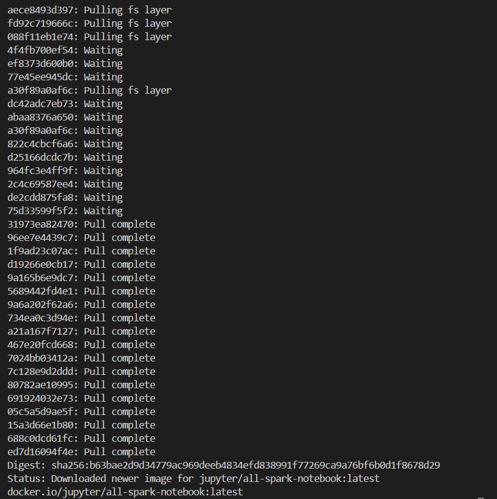
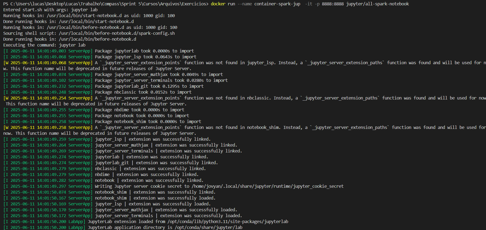
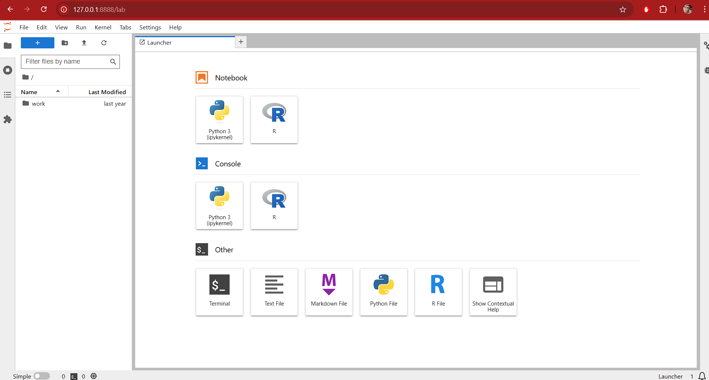
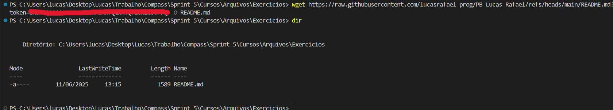
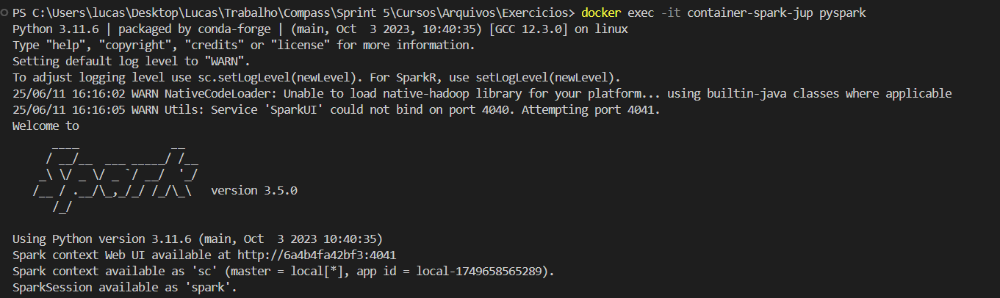
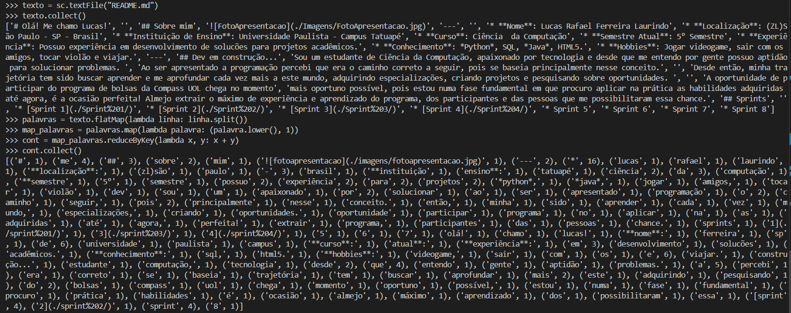
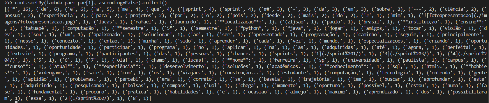
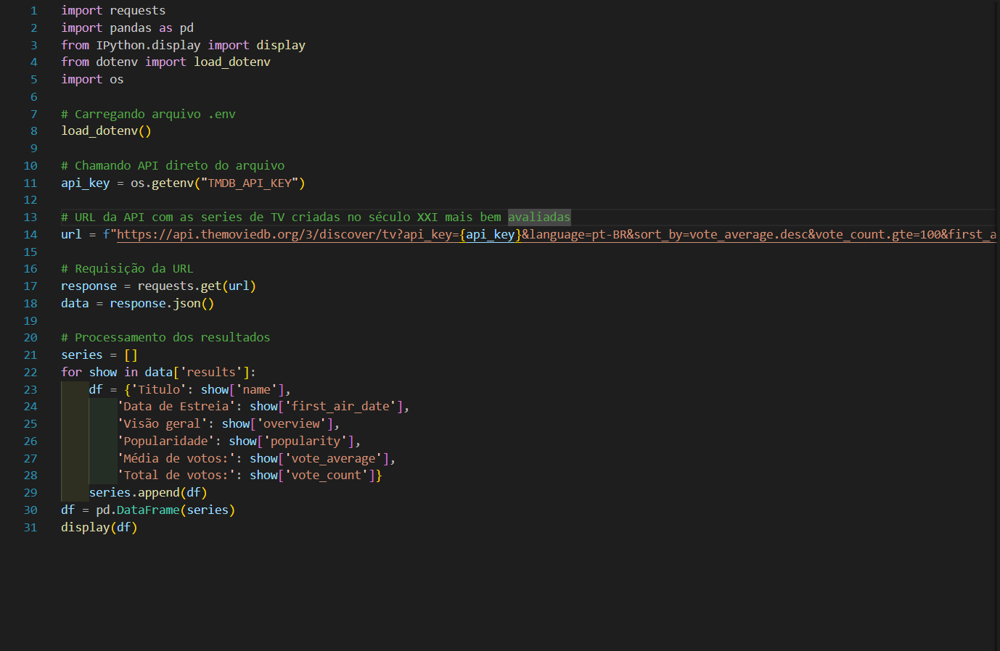
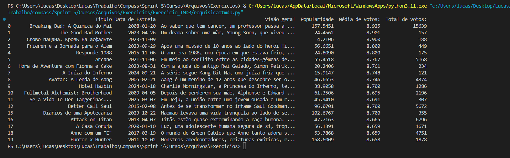

# Resumo
Durante a **Sprint 5** pude aprofundar o aprendizado com a introdução ao Apache Spark, framework de processamento de dados em larga escala mais utilizado no mercado nos tempos atuais. Obtive aprofundamento nos fundamentos de Analytics direcionado às ferramentas da AWS e introdução à ferramenta Amazon Athena, além do início de implementação do Desafio Final.  

# Desafio
* Os arquivos desenvolvidos e utilizados para a conclusão do desafio da **Sprint 5** estão disponíveis na pasta **Desafio**  e a documentação do mesmo sendo apresentada no README.md do Desafio:
    
    * [Pasta Desafio](./Desafio/)
    * [README.md do Desafio](./Desafio/README.md)

# Certificados
* Nos links abaixo se encontram os certificados em PDF relacionados aos cursos realizados na plataforma da AWS Skill Builder. Nesta sprint, foram concluídos os cursos **Fundamentals of Analytics on AWS - Part 1**, **AWS - Introduction to Amazon Athena** e por fim **AWS Serverless Analytics**.

    * [Fundamentals of Analytics on AWS - Part 1](./Certificados/AWS_Fundamentals_of_Analytics.pdf)

    * [AWS - Introduction to Amazon Athena](./Certificados/AWS_Introduction_to_Amazon_Athena.pdf)

    * [AWS - Serverless Analytics](./Certificados/AWS_Serverless_Analytics.pdf)

# Exercícios
*  Nos links a seguir, estão apresentadas as listas com as soluções dos exercícios realizados durante a sprint e logo em seguida estão suas respectivas evidências:
    ### Exercício Apache Spark - Contador de palavras
    1. Arquivo de rascunhos com script *exspark.ipynb*:

        * [Exercício Spark - exspark.ipynb](./Exercicios/Exercicio_Spark/exspark.ipynb)

    ### Exercício TMDB
    
    1. Arquivo Python com script de requisição da API *requisicaotmdb.py*:
        
        * [Exercício TMDB - Requisição](./Exercicios/Exercicio_TMDB/requisicaotmdb.py)

# Evidências
* A seguir serão apresentadas as evidências dos exercícios realizados durante essa sprint:

    ### Exercício Apache Spark - Contador de palavras

    * Abaixo segue a comprovação do pull da imagem *jupyter/all-spark-notebook*:

    

    * Em seguida na etapa 2, segue a confirmação da criação do container:

    

    * O retorno após entrar no link do JupyterLab:

    

    * Na etapa 3, segue a execução do *wget* no terminal para baixar o arquivo README.md(mantive o *token* oculto):

    

    * Segue o comando de execução do PySpark executado com sucesso:

    

    * Em seguida, o código de contagem implantado, mostrando o texto do README antes e depois do processo:

    

    * Por último uma ordenação em ordem decrescente para melhor visualização dos dados:

    

     ### Exercício TMDB

    * Abaixo segue o script python utilizado para realizar a requisição da API TMDB, em que há a busca das séries de TV criadas no século XXI que possuem as melhores avaliações:

    

    * Segue a exibição do dados da requisição no data frame:

    

