# Desafio 
Nesta Sprint, o desafio consistiu em continuar a desenvolver o projeto final que junta todos os conhecimentos adquiridos no Programa de Bolsas e realiza a construção de um Data Lake de Filmes e Séries, partindo nesta parte para o processamento da camada Trusted. A finalidade era utilizar o framework do Spark através do serviço *Glue* na **AWS** para integrar os dados das fontes de origem já existentes na camada Raw enviando-os para a Trusted Zone. 

## Etapas
Abaixo consta o passo a passo de como foram aplicadas as etapas de atividades sobre o projeto desde as implementações dos Jobs no Glue até a criação dos Crawlers.

1. O primeiro passo deste desafio foi realizar a criação do arquivo [*'job_trusted_csv.py'*](./Arquivos/job_trusted_csv.py), *Job* responsável pelo processamento do arquivo CSV da camada Raw no *AWS Glue*:

    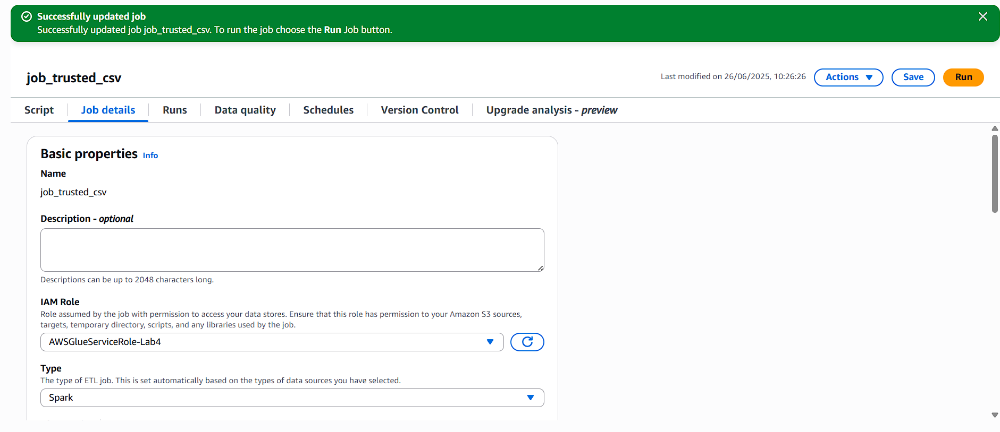

2. Em seguida, configuro no *Job details* com as opções exigidas nas instruções do desafio:

    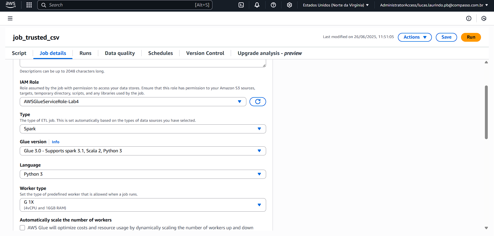

    * A IAM Role a ser utilizada foi a mesma criada no exercício do Lab Glue.

3. Logo depois, houve o desenvolvimento do seguinte código para envio do CSV para a Trusted com os comentários de explicação:

    ~~~python
    # Importação das Bibliotecas
    import sys
    from awsglue.transforms import *
    from awsglue.utils import getResolvedOptions
    from pyspark.context import SparkContext
    from awsglue.context import GlueContext
    from awsglue.job import Job

    ## @params: [JOB_NAME]
    args = getResolvedOptions(sys.argv, ['JOB_NAME'])

    sc = SparkContext() # Criação do contexto Spark
    glueContext = GlueContext(sc) # Criação do contexto Glue
    spark = glueContext.spark_session # Criação da sessão Spark
    job = Job(glueContext) # Criação do objeto Job
    job.init(args['JOB_NAME'], args) # Inicialização do Job

    # Leitura do arquivo CSV no S3
    df = glueContext.create_dynamic_frame.from_options( # Criação do DynamicFrame
        connection_type="s3", # Tipo de conexão S3
        connection_options={ # Opções de conexão
            "paths": [ # Caminho do arquivo CSV no S3
                "s3://datalake-lucasrafael/Raw/Local/CSV/Movies/"
                ],
            "recurse": True # Leitura recursiva de subdiretórios
        },
        format="csv", # Formato do arquivo
        format_options={"withHeader": True, "separator":"|"} # Opções de formatação 
        )

    # Enviando para a camada Trusted
    glueContext.write_dynamic_frame.from_options( # Escrita do DynamicFrame no S3
            frame = df, # Frame a ser escrito
            connection_type = "s3", # Tipo de conexão S3
            connection_options = { # Opções de conexão
                "path": "s3://datalake-lucasrafael/Trusted/Local/Parquet/Movies/", # Caminho de destino no S3
                "partitionKeys": [] # Nenhuma chave de particionamento
                },
            format = "parquet" # Formato de sáida do arquivo
            )

    job.commit() # Commit do Job finalizando a execução

    ~~~

    * O algoritmo se utiliza de sessões Spark e Glue para criar um Dynamic Frame com opções específicas e escrevê-lo no Bucket de Data Lake na ingerindo a camada Trusted.

4. Após a criação do código, atualizamos no Glue:

    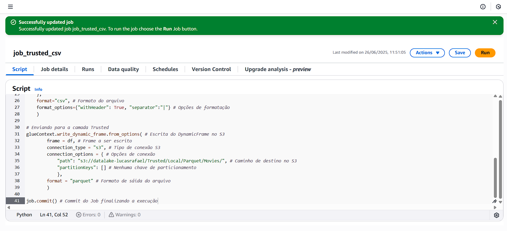

5. E executamos o Job, obtendo sucesso na execução:
    
    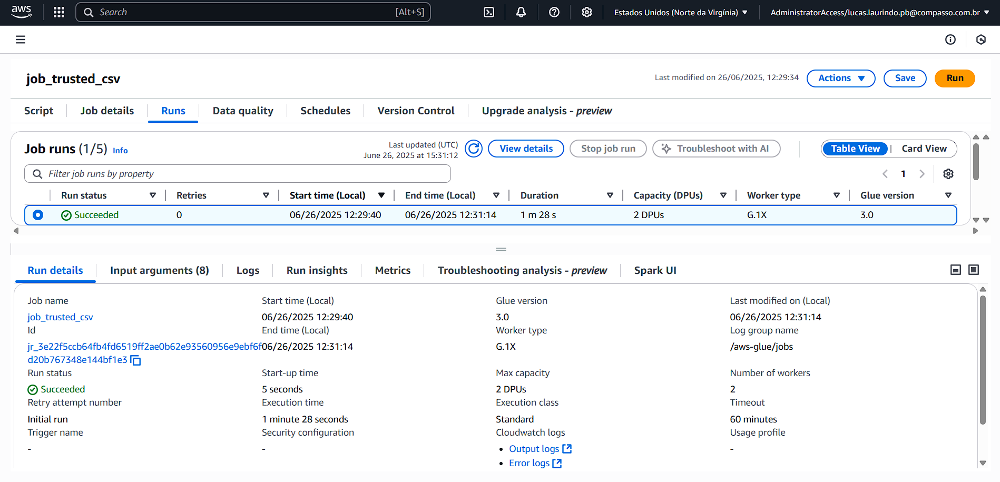

6. No bucket, verificando se os arquivos Parquet foram realmente gerados:

    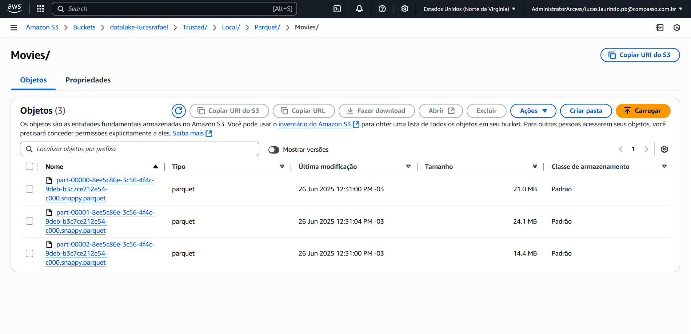

    * Pode se observar que foi implantado como caminho da camada Trusted:

        s3://datalake-lucasrafael/Trusted/Local/Parquet/Movies/

7. Finalizado o Job de processamento do CSV partimos para a implementação do Job dos arquivos JSON gerados pela API do TMDB:

    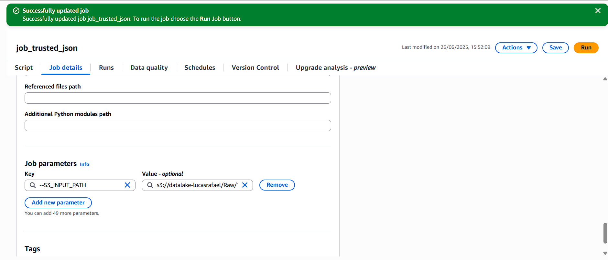

    * Na seção de *Job details* adiciono dois parâmetros para relacionar os caminhos de *Input*(Entrada) e *Target*(Alvo) como argumentos no código, em conjunto com as configurações habituais.

8. Posteriormente introduzo o primeiro código para teste:

    * Segue o código utilizado. Busquei utilizar dos particionamentos exigidos(ano, mês e dia) e adicionar um de "tema" por conta da organização dos arquivos estabelecida na camada Raw na sprint anterior:

        * OBS: Possui processos parecidos de Job de CSV, criando o DynamicFrame, convertendo em DataFrame, adicionando colunas de caminho dos arquivos, tema, ano, mês e dia(uso de Regex), para que o método de partição funcionasse corretamente.  

    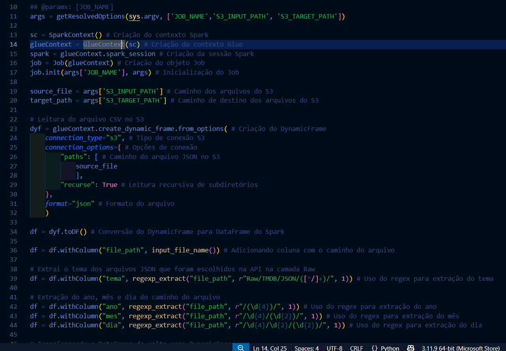

    * Para contextualização, reapresento a estrutura da camada Raw, que foi definida com o intuito de manter um diretório que facilitasse o processamento dos dados nas próximas etapas do projeto:
    
        * Pastas:
    
        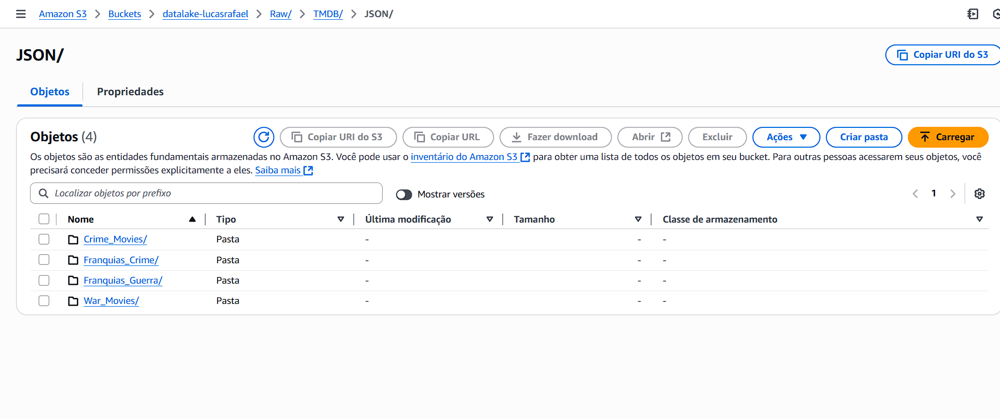

        * Exemplo de Arquivo:

        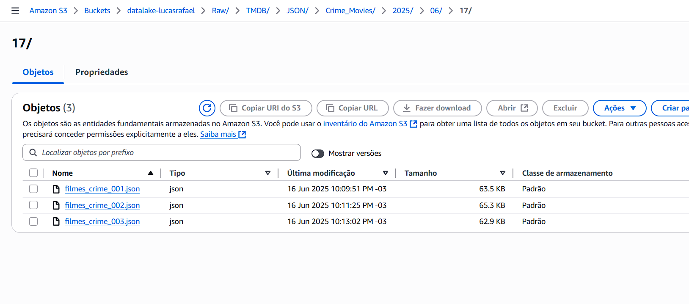

    * Por esse motivo, institui uma chave de partição de "tema" no código: 

    ~~~python
    
    df.select("file_path", "tema", "ano", "mes", "dia").distinct().show(truncate=False) # Acessando os dados para conferir se foram gerados

    # Transformando o DataFrame de volta para DynamicFrame
    df_final = DynamicFrame.fromDF(df, glueContext, "df_final") 

    # Enviando para a camada Trusted
    glueContext.write_dynamic_frame.from_options( # Escrita do DynamicFrame no S3
            frame = df_final, # Frame a ser escrito
            connection_type = "s3", # Tipo de conexão S3
            connection_options = { # Opções de conexão
                "path": target_path, # Caminho de destino no S3
                "partitionKeys": ["tema", "ano", "mes", "dia"] # Chaves de particionamento
                },
            format = "parquet" # Formato de saída do arquivo
            )

    job.commit() # Commit do Job finalizando a execução

    ~~~

    * Atualizado o código no ambiente do Glue:

    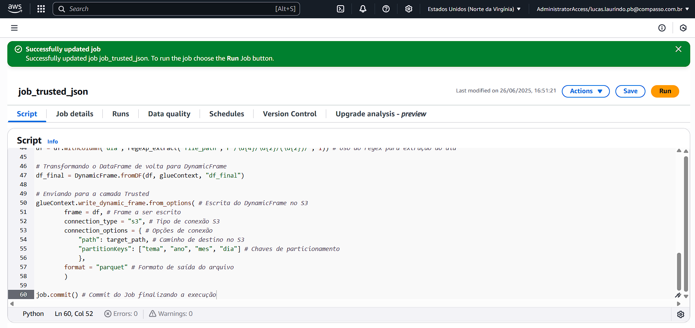

    * Executo o Job realizando o primeiro teste com sucesso:

    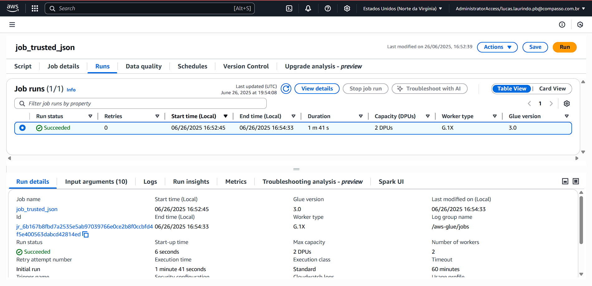

    * Porém, verificando o log do CloudWatch, é possível observar que não houve nenhum retorno no DataFrame e que nenhum arquivo foi gerado:

    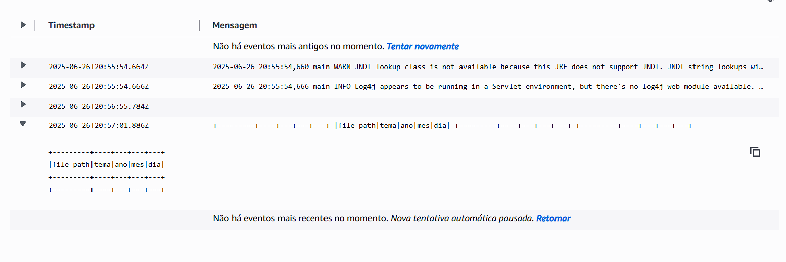

9. Para solucionar este problema efetuei uma mudança no diretório do **S3_INPUT_PATH** que mesmo com a leitura recursiva do código(*recurse: True*) não estava encontrando os arquivos JSON e inseri no código uma consulta do DF ``df_final.show(truncate=False)`` para receber a amostra dos detalhes na testagem. Desta maneira, executei um novo teste: 

    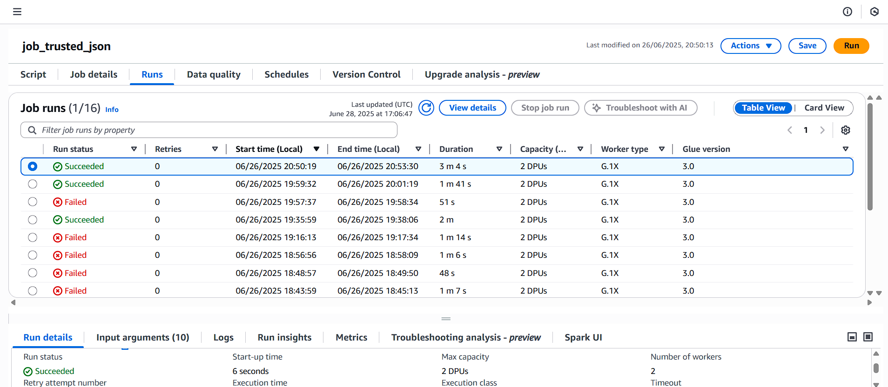

    * Com o teste, verifiquei o log com um novo retorno, obtendo vários valores do DF com *Null*, indicando um erro no processamento:

    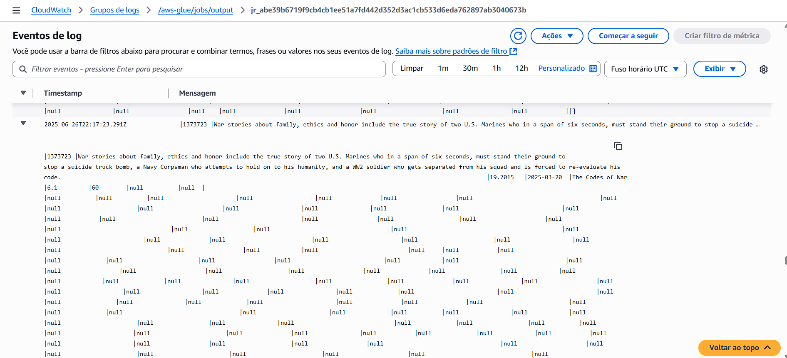

    * No bucket, podemos identificar que houve a partição por tema de maneira correta, mas que os arquivos estão com problemas já que foram retornados muitos dados nulos nos logs.

    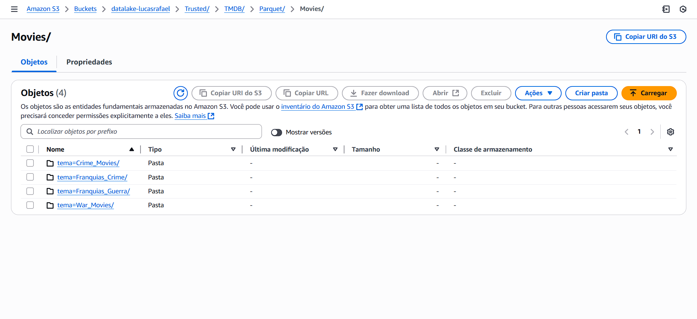

10. Investigando a causa das falhas, identifiquei que poderia ser um problema relacionado ao formato dos arquivos JSON ingeridos pela API na sprint 5. Após pesquisas realizadas e dúvidas sanadas pelas explicações do monitor, compreendi que era necessário exercer uma nova Ingestão dos dados da API na Raw Zone sem divisões de pastas no diretório, juntando todos os arquivos num formato único, consequentemente evitando erros de DataFrame nas implantações do Job e erros no Banco de Dados aplicado nas etapas seguintes do projeto. Em vista disso implantei um novo código de Ingestão da API na AWS Lambda:

    * OBS: Código está unificando dados de franquias, filmes com os gêneros de crime e guerra e palavras chave, com ajustes que evitam acúmulo de conexões e mantém uma estrutura mais otimizada de funções do algoritmo.

    ~~~python

    # ETAPA 2 DO DESAFIO
    # Importação das Bibliotecas
    import json
    import boto3
    import os
    import requests
    import gc
    from datetime import datetime
    from time import sleep
    from tmdbv3api import TMDb, Movie, Collection, Genre, Discover, Keyword

    # Ajustes para evitar acúmulo de conexões
    requests.adapters.DEFAULT_RETRIES = 1
    requests_session = requests.Session()
    requests_session.headers.update({'Connection': 'close'})

    # Nome do Bucket
    bucket_name = 'datalake-lucasrafael'

    # Conexão com o Bucket
    s3 = boto3.client('s3')

    # Buscando Chave da API
    tmdb = TMDb()
    tmdb.api_key = os.getenv("TMDB_API_KEY")
    tmdb.debug = False

    # Funções do TMDB
    movie = Movie()
    collection = Collection()
    genre = Genre()
    keyword_api = Keyword()
    discover = Discover()

    # Data e caminho para arquivos
    hoje = datetime.now() # Data para o caminho
    caminho_data = f"{hoje.year}/{hoje.month:02}/{hoje.day:02}" # Caminho com a data Organizada

    # Configurações 
    generos_desejados = [80, 10752] # Id do Gênero Guerra 
    wc_movies_data = [] # Lista para os dados de filmes de guerra
    cont_filmes_total = 0 # Contagem do total de filmes
    batch_tamanho = 100 # Tamanho estipulado para o arquivo JSON
    cont_arquivo = 1 # Contagem do n° de arquivos
    max_filmes_total = 1000 # Máximo de filmes a serem buscados
    max_pages = max_filmes_total // 20 # Máximo de páginas para busca

    ids_ja_add = set()

    def lambda_handler(event, context):
        global wc_movies_data, cont_arquivo, cont_filmes_total

        # Estrutura para busca dos dados com os gêneros, ordenado por popularidade, separando por páginas
        for page in range(1, max_pages + 1): 
            movies = discover.discover_movies({
                'with_genres': "80|10752",  # Gêneros Guerra e Crime
                'sort_by': 'popularity.desc',
                'page': page
            })
            

            for f in movies: # Para cada item na lista
                if not hasattr(f, 'id'):
                    print("Objeto sem atributo .id (pode ser uma string):", f)
                    continue

                if f.id in ids_ja_add:
                    continue
                

                try:
                    movie_details = movie.details(f.id) # Requisitando detalhes dos filmes
                    gc.collect()
                    sleep(0.2) # Intervalo
                    
                    if not any(g.id in generos_desejados for g in movie_details.genres):
                        continue 
                    
                    keywords_obj = movie.keywords(f.id) # Requisitando as palavras chaves referente aos filmes
                    keywords_list = [keyword.name for keyword in keywords_obj.keywords] if hasattr(keywords_obj, 'keywords') else [] #Lista para as palavras chave

                    wc_movies_data.append({ # Inclusão das informações do filme
                        "movie_id": movie_details.id,
                        "title": movie_details.title,
                        "overview": movie_details.overview,
                        "release_date": movie_details.release_date,
                        "popularity": movie_details.popularity,
                        "vote_average": movie_details.vote_average,
                        "vote_count": movie_details.vote_count,
                        "collection": movie_details.belongs_to_collection.name if movie_details.belongs_to_collection else None,
                        "genres": [g.name for g in movie_details.genres if g.id in generos_desejados] if movie_details.genres else [],
                        "keywords": keywords_list
                    })
                    cont_filmes_total += 1 # Incremento do total de filmes

                    if len(wc_movies_data) == batch_tamanho:
                        salvar_no_s3()
                        

                except Exception as e:
                    print(f"Erro ao processar filme {f}: Erro {e}") # Exceção para leitura

        if wc_movies_data:
            salvar_no_s3()
            
        
        print(f"Coleta finalizada com {cont_arquivo - 1} arquivos enviados.")
        return {
            'statusCode': 200,
            'body': f'{cont_filmes_total} filmes processados e salvos no S3.'
        }

    def salvar_no_s3():
        global wc_movies_data, cont_arquivo
        
        nome_arquivo = f'Raw/TMDB/JSON/Movies/{caminho_data}/filmes_{cont_arquivo:03d}.json'
        s3.put_object(
            Bucket=bucket_name,
            Key=nome_arquivo,
            Body=json.dumps(wc_movies_data, ensure_ascii=False).encode('utf-8')
            )
        
        
        print(f"Arquivo enviado para: s3://{bucket_name}/{nome_arquivo}")
        wc_movies_data = []  # Limpa a lista após o envio
        cont_arquivo += 1  # Incrementa o contador de arquivos
    ~~~

    * Ao realizar o teste da nova ingestão, obtive o seguinte erro: 

    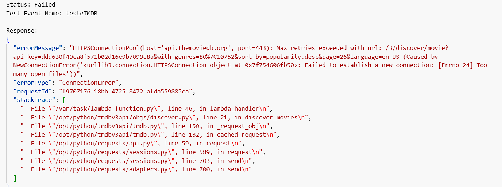

    * A mensagem de erro exibida revela que o máximo de repetições no mesmo URL de requisição foi excedida, mantendo assim muitas requisições em aberto, sem fechamento.  

    * Testei novamente diminuindo a quantidade de filmes(``max_total_filmes``) para 450, sendo concluído com sucesso:

    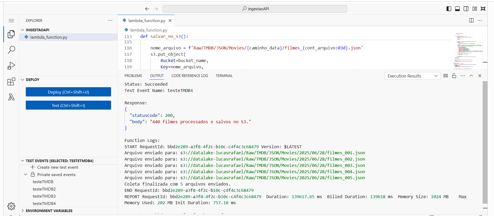

11. Levando em consideração que precisaria de uma grande quantidade de filmes para realizar as análises, foi necessário elaborar uma nova organização do código, substituindo a utilização da biblioteca *tmdbv3api* pela biblioteca *requests*, que possui uma melhor aceitação em quantidades para requisições da API, segue o algoritmo completo com as modificações:

    * Obs. : Agora os filmes são coletados através das sessões de *requests* com seus parâmetros e de URLs do TMDB.
    ~~~python

    # Importação das Bibliotecas
    import json
    import boto3
    import os
    import requests
    import gc
    from datetime import datetime
    from time import sleep

    # Nome do Bucket
    bucket_name = 'datalake-lucasrafael'

    # Conexão com o Bucket
    s3 = boto3.client('s3')

    # Chave da API do TMDB
    api_key = os.getenv("TMDB_API_KEY")

    # Sessão global para requests
    session = requests.Session() # Ajuste que evita acúmulo de conexões
    session.headers.update({'Accept': 'application/json'}) # Declarando o cabeçalho da sessão para aceitar o formato JSON
    session.params = {'api_key': api_key, 'language': 'en-US'} # Parâmetros de requisiçõe(Chave e Idioma da API)

    # Data e caminho para arquivos
    hoje = datetime.now() # Data para o caminho
    caminho_data = f"{hoje.year}/{hoje.month:02}/{hoje.day:02}" # Caminho com a data organizada

    # Configurações
    generos_desejados = [80, 10752] # Id do Gênero Guerra e Crime
    wc_movies_data = [] # Lista para os dados de filmes de guerra e crime
    cont_arquivo = 1 # Contagem do n° de arquivos
    cont_filmes_total = 0 # Contagem do total de filmes
    batch_tamanho = 100 # Tamanho estipulado para o arquivo JSON
    max_filmes_total = 1500 # Máximo de filmes a serem buscados
    max_pages = max_filmes_total // 20 # Máximo de páginas para busca (20 filmes por página)
    ids_ja_add = set() # Conjunto para evitar filmes duplicados

    def lambda_handler(event, context): 
        # Inicio da função Lambda
        global wc_movies_data, cont_arquivo, cont_filmes_total # Variáveis globais 

        # Estrutura para busca dos dados com os gêneros, ordenado por popularidade, separando por páginas
        for page in range(1, max_pages + 1):
            print(f"Buscando página {page}...") # Indicador da busca de páginas
            discover_url = f"https://api.themoviedb.org/3/discover/movie" # Url para buscar filmes
            params = { 
                'with_genres': "80|10752", # Gêneros Guerra e Crime
                'sort_by': 'popularity.desc',
                'page': page
            }
            try:
                response = session.get(discover_url, params=params) # Requisição para buscar filmes
                response.raise_for_status() # Verifica se a requisição foi bem sucedida
                movies = response.json().get("results", []) # Obtém os resultados da requisição
            except Exception as e:
                print(f"Erro ao buscar discover (página {page}): {e}") # Exceção para problemas na busca
                continue
            
            
            for f in movies: # Para cada item na lista de filmes
                movie_id = f.get("id") # Requisita o  ID do filme
                if not movie_id or movie_id in ids_ja_add: # Verifica se o filme já foi adicionado
                    continue
                ids_ja_add.add(movie_id) # Adiciona o ID do filme no conjunto

                try:
                    # Detalhes do filme
                    details_url = f"https://api.themoviedb.org/3/movie/{movie_id}" # URL de Busca
                    details_resp = session.get(details_url, params={'api_key': api_key, 'language': 'en-US'}) # Requisição da sessão de detalhes do filme
                    details_resp.raise_for_status() # Verifica se a requisição foi bem sucedida
                    movie_details = details_resp.json() # Obtem os detalhes da requisição no JSON
                    sleep(0.1) # Intervalo para evitar sobrecarga na API
                    
                    # Verifica se o filme pertence aos gêneros Crime e Guerra
                    if not any(g["id"] in generos_desejados for g in movie_details.get("genres", [])):
                        continue

                    # Busca as Palavras-chave do filme
                    keywords_url = f"https://api.themoviedb.org/3/movie/{movie_id}/keywords" # Url de busca
                    keywords_resp = session.get(keywords_url, params={'api_key': api_key}) # Requisição da sessão de palavras-chave do filme
                    keywords_resp.raise_for_status() # Verifica se a requisição foi bem sucedida
                    keywords_data = keywords_resp.json() # Obtem as palavras-chave da requisição no JSON
                    keywords_list = [k['name'] for k in keywords_data.get("keywords", [])] # Lista para as palavras-chave

                    # Montando estrutura do JSON
                    wc_movies_data.append({ # Inclusão das informações do filme
                        "movie_id": movie_id,
                        "title": movie_details.get("title"),
                        "overview": movie_details.get("overview"),
                        "release_date": movie_details.get("release_date"),
                        "popularity": movie_details.get("popularity"),
                        "vote_average": movie_details.get("vote_average"),
                        "vote_count": movie_details.get("vote_count"),
                        "collection": movie_details.get("belongs_to_collection", {}).get("name") if movie_details.get("belongs_to_collection") else None,
                        "genres": [g["name"] for g in movie_details.get("genres", []) if g["id"] in generos_desejados],
                        "keywords": keywords_list
                    })

                    cont_filmes_total += 1 # Incremento do total de filmes

                    # Verifica se o tamanho do batch foi atingido para salvar o JSON no S3
                    if len(wc_movies_data) == batch_tamanho: 
                        salvar_no_s3() # Chama a função para salvar os dados no S3
                        wc_movies_data.clear() # Limpa a lista após o envio
                        gc.collect() # Coleta lixo para liberar memória
                        sleep(0.5) # Intervalo para sobrecarga na API

                except Exception as e:
                    print(f"Erro ao processar filme ID {movie_id}: {e}") # Exceção para erros de leitura
                    continue
        
        # Verifica se ainda há dados para salvar no S3 após o loop
        if wc_movies_data: 
            salvar_no_s3()

        print(f"Coleta finalizada com {cont_arquivo - 1} arquivos enviados.") # Indicador de fim da coleta de dados
        
        return { # Retorno da função lambda 
            'statusCode': 200,
            'body': f'{cont_filmes_total} filmes processados e salvos no S3.'
        }

    # Função para salvar os dados no S3
    def salvar_no_s3():
        global wc_movies_data, cont_arquivo # Variáveis globais
        nome_arquivo = f'Raw/TMDB/JSON/Movies/{caminho_data}/filmes_{cont_arquivo:03d}.json' # Nome do arquivo com o caminho completo

        s3.put_object( # Envio do arquivo para o S3
            Bucket=bucket_name, 
            Key=nome_arquivo,
            Body=json.dumps(wc_movies_data, ensure_ascii=False).encode('utf-8')
        )

        print(f"Arquivo enviado para: s3://{bucket_name}/{nome_arquivo}") # Indicador de envio do arquivo
        cont_arquivo += 1 # Incrementa a contagem de arquivos

    # Finalizado o desafio

    ~~~

    * Em seguida com o teste na Lambda, obtive como retorno o resultado da nova Ingestão:  

    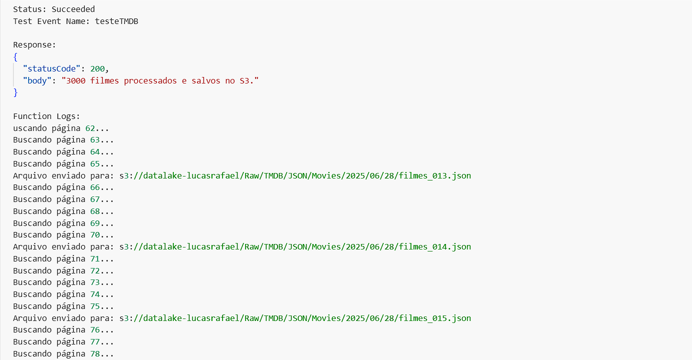

    * Observe o aumento na quantidade de filmes coletados e arquivos criados:

    

    * E portanto o novo diretório da camada Raw no S3 fica desta maneira:

    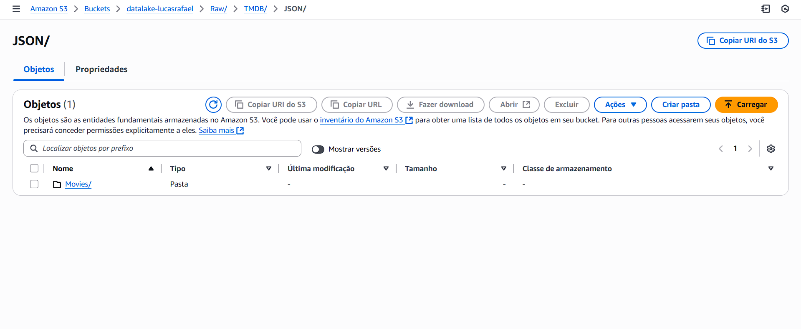

    * Assim como os novos arquivos JSON gerados pela ingestão:

    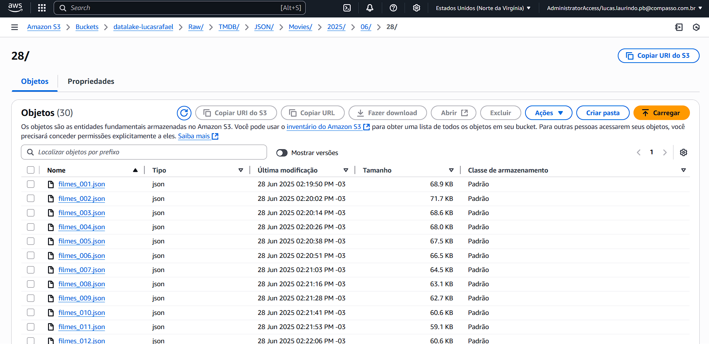 

12. Com a ingestão concluída corretamente, retornamos para a implantação do Job no Glue. Alteramos as chaves de partições no código mantendo apenas a partição determinada(ano, mês e dia), obtendo mais uma exceção durante a execução:

    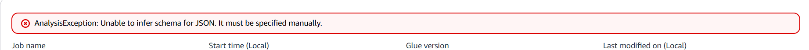

    * Houve uma exceção de análise, indicando que o Spark não foi capaz de identificar o Schema e que ele deve ser especificado manualmente.

    * Por isso, baixei um dos arquivos JSON da camada para examinar o pretexto do problema:

    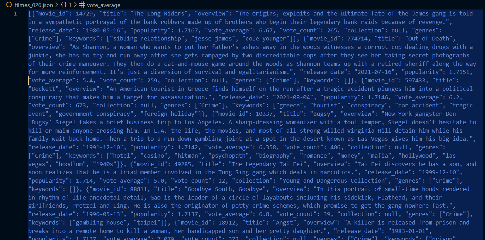

    * Obs. : É possível reconhecer que o arquivo JSON está num formato de Array(lista). O Glue não interpreta Arrays JSON.

13. Para que o Glue interprete de maneira correta, alterei novamente o algoritmo do Job, desta vez de forma definitiva, obtendo o código final.

    * O algoritmo efetua a criação de um Schema manual ``movie_schema`` com o formato do JSON, realiza a leitura dos arquivos com texto num DF transformando-os em JSON novamente com o nome de ``filmes``, para que sejam descompactados com a função ``explode`` e particionados conforme as instruções:

    ~~~python
    import sys
    from awsglue.transforms import *
    from awsglue.utils import getResolvedOptions
    from pyspark.context import SparkContext
    from awsglue.context import GlueContext
    from awsglue.job import Job
    from awsglue.dynamicframe import DynamicFrame
    from pyspark.sql.functions import input_file_name, regexp_extract, explode, from_json
    from pyspark.sql.types import *

    ## @params: [JOB_NAME]
    args = getResolvedOptions(sys.argv, ['JOB_NAME','S3_INPUT_PATH', 'S3_TARGET_PATH'])

    sc = SparkContext() # Criação do contexto Spark
    glueContext = GlueContext(sc) # Criação do contexto Glue
    spark = glueContext.spark_session # Criação da sessão Spark
    job = Job(glueContext) # Criação do objeto Job
    job.init(args['JOB_NAME'], args) # Inicialização do Job

    source_file = args['S3_INPUT_PATH'] # Caminho dos arquivos do S3
    target_path = args['S3_TARGET_PATH'] # Caminho de destino dos arquivos do S3

    # Criando Schema manualmente definido para os arquivos JSON
    movie_schema = StructType([
            StructField("movie_id", LongType(), True),
            StructField("title", StringType(), True),
            StructField("overview", StringType(), True),
            StructField("release_date", StringType(), True),
            StructField("popularity", DoubleType(), True),
            StructField("vote_average", DoubleType(), True),
            StructField("vote_count", LongType(), True),
            StructField("collection", StringType(), True),
            StructField("genres", ArrayType(StringType()), True),
            StructField("keywords", ArrayType(StringType()), True)
        ])

    # Lendo arquivos JSON diretamente da Camada Raw com Spark
    df_raw = spark.read.text(source_file) # Lendo em texto

    # Transformando o DataFrame de texto em JSON
    df_json = df_raw.select(
        from_json(df_raw.value, ArrayType(movie_schema)).alias("filmes"),
        input_file_name().alias("file_path")
    )

    # Explodindo o array de filmes para que cada filme seja uma linha
    df = df_json.select(explode("filmes").alias("row"), "file_path").select("row.*", "file_path")

    df.show(truncate=False) # Exibindo o DataFrame para conferência

    df = df.withColumn("file_path", input_file_name()) # Adicionando coluna com o caminho do arquivo

    # Extração do ano, mês e dia do caminho do arquivo
    df = df.withColumn("ano", regexp_extract("file_path", r"/(\d{4})/", 1)) # Uso do regex para extração do ano
    df = df.withColumn("mes", regexp_extract("file_path", r"/\d{4}/(\d{2})/", 1)) # Uso do regex para extração do mês
    df = df.withColumn("dia", regexp_extract("file_path", r"/\d{4}/\d{2}/(\d{2})/", 1)) # Uso do regex para extração do dia

    df.select("file_path", "ano", "mes", "dia").distinct().show(truncate=False) # Acessando os dados para conferir se foram passados

    # Transformando o DataFrame de volta para DynamicFrame
    df_final = DynamicFrame.fromDF(df, glueContext, "df_final") 

    # Enviando para a camada Trusted
    glueContext.write_dynamic_frame.from_options( # Escrita do DynamicFrame no S3
            frame = df_final, # Frame a ser escrito
            connection_type = "s3", # Tipo de conexão S3
            connection_options = { # Opções de conexão
                "path": target_path, # Caminho de destino no S3
                "partitionKeys": ["ano", "mes", "dia"] # Chaves de particionamento
                },
            format = "parquet" # Formato de saída do arquivo
            )

    job.commit() # Commit do Job finalizando a execução

    ~~~

    * Depois de alguns testes, executada com sucesso:

    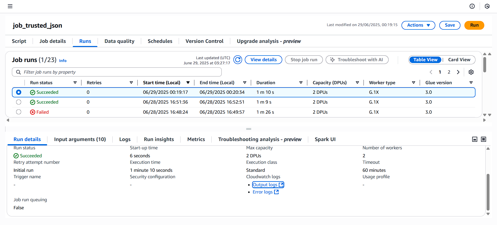

    * E seguindo com as confirmações dos logs:

    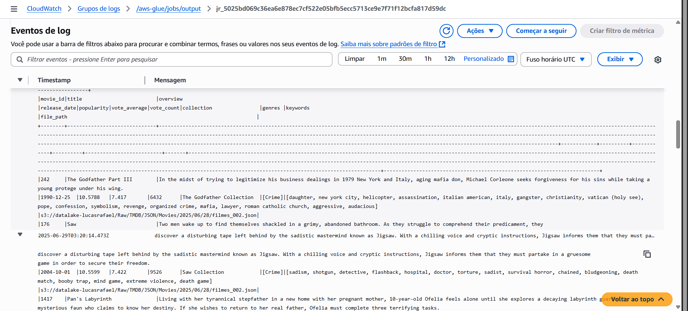

    * Constatamos que os dados estão apresentados na forma desejada:

    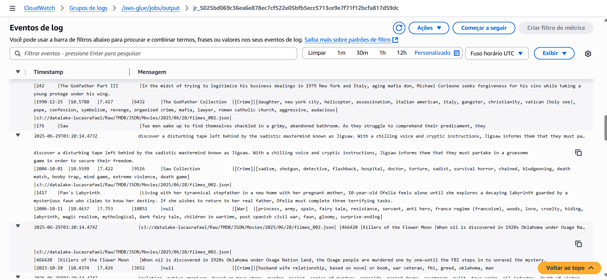

    * E que os arquivos foram realmente particionados em formato Parquet com o diretório correto, concluindo a etapa dos Jobs:

    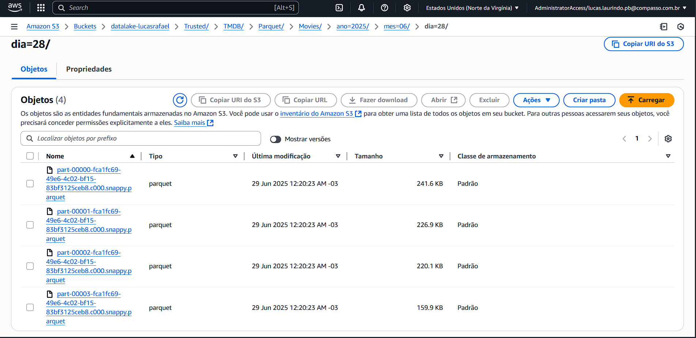

14. Efetuadas as implantações dos Jobs, devo criar os Crawlers que agregarão os Jobs num mesmo banco de dados que servirá para catalogar os dados armazenados no S3 na camada Refined da próxima Sprint. Primeiro realizo a criação do Database com o nome *filmes-db*:

    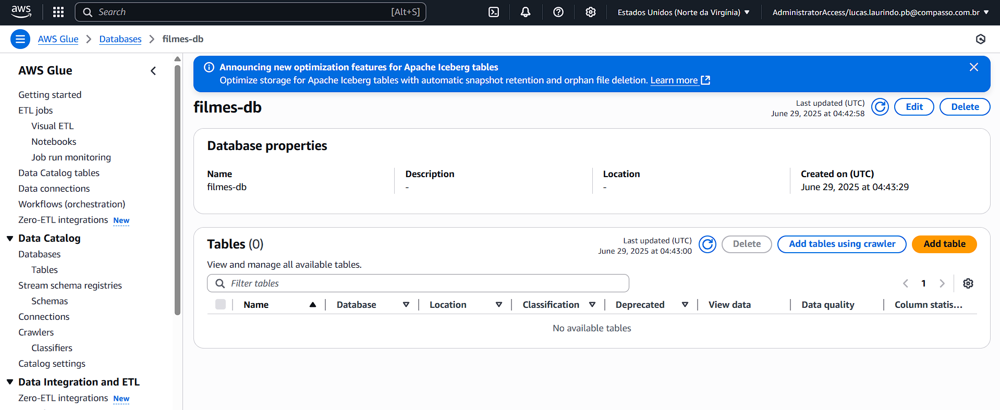

15. Em seguida gero um crawler para os dados do CSV vinculado ao banco de dados:

    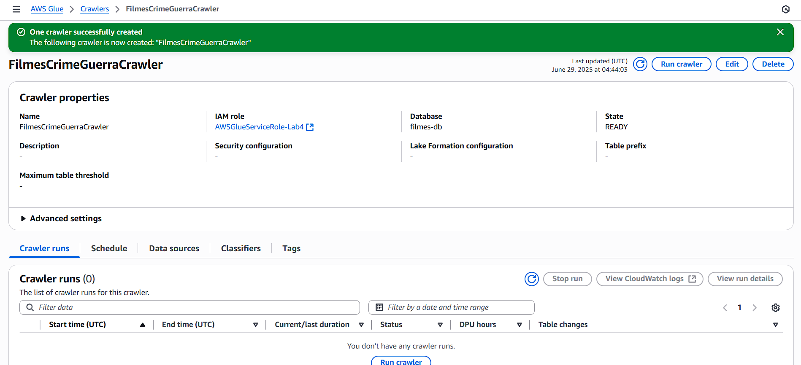

    * E realizo a consulta teste no Amazon Athena, obtendo a prova da vinculação ao banco: 

    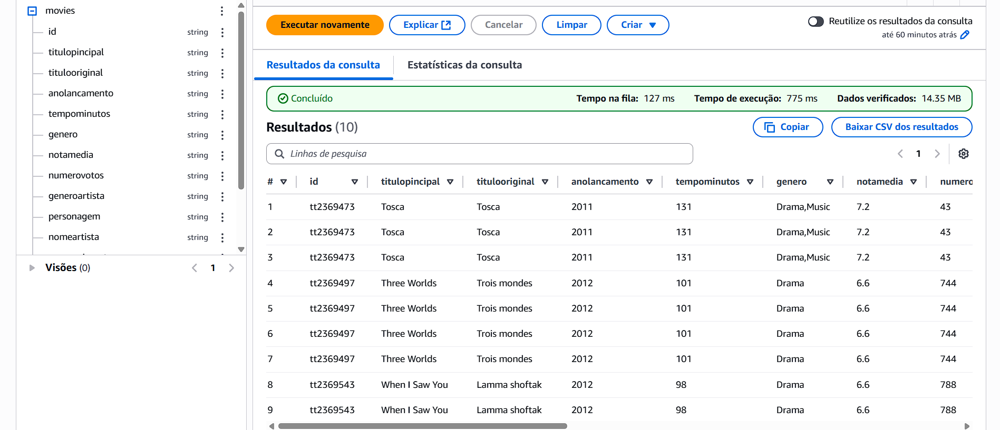

16. Repetindo o processo para o Crawler dos dados buscados pelo TMDB:

    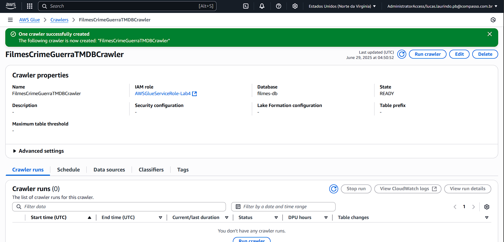

    * Adquirindo o resultado da consulta de verificação das informações no Athena:

    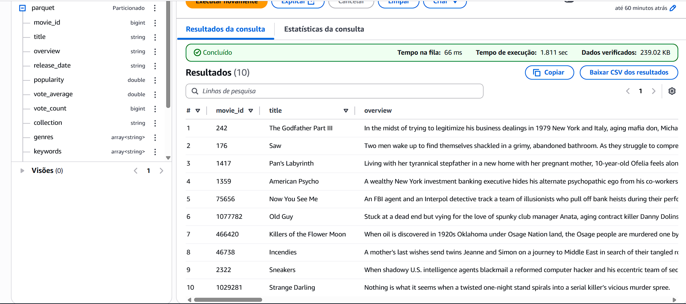

    * Apresentando a partição de data:

    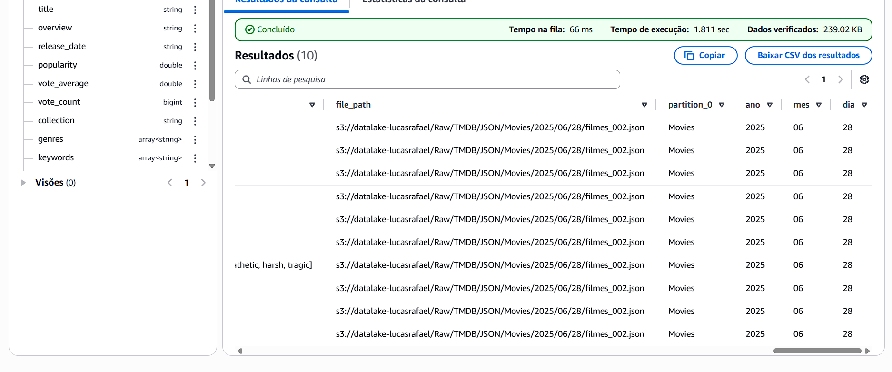

17. Concluindo a entrega 3 do Desafio Final, temos a comprovação da execução bem sucedida dos Crawlers pós criação da camada Trusted:

    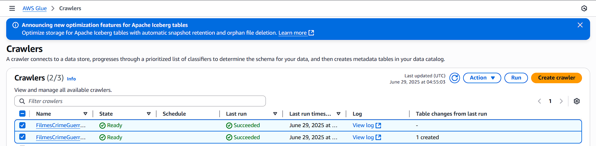

18. Encerradas as explicações, chego ao fim do **Desafio da Sprint 6**. Agradeço por acompanharem o guia passo a passo do projeto que foi desenvolvido para aplicar os conhecimentos adquiridos nesta *sprint*. Estou aberto a novas sugestões de melhoria e feedback, que contribuirão muito para meu desenvolvimento profissional.