# Resumo
Durante a **Sprint 6** pude aprofundar os aprendizados do programa em relação ao framework Apache Spark com a prática de exercícios. Obtive um aprofundamento maior nos fundamentos de Analytics focalizado em Data Warehousing, introdução à ferramenta de integração de dados AWS Glue e a continuação da implementação do Desafio Final em sua segunda parte.  

# Desafio
* Os arquivos desenvolvidos e utilizados para a conclusão do desafio da **Sprint 6** estão disponíveis na pasta **Desafio**  e a documentação do mesmo sendo apresentada no README.md do Desafio:
    
    * [Pasta Desafio](./Desafio/)
    * [README.md do Desafio](./Desafio/README.md)

# Certificados
* Nos links abaixo se encontram os certificados em PDF relacionados aos cursos realizados na plataforma da AWS Skill Builder. Nesta sprint, foram concluídos os cursos **Fundamentals of Analytics on AWS - Part 2** e **AWS Glue Getting Started**.

    * [Fundamentals of Analytics on AWS - Part 2](./Certificados/AWS_Fundamentals_of_Analytics_pt2.pdf)

    * [AWS Glue Getting Started](./Certificados/AWS_Glue_Getting_Started.pdf)

# Exercícios
*  Nos links a seguir, estão apresentadas os arquivos de solução dos exercícios realizados durante a sprint e logo em seguida estão suas respectivas evidências:
    ### Exercício Parte 1 - Geração em massa de Dados
    1. Script utilizado para as etapas de *WarmUp*:

        * [Exercicio Parte 1 - Python WarmUp](./Exercicios/Pt_1-GeracaoDados/pt1-warmUpDados.py)

    2. Arquivo de texto gerado nas etapas de *WarmUp*:

        * [Exercicio Parte 1 - Arquivo *animais.txt*](./Exercicios/Pt_1-GeracaoDados/animais.txt)

    3. Script utilizado na etapa de geração de dados:

        * [Exercicio Parte 1 - Arquivo Python](./Exercicios/Pt_1-GeracaoDados/pt1-geracaoDados.py)

    ### Exercício Parte 2 - Apache Spark
    
    1. Arquivo Python com script de manipulação dos dados *pt2-manipulacaoSpark.py*:
        
        * [Exercício Parte 2 - Arquivo Python](./Exercicios/Pt_2-Spark/pt2-manipulacaoSpark.py)

    ### Exercício Lab AWS Glue

    1. Script utilizado para implantar o ETL Job no Glue:

        * [Lab AWS Glue - Arquivo Teste](./Exercicios/Lab_Glue/testejob.py)

# Evidências
* A seguir serão apresentadas as evidências dos exercícios realizados durante essa sprint:

    ### Exercício Parte 1 - Geração em massa de dados 

    * Abaixo segue o código utilizado para as etapas 1 e 2 de *WarmUp*, em que para a primeira é gerada uma lista aleatória com números e para a segunda é gerado um arquivo com uma lista com nomes de animais:

        ~~~python
        import random

        # Gerar lista aleatória de números
        def gerar_lista_aleatoria(tamanho):
            lista_aleatoria = []
            for i in range(tamanho):
                lista_aleatoria.append(random.randint(0, 1000))
            lista_aleatoria.reverse()
            return lista_aleatoria
        
        print(gerar_lista_aleatoria(250))

        # Gerar arquivo com lista de animais
        def escrever_lista_animais(lista_animais):
            lista_animais = ['Cachorro', 'Gato', 'Elefante', 'Leão', 'Urso', 'Zebra', 'Hipopótamo', 'Girafa', 'Tigre', 'Coelho', 'Jacaré', 'Cavalo', 'Macaco', 'Peixe', 'Pássaro', 'Raposa', 'Cobra', 'Vaca', 'Baleia', 'Lobo']
            lista_animais.sort()
            [print(animal) for animal in lista_animais]
            with open('animais.txt', 'w', encoding='utf-8') as arquivo:
                linhas = [f"{animal}\n" for animal in lista_animais]
                arquivo.writelines(linhas)

        print(escrever_lista_animais([]))
        ~~~

    * Abaixo segue a imagem de execução da etapa 1:

    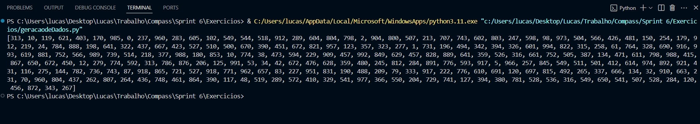

    * Em seguida na etapa 2, segue o arquivo gerado pela execução do código:

    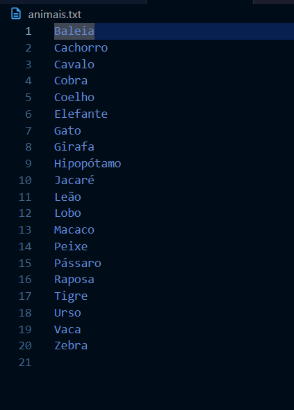

    * Para conclusão da etapa 3, segue o algoritmo utilizado para gerar um arquivo com nomes aleatórios:

    ~~~python
    # Importações
    import random
    import time
    import os
    import names

    inicio = time.time()

    random.seed(40)

    qtd_nomes_unicos = 39080

    qtd_nomes_aleatorios = 10000000

    # Geração de nomes únicos
    aux = []

    for i in range(0, qtd_nomes_unicos):
        aux.append(names.get_full_name())
        
    print(f"Gerando {qtd_nomes_aleatorios} nomes aleatórios...")

    # Geração de nomes aleatórios
    dados = []

    for i in range(0, qtd_nomes_aleatorios):
        dados.append(random.choice(aux))
        
    # Salvando os dados em um arquivo
    with open("nomes_aleatorios.txt", "w", encoding="utf-8") as arquivo:
        linhas = [f"{nome}\n" for nome in dados]
        arquivo.writelines(linhas)

    if os.path.exists("nomes_aleatorios.txt"):
        print(f"Arquivo 'nomes_aleatorios.txt' gerado com {qtd_nomes_aleatorios} nomes aleatórios.")

    fim = time.time()
    print(f"Tempo de Execução: {fim - inicio:.2f} segundos.")
    ~~~

    * Abaixo segue o resultado da execução no terminal:

    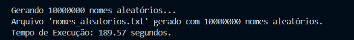

    * Finalizando a parte 1 dos exercícios segue a apresentação do arquivo *nomes_aleatorios.txt* gerado:

    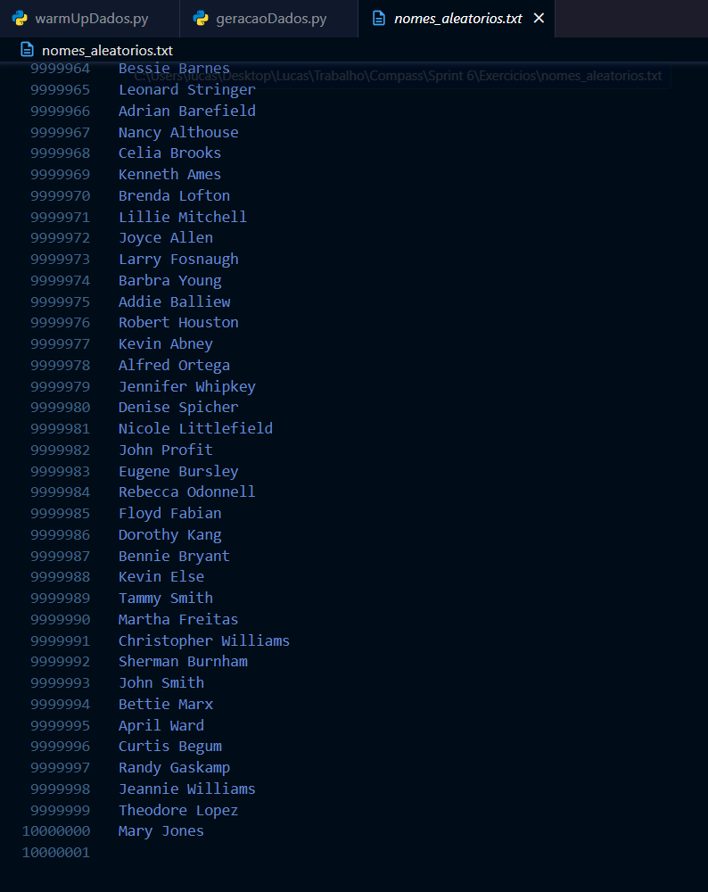

        * OBS: o arquivo não foi enviado para o repositório por possuir o tamanho de 130 MBs excedendo o tamanho limite permitido. 

    ### Exercício Parte 2 - Apache Spark

    * Abaixo segue o código utilizado para as 10 etapas desta parte dos exercícios com as manipulações realizadas com uso do Spark:

    ~~~python

    # Importações
    from pyspark.sql import SparkSession
    from pyspark import SparkContext, SQLContext
    from pyspark.sql.functions import array, lit, rand, floor, element_at, count

    # Etapa 1 - Criação da sessão Spark
    spark = SparkSession \
        .builder \
        .master("local[*]") \
        .appName("Manipulacao DataFrame") \
        .getOrCreate()
        
    df_nomes = spark.read.csv("nomes_aleatorios.txt", header=False, sep="\n", inferSchema=True)

    df_nomes.show()

    # Etapa 2 - Renomeando a coluna
    df_nomes = df_nomes.withColumnRenamed("_c0", "Nomes")

    df_nomes.printSchema()
    df_nomes.show(10)

    # Etapa 3 - Adicionando coluna Escolaridade
    valores_escolaridade = array(
        lit("Fundamental"),
        lit("Médio"),
        lit("Superior")
    )
    indices_escola = (floor(rand() * 3) + 1).cast('int') 
    df_nomes = df_nomes.withColumn("Escolaridade", element_at(valores_escolaridade, indices_escola))

    df_nomes.show()

    # Etapa 4 - Adicionando coluna País
    valores_paises = array(
        lit("Brasil"),
        lit("Argentina"),
        lit("Colômbia"),
        lit("Chile"),
        lit("Uruguai"),
        lit("Paraguai"),
        lit("Bolívia"),
        lit("Peru"),
        lit("Venezuela"),
        lit("Equador"),
        lit("Suriname"),
        lit("Guiana"),
        lit("Guiana Francesa")
    )

    indices_paises = (floor(rand() * 13) + 1).cast('int')
    df_nomes = df_nomes.withColumn("Pais", element_at(valores_paises, indices_paises))

    df_nomes.show()

    # Etapa 5 - Adicionando coluna AnoNascimento
    indices_anos = (floor(rand() * 66) + 1945).cast('int')  # Anos de 1945 a 2010
    df_nomes = df_nomes.withColumn("AnoNascimento", indices_anos)

    df_nomes.show()

    # Etapa 6 - Selecionando Pessoas que nasceram no século XXI
    df_select = df_nomes.select("*").filter(df_nomes.AnoNascimento > 2000)
    df_select.show(10)

    # Etapa 7 - Repetir o processo com Spark SQL
    df_nomes.createOrReplaceTempView("pessoas")

    spark.sql("SELECT * FROM pessoas WHERE AnoNascimento >= 2000").show(10)

    # Etapa 8 - Contando pessoas que são da geração Millenials
    df_select = df_nomes.filter(df_nomes.AnoNascimento.between(1980, 1994)).agg(count("*"))
    df_select.show()

    # Etapa 9 - Repetindo o processo com SQL
    spark.sql("SELECT COUNT(*) AS Millenials FROM pessoas WHERE AnoNascimento BETWEEN 1980 AND 1994").show()

    # Etapa 10 - Obtendo a quantidade de pessoas por país para cada geração usando SQL
    df_resultado = spark.sql("""SELECT Pais, CASE 
                WHEN AnoNascimento BETWEEN 1945 AND 1964 THEN 'Baby Boomers' 
                WHEN AnoNascimento BETWEEN 1965 AND 1979 THEN 'Geração X'
                WHEN AnoNascimento BETWEEN 1980 AND 1994 THEN 'Millenials - Y'
                WHEN AnoNascimento BETWEEN 1995 AND 2015 THEN 'Geração Z'
                ELSE 'Outras'
                END AS Geracoes,
                COUNT(*) AS Quantidade
                FROM pessoas
                GROUP BY Pais, Geracoes
                ORDER BY Pais ASC, Geracoes ASC, Quantidade ASC """)
    df_resultado.show(100, truncate=False)

    ~~~

    * Abaixo segue o resultado da execução da etapa 1 de início da sessão Spark e criação do DataFrame:

    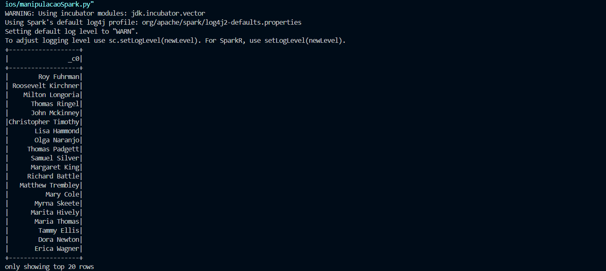

    * Em seguida, o resultado da execução da etapa 2 que imprime o Schema e renomeia a coluna principal para "Nomes":

    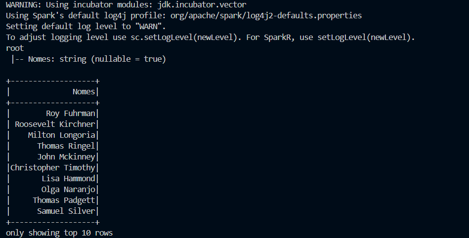

    * Na terceira etapa, com a criação da coluna Escolaridade e seus valores, obtivemos como resultado:

    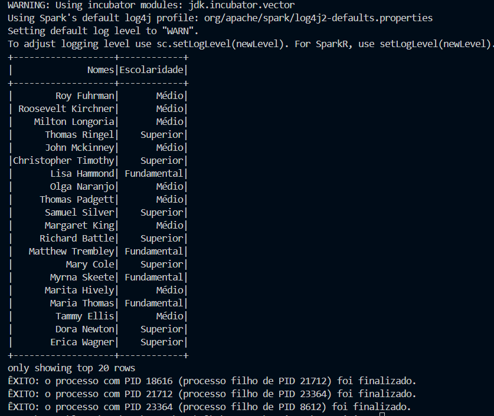

    * Para a etapa 4, recebemos o seguinte resultado da criação da coluna País:

    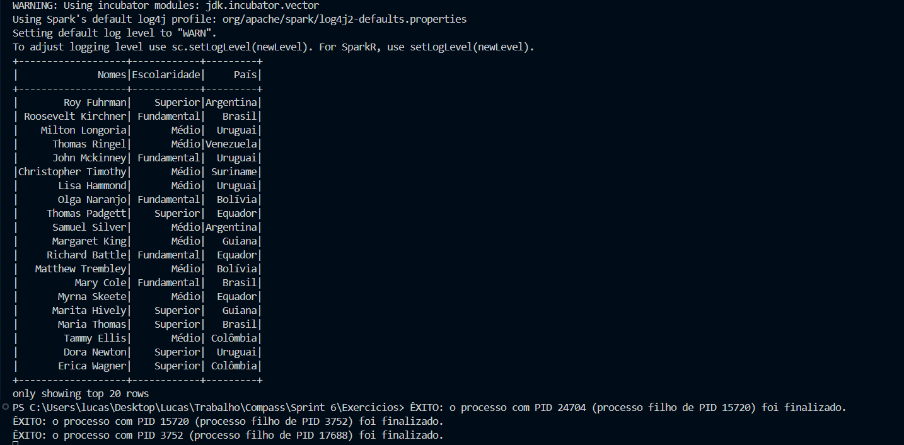

    * Segue a exibição do resultado da etapa 5, em que foi elaborada a coluna AnoNascimento:

    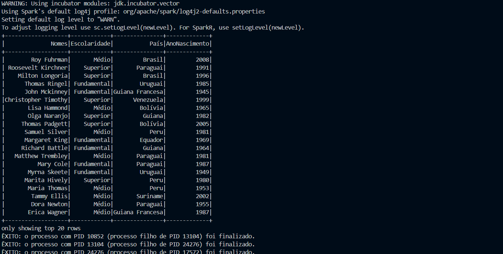

    * Na etapa 6, eram selecionados dados de pessoas que "nasceram" no século XXI, o resultado foi:

    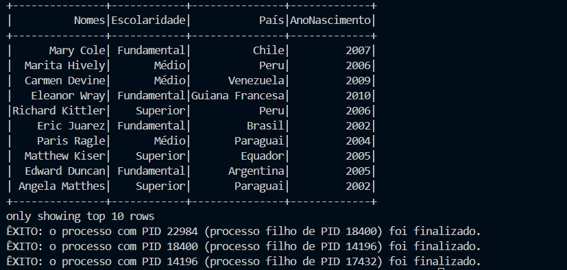

    * Semelhante a última, porém utilizando o SQL, na etapa 7 o resultado foi parecido:

    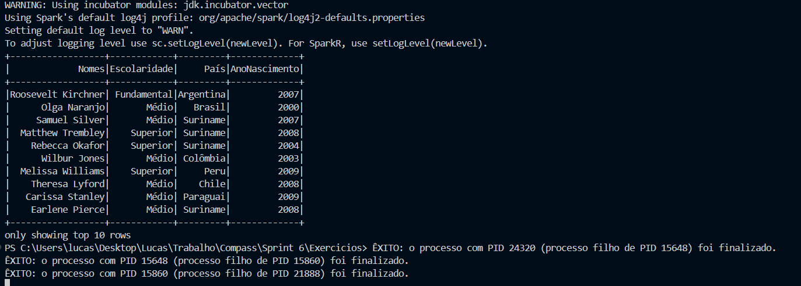

    * Já na oitava etapa, obtive como resultado da contagem das pessoas da geração Millenials:

    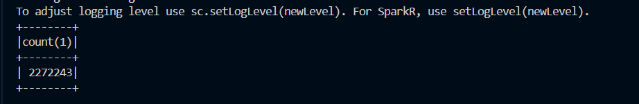

    * Na nona etapa, com o resultado semelhante ao da oitava, também utilizando SQL:

    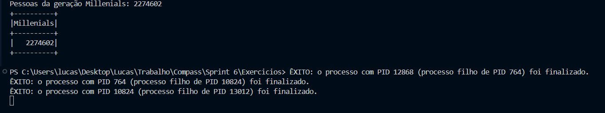

    * Finalizando esta parte do exercício na etapa 10, segue o resultado da última consulta, que obtia a quantidade de pessoas de cada geração divididas por país com utilização do Spark SQL:

    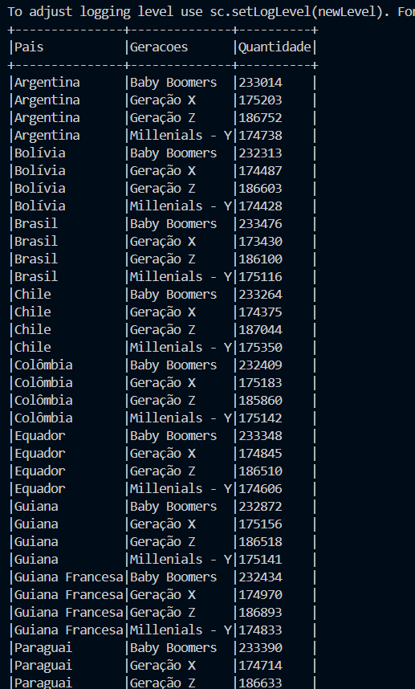

    ### Exercício Lab AWS Glue

    * Abaixo segue o código utilizando para implantação do Script do ETL Job no Glue:

    ~~~python

    import sys
    from awsglue.transforms import *
    from awsglue.utils import getResolvedOptions
    from pyspark.context import SparkContext
    from awsglue.context import GlueContext
    from awsglue.job import Job
    from awsglue.dynamicframe import DynamicFrame
    from pyspark.sql import SparkSession
    from pyspark import SparkContext, SQLContext
    from pyspark.sql.functions import upper, col, desc, asc, count, sum

    ## @params: [JOB_NAME]
    args = getResolvedOptions(sys.argv, ['JOB_NAME', 'S3_INPUT_PATH', 'S3_TARGET_PATH'])

    sc = SparkContext()
    glueContext = GlueContext(sc)
    spark = glueContext.spark_session
    job = Job(glueContext)
    job.init(args['JOB_NAME'], args)

    source_file = args['S3_INPUT_PATH']
    target_path = args['S3_TARGET_PATH']

    # Leitura do Arquivo
    my_dynamic_frame = glueContext.create_dynamic_frame.from_options(
        "s3",
        {
            "paths": [
                source_file
                ]
        },
        "csv",
        {"withHeader": True, "separator":","}
        )
        

    # Consultas
    # Impressão do Schema do DF
    my_dynamic_frame.printSchema()

    spark_df = my_dynamic_frame.toDF()

    # Alterando a caixa para Maiúsculo
    spark_df = spark_df.withColumn("nome", upper(col("nome")))

    # Contagem de linhas do DF
    spark_df.agg(count("*").alias("total_linhas")).show()

    # Contagem de registros agrupando por ano e sexo
    spark_df.groupBy("ano", "sexo").agg(count(col("nome")).alias("total_pessoas")).orderBy(desc(col("ano"))).show()

    # Nome feminino com mais registros e ano que ocorreu
    df_feminino = spark_df.filter(col("sexo") == "F").groupBy("nome", "ano").agg(sum("total").alias("total_registros")) \
        .orderBy(desc(col("total_registros"))).show(1)

    # Nome masculino com mais registros e ano que ocorreu
    df_masculino = spark_df.filter(col("sexo") == "M").groupBy("nome", "ano").agg(sum("total").alias("total_registros")) \
        .orderBy(desc(col("total_registros"))).show(1)

    # Registros para cada ano presente no DataFrame
    spark_df.groupBy("ano").agg(sum("total").alias('total_ano')).orderBy(asc(col("ano"))).limit(10).show()

    # Transformação do DataFrame em DinamycFrame
    df_final = DynamicFrame.fromDF(spark_df, glueContext, "df_final")
        
    # Escrevendo o conteúdo do DF no S3
    glueContext.write_dynamic_frame.from_options(
            frame = df_final,
            connection_type = "s3",
            connection_options = {
                "path": target_path,
                "partitionKeys": ["sexo", "ano"]
                },
            format = "json"
            )

    job.commit()

    ~~~

    * Segue a comprovação da execução com sucesso do Job no Glue:

    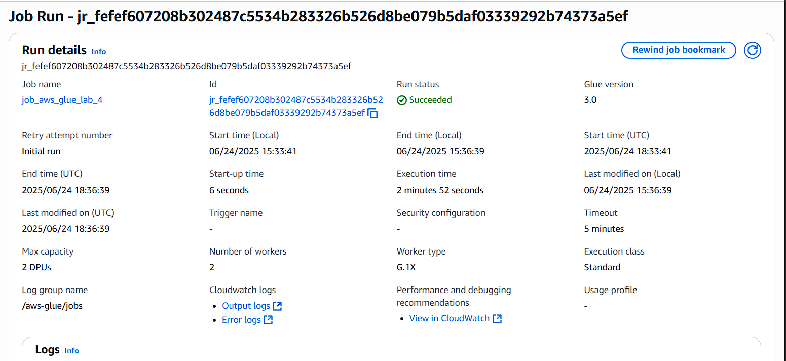

    * Abaixo seguem os detalhes do eventos de log no Cloud Watch comprovando a execução com sucesso:

    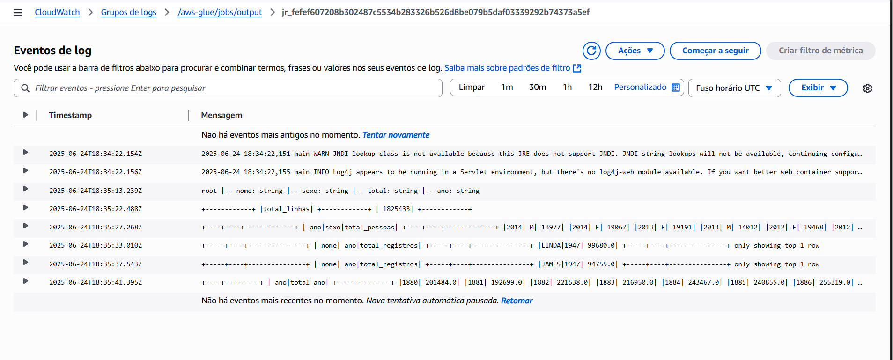

    * Ainda nos logs seguem os resultados das consultas específicas:

        * Impressão do Schema:

        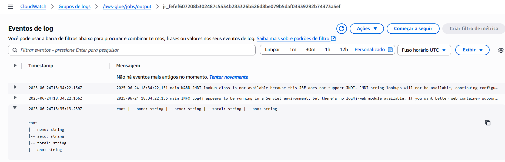

        * Contagem das linhas do DataFrame:

        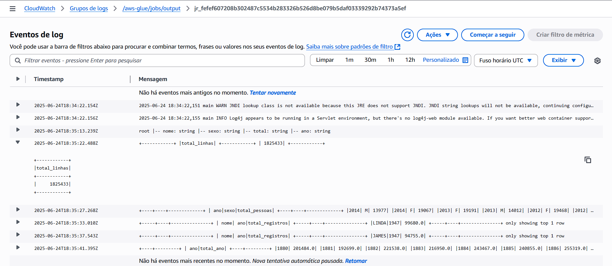

        * Contagem de registros agrupado por ano e sexo ordenado pelos anos mais recente:

        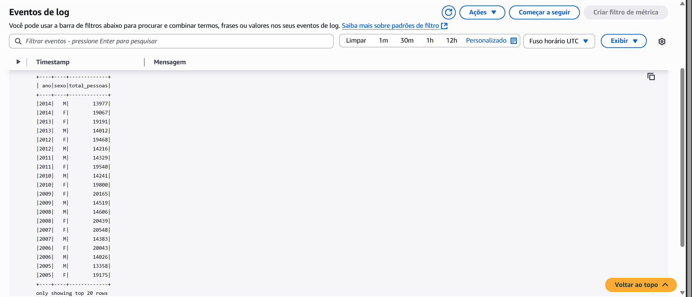

        * Busca do nome feminino com mais registros e ano em que ocorreu:

        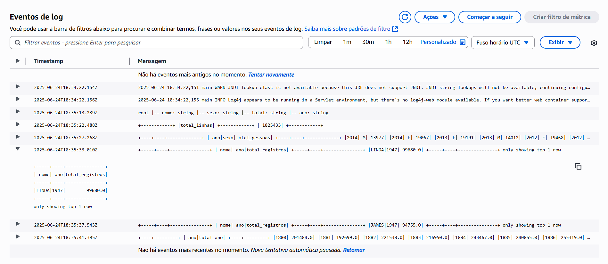

        * Busca do nome masculino com mais registros e ano em que ocorreu:

        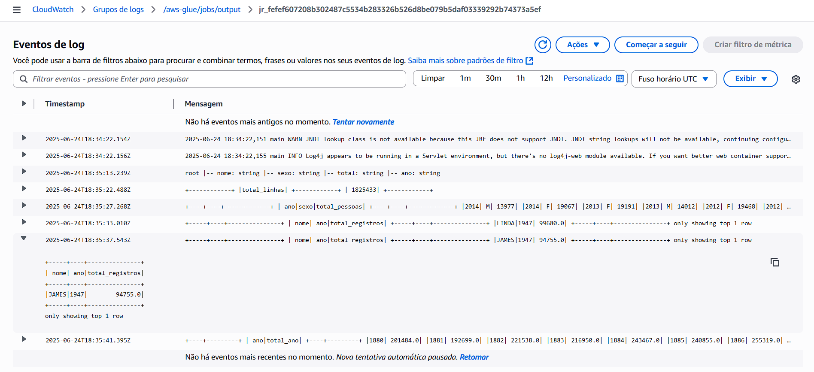

        * Busca de registros de nomes para cada ano presente no DataFrame

        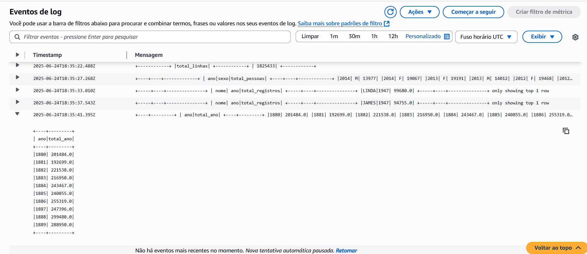

    * Em seguida, segue a comprovação da criação do crawler:

    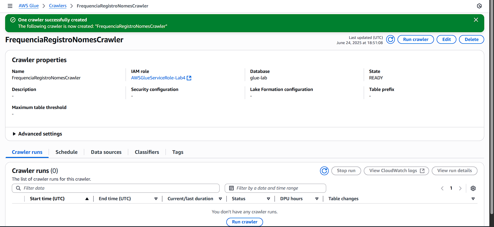

    * Segue os detalhes de logs de partições criados pela execução do crawler:

    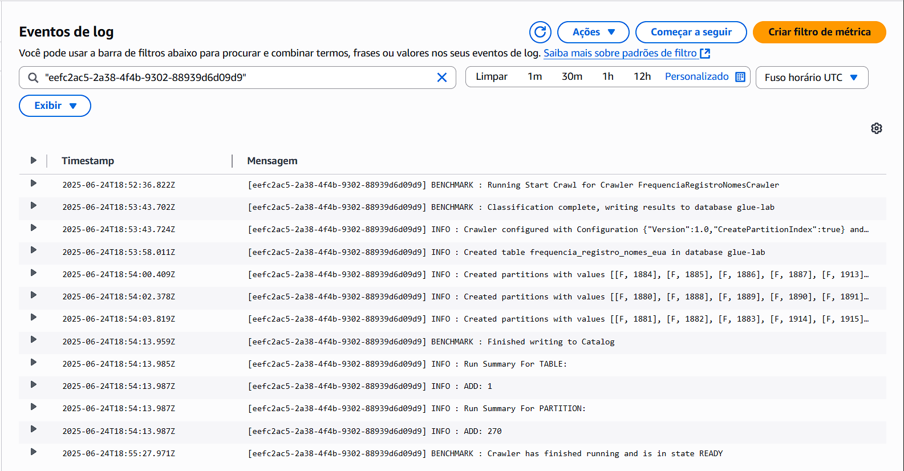

    * Após as partições segue um exemplo de arquivo criado por meio delas no Bucket do S3:

    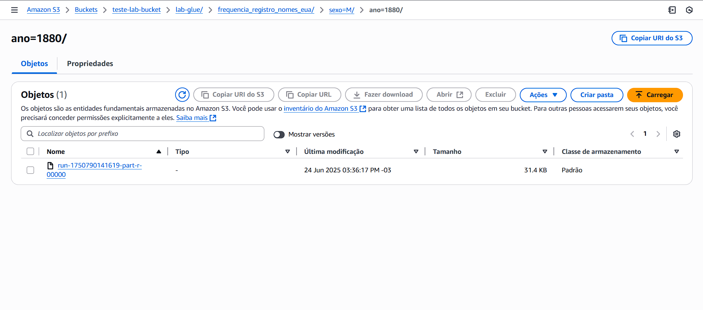

    * Finalizando o Lab no Athena, com a consulta das informações do banco de dados: 

    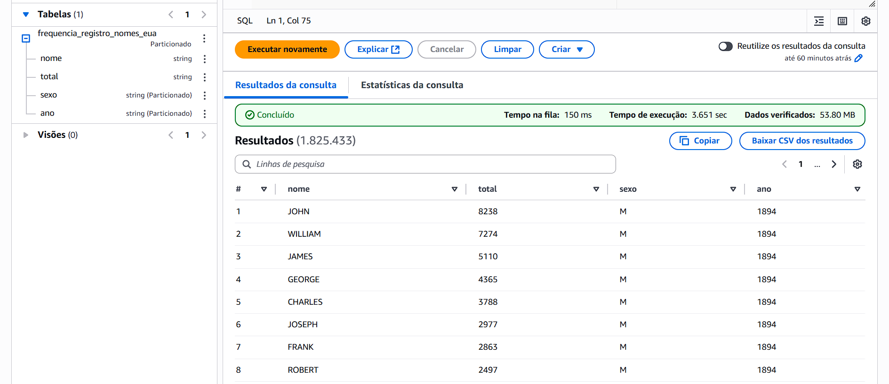