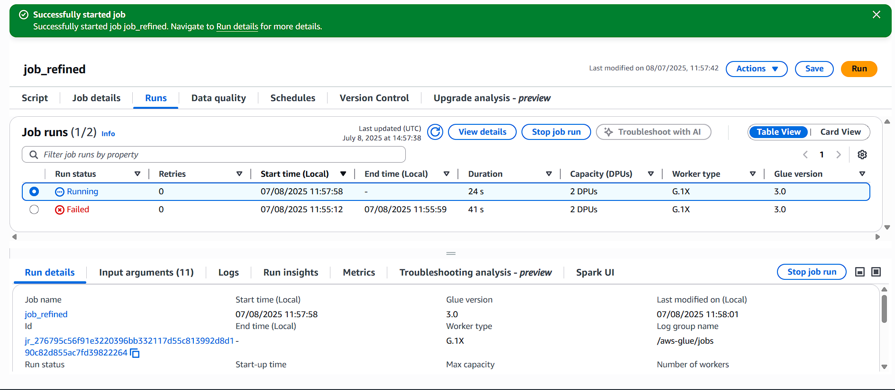
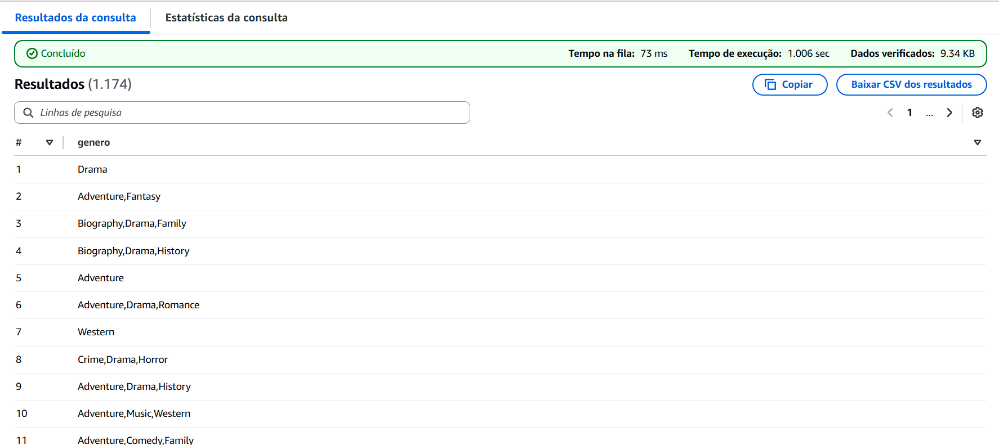

# Desafio 
Nesta Sprint, o desafio consistiu em continuar a desenvolver o projeto final que junta todos os conhecimentos adquiridos no Programa de Bolsas e realiza a construção de um Data Lake de Filmes e Séries, partindo nesta entrega para o processamento da camada Refined. Esta etapa consistia em utilizar o *Glue* novamente para preparar e transformar os dados oriundos da camada Trusted implantando-os n camada Refined com base na modelagem de dados criada para o projeto.  

## Etapas
Abaixo consta o passo a passo de como foram aplicadas as etapas de atividades sobre o projeto desde a criação da modelagem de dados até a Implementação do Job para a camada e criação do Crawler.

1. O primeiro passo deste desafio foi preparar o ambiente para a criação da modelagem de dados. Para isso, já havia instalado anteriormente para outros projetos o *MySQLWorkbench*, então apenas criei um novo projeto. Após a análise questionamentos escolhidos, gerei a modelagem com as seguintes tabelas, englobando apenas informações que realmente utilizarei na extração de *insights*: 

    

    * A tabela principal é a Fato Filmes, com todas as informações relacionadas aos filmes(ID, Título, Descrição, Média de nota, Quantidade de Votos, Popularidade, Palavras-Chave, Data de Lançamento, ID de Gêneros e ID de Franquias)

    * Já as tabelas de dimensão possuem outras informações: Dimensão Data com as informações de data(Data de lançamento, ano, mês, dia, semestre e década), Dimensão Gênero com as informações(ID e nome dos gêneros Crime e Guerra) e Dimensão Franquias(com ID e nome das franquias de filmes).

    * Todas as tabelas de dimensão possuem relação com a fato.

2. Em seguida à criação da modelagem, reconheci nos códigos da etapa anterior que havia um problema na estrutura da tabela(schema) implantadas nas camadas Raw e Trusted:

    

    * Não haviam as informações de ID das franquias e dos gêneros, dados esses que seriam necessários na criação das tabelas como mostrado na modelagem.

3. Para solucionar este problema na estrutura, retornei para a etapa de ingestão da camada Raw e realizei mudanças no código para uma ingestão mais completa: 
    
    * Acrescentei na estrutura a busca dos IDs das Franquias e dos Gêneros diretamente do TMDB, além de aumentar a quantidade máxima de filmes a serem buscados, abrangendo uma maior concentração de informações.

    ~~~python
    max_filmes_total = 7500 # Máximo de filmes a serem buscados

    # Estrutura do JSON
     wc_movies_data.append({ # Inclusão das informações do filme
        "movie_id": movie_id,
        "title": movie_details.get("title"),
        "overview": movie_details.get("overview"),
        "release_date": movie_details.get("release_date"),
        "popularity": movie_details.get("popularity"),
        "vote_average": movie_details.get("vote_average"),
        "vote_count": movie_details.get("vote_count"),
        "id_collection": movie_details.get("belongs_to_collection", {}).get("id") if movie_details.get("belongs_to_collection") else None, # Acrescentando ID das Franquias
        "collection": movie_details.get("belongs_to_collection", {}).get("name") if movie_details.get("belongs_to_collection") else None,
        "id_genres": [g["id"] for g in movie_details.get("genres", []) if g["id"] in generos_desejados], # Acrescentando ID dos Gêneros
        "genres": [g["name"] for g in movie_details.get("genres", []) if g["id"] in generos_desejados],
        "keywords": keywords_list
        })

    ~~~

    * Resolvi buscar as informações do TMDB com o intuito de evitar de criar IDs diretamente do algoritmo.

4. Após a mudança, segue o status de resultado da mudança na Lambda:

    

    * E o resultado dos arquivos no S3:

    

5. Consequentemente com a nova ingestão, era necessário atualizar o algoritmo do job na camada Trusted, para que o Schema pudesse englobar os IDs adicionados:

    ~~~python
    # Schema manualmente definido para os arquivos JSON
    movie_schema = StructType([
            StructField("movie_id", LongType(), True),
            StructField("title", StringType(), True),
            StructField("overview", StringType(), True),
            StructField("release_date", StringType(), True),
            StructField("popularity", DoubleType(), True),
            StructField("vote_average", DoubleType(), True),
            StructField("vote_count", LongType(), True),
            StructField("id_collection", LongType(), True), # ID de Franquias adicionados
            StructField("collection", StringType(), True),
            StructField("id_genres", ArrayType(LongType()), True), # ID de gêneros adicionados
            StructField("genres", ArrayType(StringType()), True),
            StructField("keywords", ArrayType(StringType()), True)
        ])

    ~~~

    * Executando o Job no Glue obtemos como resultados os arquivos Parquet gerados com a nova data de envio particionada, segue o exemplo:
     
     

    * E no Athena obtive como resultado da consulta da tabela o seguinte retorno: 

    

6. Desta maneira, com as informações salvas, podemos implantar o Job da camada Refined. Para primeiros testes, estabeleci o seguinte algoritmo no Glue:

    * Este algoritmo possui as inicializações das sessões Spark & Glue, armazena os caminhos de origem e destino dos arquivos no S3, realiza a leitura do arquivo local(CSV) e dos arquivos gerados da API(TMDB), processando-os e criando as tabelas de acordo com a modelagem de dados exercida no princípio da entrega. Alguns dos tipos de processamento para as limpezas utilizados foram a explosão de arrays mantendo dados nulos com ```explode_outer```, ```regexp_replace``` para remover caracteres indesejados dos dados da coluna, ```lit``` para preencher colunas com seus dados nulos, entre outros, finalizando com a criação de *Views* temporárias. Como é possível identificar também, criei dimensões locais e dimensões com API com nomes similares de colunas, para que nas consultas da próxima entrega seja aplicada a operação de Join nessas dimensões, se tornando apenas uma. Segue o algoritmo: 

    ~~~python
    # Importação das bibliotecas
    import sys
    from awsglue.transforms import *
    from awsglue.utils import getResolvedOptions
    from pyspark.context import SparkContext
    from awsglue.context import GlueContext
    from awsglue.job import Job
    from pyspark.sql.functions import regexp_replace, col, when, lit, explode_outer, explode, split, to_date, year, month, dayofmonth, when, floor
    from pyspark.sql.types import IntegerType, FloatType

    # Inicialização do Job
    ## @params: [JOB_NAME]
    args = getResolvedOptions(sys.argv, ['JOB_NAME', 'S3_LOCAL_PATH', 'S3_API_PATH', 'S3_TARGET_PATH'])

    # Criação dos contextos Glue e Spark
    sc = SparkContext()
    glueContext = GlueContext(sc)
    spark = glueContext.spark_session
    job = Job(glueContext)
    job.init(args['JOB_NAME'], args)

    # Caminhos de origem e destino dos arquivos
    source_csv_path = args['S3_LOCAL_PATH']
    source_json_path = args['S3_API_PATH']
    target_path = args['S3_TARGET_PATH']


    # Limpeza de dados do CSV
    df_local_trusted = spark.read.parquet(source_csv_path)

    # Renomeando ID 
    df_local = df_local_trusted.withColumnRenamed('id', 'filme_id')

    # Removendo índice de letra(tt) do ID
    df_local = df_local.withColumn('filme_id', regexp_replace('filme_id', 'tt', ''))

    # Substituindo valores nulos por None com est. de repetição
    df_local = df_local.select([when(col(c) == "\\N", lit(None)).otherwise(col(c)).alias(c) for c in df_local.columns])

    # Convertendo tipos de dados
    df_local = df_local.withColumn('filme_id', col('filme_id').cast(IntegerType())) \
        .withColumn('anoLancamento', col('anoLancamento').cast(IntegerType())) \
        .withColumn('tempoMinutos', col('tempoMinutos').cast(IntegerType())) \
        .withColumn('notaMedia', col('notaMedia').cast(FloatType())) \
        .withColumn('numeroVotos', col('numeroVotos').cast(IntegerType())) \
        .withColumn('anoNascimento', col('anoNascimento').cast(IntegerType())) \
        .withColumn('anoFalecimento', col('anoFalecimento').cast(IntegerType()))

    # Criação da tabela Fato_Filme Local(Arquivo CSV)   
    fato_filmes_local = df_local.select(
        col("filme_id"),
        col("tituloPincipal").alias("titulo"),
        col("notaMedia").alias("nota_media"),
        col("numeroVotos").alias("qtd_votos")
    )

    # Criação da tabela Dimensão Gênero Local 
    dim_genero_local = df_local.select(
        col("genero")
    ).dropna().dropDuplicates()

    # Criação da tabela Dimensão Data Local
    dim_data_local = df_local.select(
        col("anoLancamento").alias("ano_lancamento")
    ).dropna().dropDuplicates() \
        .withColumn("decada", floor(col("ano_lancamento") / 10) * 10)
        


    # Limpeza de dados do TMDB
    df_trusted = spark.read.parquet(source_json_path)

    # Criação das colunas de atributos de data para a tabela
    df = df_trusted \
        .withColumn("release_date", to_date(col("release_date"), "yyyy-MM-dd")) \
        .withColumn("ano_lancamento", year(col("release_date"))) \
        .withColumn("mes_lancamento", month(col("release_date"))) \
        .withColumn("dia_lancamento", dayofmonth(col("release_date"))) \
        .withColumn("semestre", when(month(col("release_date")) <= 6, 1).otherwise(2)) \
        .withColumn("decada", floor(col("ano_lancamento") / 10) * 10)

    # Explodindo os Arrays das colunas IdGênero, Gênero e Palavras-Chave
    df_explodido = df \
        .withColumn("id_genero", explode_outer(col("id_genres"))) \
        .withColumn("genero", explode_outer(col("genres"))) \
        .withColumn("palavra_chave", explode_outer(col("keywords")))
        
    # Criação da Tabela Fato Filmes com suas colunas
    fato_filmes = df_explodido.select(
        col("movie_id").alias("filme_id"),
        col("title").alias("titulo"),
        col("overview").alias("descricao"),
        col("vote_average").alias("nota_media"),
        col("vote_count").alias("qtd_votos"),
        col("popularity").alias("popularidade"),
        col("palavra_chave"),
        col("release_date").alias("data_lancamento"),
        col("id_genero"),
        col("id_collection").alias("id_franquia")
    )


    # Criação da Tabela Dimensão Gênero com suas colunas
    dim_genero = df_explodido.select(
        col("id_genero"),
        col("genero")
    ).dropDuplicates()

    # Criação da Tabela Dimensão Franquia com suas colunas
    dim_franquia = df_explodido.select(
        col("id_collection").alias("id_franquia"),
        col("collection").alias("franquia")
    ).dropna().dropDuplicates()

    # Criação da Tabela Dimensão Data com suas colunas
    dim_data = df_explodido.select(
        col("release_date").alias("data_lancamento"),
        col("ano_lancamento"),
        col("mes_lancamento"),
        col("dia_lancamento"),
        col("semestre"),
        col("decada")
    ).dropDuplicates()

    # Salvando as tabelas em Parquet nos caminhos
    # Tabelas TMDB
    fato_filmes.write.mode("overwrite").parquet(target_path + "Fato_Filmes")
    dim_genero.write.mode("overwrite").parquet(target_path + "Dim_Genero")
    dim_franquia.write.mode("overwrite").parquet(target_path + "Dim_Franquia")
    dim_data.write.mode("overwrite").parquet(target_path + "Dim_Data")

    # Tabelas Locais
    fato_filmes_local.write.mode("overwrite").parquet(target_path + "Fato_Filmes_Local")
    dim_genero_local.write.mode("overwrite").parquet(target_path + "Dim_Genero_Local")
    dim_data_local.write.mode("overwrite").parquet(target_path + "Dim_Data_Local")

    # Criação das Views para teste
    # Views TMDB
    fato_filmes.createOrReplaceTempView("fato_filmes_v")
    dim_genero.createOrReplaceTempView("dim_genero_v")
    dim_franquia.createOrReplaceTempView("dim_franquia_v")
    dim_data.createOrReplaceTempView("dim_data_v")

    # Views Local 
    fato_filmes_local.createOrReplaceTempView("fato_filmes_local_v")
    dim_genero_local.createOrReplaceTempView("dim_genero_local_v")
    dim_data_local.createOrReplaceTempView("dim_data_local_v")

    job.commit()
    ~~~
    
    * Criado o algoritmo, transfiro para o Glue:
     
    

    * Segue o Job rodando:

    

    * E a execução obtendo sucesso:

    

    * Com o sucesso na execução obtivemos a seguinte estrutura de arquivos até as pastas de dimensão:

        s3://datalake-lucasrafael/Refined/Tables/Parquet/Dim.../

    

    * Arquivos Parquet retirados como exemplo da pasta Fato Filmes:

    

7. Para seguir com o desenvolvimento da camada Refined, construo um crawler para estabelecer as tabelas no *Catalog*:

    

    * Ativei o crawler, adquirindo uma execução com êxito:

    

    * E conferi a composição das tabelas na seção *Tables*:

    

    * No ato de verificação das consultas no Athena, descobri um problema:

    

    * Na Dimensão Gênero, os valores estão repetidos com os dois IDs. Isto é um problema pois o ID correto para o gênero Crime é 80 e consequentemente para o gênero Guerra é 10752. O que pode ter ocorrido é um erro na ordem dos IDs ou dos valores na implementação do Job.

8. Depois de algumas pesquisas, identifiquei que o impecílio realmente tinha relação com a ordem no Job e com a forma que havia explodido os *arrays*, então efetuei mudanças neste fragmento do código:

    * Adicionei a importação da função ```posexplode_outer```, utilizei para explodir(expandir) de forma separada os atributos da dimensão em Data Frames específicos, que atribuem uma posição para cada atributo com novas colunas ```"pos"```(criadas pela função). Em seguida com o ```df_explodido```, juntamos o Data Frame com as colunas da dimensão gênero filtrando através das suas posições e excluindo logo depois as colunas utilizadas para diferenciar essas posições.

    ~~~python
    from pyspark.sql.functions import regexp_replace, col, when, lit, explode_outer, split, to_date, year, month, dayofmonth, when, floor, posexplode_outer

    [...]

    # Explodindo ID do gênero
    df_generos_ids = df.select("*", posexplode_outer("id_genres").alias("pos", "id_genero"))

    # Explodindo Conteúdo de Gêneros
    df_generos = df_generos_ids.select("*", posexplode_outer("genres").alias("pos2", "genero"))

    # Juntando os gêneros e Explodindo as Palavras-Chave (Excluindo colunas criadas para posicionamento dos dados de gênero)
    df_explodido = df_generos \
        .filter(col("pos") == col("pos2")) \
        .drop("pos", "pos2") \
        .withColumn("palavra_chave", explode_outer(col("keywords")))

    [...]
    ~~~
    
    * Elaborados alguns testes e transferido o código final para o Glue atingimos sucesso na execução da Run:  

    

    * Segue o log operado com sucesso apresentando a correção na Dimensão Gênero:
    
    
 
9. Antes de expor as consultas de verificação dos dados, segue o código completo do Job Refined do Glue:

    ~~~python
    # Importação das bibliotecas
    import sys
    from awsglue.transforms import *
    from awsglue.utils import getResolvedOptions
    from pyspark.context import SparkContext
    from awsglue.context import GlueContext
    from awsglue.job import Job
    from pyspark.sql.functions import regexp_replace, col, when, lit, posexplode_outer, explode_outer, split, to_date, year, month, dayofmonth, when, floor
    from pyspark.sql.types import IntegerType, FloatType

    # Inicialização do Job
    ## @params: [JOB_NAME]
    args = getResolvedOptions(sys.argv, ['JOB_NAME', 'S3_LOCAL_PATH', 'S3_API_PATH', 'S3_TARGET_PATH'])

    # Criação dos contextos Glue e Spark
    sc = SparkContext()
    glueContext = GlueContext(sc)
    spark = glueContext.spark_session
    job = Job(glueContext)
    job.init(args['JOB_NAME'], args)

    # Caminhos de origem e destino dos arquivos
    source_csv_path = args['S3_LOCAL_PATH']
    source_json_path = args['S3_API_PATH']
    target_path = args['S3_TARGET_PATH']


    # Limpeza de dados do CSV
    df_local_trusted = spark.read.parquet(source_csv_path)

    # Renomeando ID 
    df_local = df_local_trusted.withColumnRenamed('id', 'filme_id')

    # Removendo índice de letra(tt) do ID
    df_local = df_local.withColumn('filme_id', regexp_replace('filme_id', 'tt', ''))

    # Substituindo valores nulos por None
    df_local = df_local.select([when(col(c) == "\\N", lit(None)).otherwise(col(c)).alias(c) for c in df_local.columns])

    # Convertendo tipos de dados
    df_local = df_local.withColumn('filme_id', col('filme_id').cast(IntegerType())) \
        .withColumn('anoLancamento', col('anoLancamento').cast(IntegerType())) \
        .withColumn('tempoMinutos', col('tempoMinutos').cast(IntegerType())) \
        .withColumn('notaMedia', col('notaMedia').cast(FloatType())) \
        .withColumn('numeroVotos', col('numeroVotos').cast(IntegerType())) \
        .withColumn('anoNascimento', col('anoNascimento').cast(IntegerType())) \
        .withColumn('anoFalecimento', col('anoFalecimento').cast(IntegerType()))

    # Criação da tabela Fato_Filme Local(Arquivo CSV)   
    fato_filmes_local = df_local.select(
        col("filme_id"),
        col("tituloPincipal").alias("titulo"),
        col("notaMedia").alias("nota_media"),
        col("numeroVotos").alias("qtd_votos")
    )

    fato_filmes_local.show(10)

    # Criação da tabela Dimensão Gênero Local 
    dim_genero_local = df_local.select(
        col("genero")
    ).dropna().dropDuplicates()

    dim_genero_local.show()

    # Criação da tabela Dimensão Data Local
    dim_data_local = df_local.select(
        col("anoLancamento").alias("ano_lancamento")
    ).dropna().dropDuplicates() \
        .withColumn("decada", floor(col("ano_lancamento") / 10) * 10)
        
    dim_data_local.show(10)

    # Limpeza de dados do TMDB
    df_trusted = spark.read.parquet(source_json_path)

    # Criação das colunas de atributos de data para a tabela
    df = df_trusted \
        .withColumn("release_date", to_date(col("release_date"), "yyyy-MM-dd")) \
        .withColumn("ano_lancamento", year(col("release_date"))) \
        .withColumn("mes_lancamento", month(col("release_date"))) \
        .withColumn("dia_lancamento", dayofmonth(col("release_date"))) \
        .withColumn("semestre", when(month(col("release_date")) <= 6, 1).otherwise(2)) \
        .withColumn("decada", floor(col("ano_lancamento") / 10) * 10)

    # Explodindo ID do gênero
    df_generos_ids = df.select("*", posexplode_outer("id_genres").alias("pos", "id_genero"))

    # Explodindo Conteúdo de Gêneros
    df_generos = df_generos_ids.select("*", posexplode_outer("genres").alias("pos2", "genero"))

    # Juntando os gêneros e Explodindo as Palavras-Chave (Excluindo colunas criadas para posicionamento dos dados de gênero)
    df_explodido = df_generos \
        .filter(col("pos") == col("pos2")) \
        .drop("pos", "pos2") \
        .withColumn("palavra_chave", explode_outer(col("keywords")))
        
    # Criação da Tabela Fato Filmes com suas colunas
    fato_filmes = df_explodido.select(
        col("movie_id").alias("filme_id"),
        col("title").alias("titulo"),
        col("overview").alias("descricao"),
        col("vote_average").alias("nota_media"),
        col("vote_count").alias("qtd_votos"),
        col("popularity").alias("popularidade"),
        col("palavra_chave"),
        col("release_date").alias("data_lancamento"),
        col("id_genero"),
        col("id_collection").alias("id_franquia")
    )

    fato_filmes.show(10)

    # Criação da Tabela Dimensão Gênero com suas colunas
    dim_genero = df_explodido.select(
        col("id_genero"),
        col("genero")
    ).dropDuplicates()

    dim_genero.show(10)

    # Criação da Tabela Dimensão Franquia com suas colunas
    dim_franquia = df_explodido.select(
        col("id_collection").alias("id_franquia"),
        col("collection").alias("franquia")
    ).dropna().dropDuplicates()

    dim_franquia.show(10)

    # Criação da Tabela Dimensão Data com suas colunas
    dim_data = df_explodido.select(
        col("release_date").alias("data_lancamento"),
        col("ano_lancamento"),
        col("mes_lancamento"),
        col("dia_lancamento"),
        col("semestre"),
        col("decada")
    ).dropDuplicates()

    dim_data.show(10)

    # Salvando as tabelas em Parquet nos caminhos
    # Tabelas TMDB
    fato_filmes.write.mode("overwrite").parquet(target_path + "Fato_Filmes")
    dim_genero.write.mode("overwrite").parquet(target_path + "Dim_Genero")
    dim_franquia.write.mode("overwrite").parquet(target_path + "Dim_Franquia")
    dim_data.write.mode("overwrite").parquet(target_path + "Dim_Data")

    # Tabelas Locais
    fato_filmes_local.write.mode("overwrite").parquet(target_path + "Fato_Filmes_Local")
    dim_genero_local.write.mode("overwrite").parquet(target_path + "Dim_Genero_Local")
    dim_data_local.write.mode("overwrite").parquet(target_path + "Dim_Data_Local")

    # Criação das Views para teste
    # Views TMDB
    fato_filmes.createOrReplaceTempView("fato_filmes_v")
    dim_genero.createOrReplaceTempView("dim_genero_v")
    dim_franquia.createOrReplaceTempView("dim_franquia_v")
    dim_data.createOrReplaceTempView("dim_data_v")

    # Views Local 
    fato_filmes_local.createOrReplaceTempView("fato_filmes_local_v")
    dim_genero_local.createOrReplaceTempView("dim_genero_local_v")
    dim_data_local.createOrReplaceTempView("dim_data_local_v")

    job.commit()    
    ~~~

10. Finalizando a entrega 4 do desafio final, apresento as Consultas no Athena com as Tabelas Fato, Dimensões e seus atributos: 

    * Fato Filmes:

    
    
    * O restante da Fato com a explosão do ID de gênero e das palavras chave: 

    
    
    * Fato Filmes local:

    

    * Dimensão Gênero correta:

    

    * Dimensão Gênero Local.

    

    * Dimensão Franquias:

    

    * Dimensão Data:

    

    * Dimensão Data Local:

    

11. Encerradas as explicações, chego ao fim do **Desafio da Sprint 7**. Agradeço por acompanharem o guia passo a passo da continuação do projeto que foi desenvolvido para aplicar os conhecimentos adquiridos no Programa de Bolsas. Estou aberto a novas sugestões de melhoria e feedback, que contribuirão muito para meu desenvolvimento profissional.