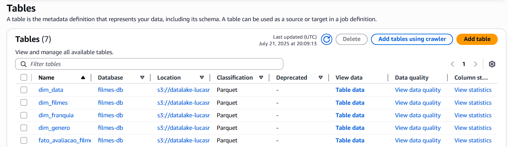
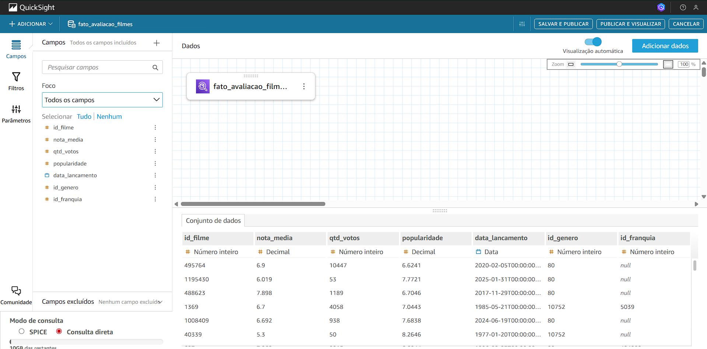
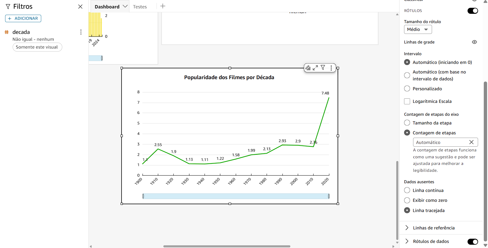

# Desafio 
Esta Sprint consistiu em finalizar o desenvolvimento do desafio final que junta todos os conhecimentos adquiridos no Programa de Bolsas e realiza a construção de um Data Lake de Filmes e Séries, partindo nesta última entrega para a extração de Insights com o uso da plataforma da AWS, Quicksight. Para concluir o projeto, era necessário criar um dashboard de dados que solucionasse os questionamentos criados em etapas anteriores, utilizando como fonte os dados da camada Refined.  

## Etapas
Abaixo consta o passo a passo de como foram aplicadas as etapas da entrega final sobre o projeto desde os reparos na modelagem e camada Refined até a criação do dashboard com os gráficos.

1. O primeiro passo para inicializar a entrega final compreendeu em, através de informações enviadas pelos avaliadores na correção da Sprint anterior, realizar reparos na modelagem dimensional:

    * Para tornar a modelagem dimensional assertiva, era necessário que alterasse o nome da tabela Fato especificando seus dados e que mantivesse somente dados numéricos na mesma. Com base nessas informações, adicionei uma nova Dimensão para incorporar os dados de filmes, criando dessa forma uma nova estrutura de modelagem:  

    

    * A tabela principal tem novo nome: Fato Avaliação Filmes, agora com todas as informações numéricas relacionadas aos filmes(ID de filme, Média de nota, Quantidade de Votos, Popularidade, Data de Lançamento, ID de Gêneros e ID de Franquias)

    * Já as tabelas de dimensão possuem as mesmas informações que já haviam mas com o acréscimo da Dimensão Filmes que possui: Id de Filmes, Título de Filmes, Descrição(Sinopse) de Filmes e as Palavras-Chave do filme.


2. Pós reestruturação da modelagem, ainda corrigindo as brechas da Sprint anterior, exerci uma recomposição da camada Refined. Havia incorreções no procedimento de ingestão, os dados eram processados, porém separados por origem quando na verdade era exigida a unificação dos dados:

    * Para unificar os dados, além da criação das dimensões filme para as duas origens(TMDB e CSV), gerei as tabelas com campos iguais e utilizei a função ```unionByName``` unindo as duas fontes uma tabela por vez. Dessa maneira atualizei o código do Job Refined, código completo está em [*novojob_refined.py*](./Arquivos/novojob_refined.py):

    ~~~python
    # Importação das bibliotecas
    # ...
    from pyspark.sql.functions import regexp_replace, col, when, lit, posexplode_outer, explode_outer, split, to_date, year, month, dayofmonth, floor, trim

    # Inicialização do Job
    ## @params: [JOB_NAME]
    args = getResolvedOptions(sys.argv, ['JOB_NAME', 'S3_LOCAL_PATH', 'S3_API_PATH', 'S3_TARGET_PATH'])

    # Criação dos contextos Glue e Spark
    # ...

    # Caminhos de origem e destino dos arquivos
    source_csv_path = args['S3_LOCAL_PATH']
    source_json_path = args['S3_API_PATH']
    target_path = args['S3_TARGET_PATH']

    # Limpeza de dados do TMDB
    df_tmdb_trusted = spark.read.parquet(source_json_path)

    # Criação das colunas de atributos de data para a tabela
    df = df_tmdb_trusted \
        .withColumn("release_date", to_date(col("release_date"), "yyyy-MM-dd")) \
        .withColumn("ano_lancamento", year(col("release_date"))) \
        .withColumn("mes_lancamento", month(col("release_date"))) \
        .withColumn("dia_lancamento", dayofmonth(col("release_date"))) \
        .withColumn("semestre", when(month(col("release_date")) <= 6, 1).otherwise(2)) \
        .withColumn("decada", floor(col("ano_lancamento") / 10) * 10)

    # Explodindo ID do gênero
    df_generos_ids = df.select("*", posexplode_outer("id_genres").alias("pos", "id_genero"))

    # Explodindo Conteúdo de Gêneros
    df_generos_tmdb = df_generos_ids.select("*", posexplode_outer("genres").alias("pos2", "genero"))


    # Juntando os gêneros e Explodindo as Palavras-Chave (Excluindo colunas criadas para posicionamento dos dados de gênero)
    df_tmdb_explodido = df_generos_tmdb \
        .filter(col("pos") == col("pos2")) \
        .drop("pos", "pos2") \
        .withColumn("palavra_chave", explode_outer(col("keywords")))
        
    # Criação da Tabela Fato Avaliação Filmes com suas colunas
    fato_avaliacao_filmes_tmdb = df_tmdb_explodido.select(
        col("movie_id").alias("id_filme"),
        col("vote_average").alias("nota_media"),
        col("vote_count").alias("qtd_votos"),
        col("popularity").alias("popularidade"),
        col("release_date").alias("data_lancamento"),
        col("id_genero"),
        col("id_collection").alias("id_franquia")
    )


    # Criação da tabela Dimensão Filmes com suas colunas
    dim_filmes_tmdb = df_tmdb_explodido.select(
        col("movie_id").alias("id_filme"),
        col("title").alias("titulo"),
        col("overview").alias("descricao"),
        col("palavra_chave")
    )

    # Criação da Tabela Dimensão Gênero com suas colunas
    dim_genero_tmdb = df_tmdb_explodido.select(
        col("id_genero"),
        col("genero")
    ).dropDuplicates()


    # Criação da Tabela Dimensão Franquia com suas colunas
    dim_franquia_tmdb = df_tmdb_explodido.select(
        col("id_collection").alias("id_franquia"),
        col("collection").alias("franquia")
    ).dropna().dropDuplicates()


    # Criação da Tabela Dimensão Data com suas colunas
    dim_data_tmdb = df_tmdb_explodido.select(
        col("release_date").alias("data_lancamento"),
        col("ano_lancamento"),
        col("mes_lancamento"),
        col("dia_lancamento"),
        col("semestre"),
        col("decada")
    ).dropDuplicates()


    # Limpeza de dados do CSV
    df_local_trusted = spark.read.parquet(source_csv_path)

    # Renomeando ID 
    df_local = df_local_trusted.withColumnRenamed('id', 'id_filme')

    # Removendo índice de letra(tt) do ID
    df_local = df_local.withColumn('id_filme', regexp_replace('id_filme', 'tt', ''))

    # Substituindo valores nulos por None
    df_local = df_local.select([when(col(c) == "\\N", lit(None)).otherwise(col(c)).alias(c) for c in df_local.columns])

    # Convertendo tipos de dados
    df_local = df_local.withColumn('id_filme', col('id_filme').cast(IntegerType())) \
        .withColumn('anoLancamento', col('anoLancamento').cast(IntegerType())) \
        .withColumn('tempoMinutos', col('tempoMinutos').cast(IntegerType())) \
        .withColumn('notaMedia', col('notaMedia').cast(FloatType())) \
        .withColumn('numeroVotos', col('numeroVotos').cast(IntegerType())) \
        .withColumn('anoNascimento', col('anoNascimento').cast(IntegerType())) \
        .withColumn('anoFalecimento', col('anoFalecimento').cast(IntegerType()))
        
    # Explosão dos arrays de gênero
    df_local = df_local \
        .withColumn("genero_explodido", explode_outer(split(col("genero"), ","))) \
        .withColumn("genero_explodido", trim(col("genero_explodido"))) \
        .filter(col("genero_explodido").isin(["Crime", "War"])) \
        .withColumn("id_genero", when(col("genero_explodido") == "Crime", 80)
                                .when(col("genero_explodido") == "War", 10752))
        
        
        
    # Criação da tabela Fato_Avaliacao_Filmes_Local(Arquivo CSV)   
    fato_avaliacao_filmes_local = df_local.select(
        col("id_filme"),
        col("notaMedia").alias("nota_media"),
        col("numeroVotos").alias("qtd_votos"),
        lit(None).cast("double").alias("popularidade"),
        to_date(col("anoLancamento").cast("string"), "yyyy").alias("data_lancamento"),
        col("id_genero"),
        lit(None).cast("int").alias("id_franquia")
        
    )


    # Criacão da tabela Dimensão Filmes Local
    dim_filmes_local = df_local.select(
        col("id_filme"),
        col("tituloPincipal").alias("titulo"),
        lit(None).cast("string").alias("descricao"),
        lit(None).cast("string").alias("palavra_chave")
    ).dropna().dropDuplicates()


    # Criação da tabela Dimensão Gênero Local 
    dim_genero_local = df_local.select(
        col("id_genero"),
        col("genero_explodido").alias("genero")
    ).dropna().dropDuplicates()


    # Criação da tabela Dimensão Data Local
    dim_data_local = df_local.select(
        to_date(col("anoLancamento").cast("string"), "yyyy").alias("data_lancamento"),
        col("anoLancamento").alias("ano_lancamento") ,
        lit(None).cast("int").alias("mes_lancamento"),
        lit(None).cast("int").alias("dia_lancamento"),
        lit(None).cast("int").alias("semestre"),
    ).dropna().dropDuplicates() \
        .withColumn("decada", floor(col("ano_lancamento") / 10) * 10)
        


    # Unificando as tabelas TMDB e Locais
    fato_avaliacao_filmes = fato_avaliacao_filmes_tmdb.unionByName(fato_avaliacao_filmes_local).dropDuplicates()
    dim_filmes = dim_filmes_tmdb.unionByName(dim_filmes_local)
    dim_genero = dim_genero_tmdb.unionByName(dim_genero_local).dropDuplicates()
    dim_franquia = dim_franquia_tmdb
    dim_data = dim_data_tmdb.unionByName(dim_data_local).dropDuplicates()

    # Apresentacao das tabelas para verificação dos logs
    fato_avaliacao_filmes.show()
    dim_filmes.show()
    dim_genero.show()
    dim_franquia.show(10)
    dim_data.show(10)


    # Salvando as tabelas em Parquet nos caminhos
    # Tabelas
    fato_avaliacao_filmes.write.mode("overwrite").parquet(target_path + "Fato_Avaliacao_Filmes")
    dim_filmes.write.mode("overwrite").parquet(target_path + "Dim_Filmes")
    dim_genero.write.mode("overwrite").parquet(target_path + "Dim_Genero")
    dim_franquia.write.mode("overwrite").parquet(target_path + "Dim_Franquia")
    dim_data.write.mode("overwrite").parquet(target_path + "Dim_Data")

    job.commit()
    ~~~

    * Código atualizado no Glue:

    

    * Exemplo de log no CloudWatch:

    

    * Pastas das tabelas geradas no Bucket:

    

    * E para confirmar o reprocessamento da camada Refined, segue o exemplo dos arquivos gerados na Dim_Filmes:

    

3. Enfim implantada a camada Refined, posso reexecutar o Crawler para transferir as tabelas do conjunto de dados para o Athena: 

    

    * Com a execução, as tabelas foram exercidas no Banco de Dados:

    

4. Realizando as consultas no Athena para verificação dos dados:

    * Código SQL utilizado: ```SELECT * FROM "AwsDataCatalog"."filmes-db"."nome-tabela";```

    * Tabela Fato Avaliação Filmes:

    

    * Dimensão Filmes:

    

    

    * Dimensão Franquias:

    

    * Dimensão Gênero:

    

    * Dimensão Data:

    

5. Com todas as etapas do processamento da Camada Refined reconstruídos, partimos pra plataforma do QuickSight para iniciar a extração dos insights. Primeiramente é necessário anexar a fonte de dados. Clicando na aba de **"Novo Conjunto de Dados"** e escolhendo a tabela fato pelo Catálogo de Dados do Athena, obtenho a seguinte tela com os dados:

    

    * Antes de publicar os campos, acrescento as outras tabelas do banco de dados no conjunto:

    

    * No restante das dimensões efetuo os Joins completando as conexões na base de dados:

    

    * A seguir realizo a exclusão dos campos repetidos, mantendo apenas as chaves estrangeiras no conjunto:

    

    * Com tudo ajustado, depois de pressionar o botão **Publicar e Visualizar**, obtenho a seguinte informação sobre a importação concluída:

    

    * E a tela de análises:

    

6. Com a anexagem completa, podemos iniciar a extração dos insights criando os gráficos com base nos questionamentos escolhidos na entrega 1, seguem as perguntas para recordação:

    1. Quais são as franquias mais populares nos gêneros Crime e Guerra e como se comparam entre si?

    2. Quais grandes guerras são as mais retratadas nos filmes ao longo do tempo?

    3. Da grande guerra mais recorrente no filmes, quais possuem a melhor nota de crítica?

    4. No período de guerra, houve maior ou menor produção de filmes de crime? Como isso impactou na avaliação do público?

    5. Entre os filmes do gênero Crime, qual tema/crime é mais retratado?

    6. Como a popularidade de filmes de Crime evoluiu no decorrer das décadas?

* Como procedimento da análise escolhida, optei por gerar os gráficos na ordem das questões para que no fim pudesse ordená-los de acordo com a melhor narrativa para o Dashboard.

7. Para os gráficos que solucionem o primeiro questionamento, preferi criar um gráfico de barras na posição vertical, com o campo *franquia* no eixo X, com a média do campo *popularidade* no valor e *genero* no elemento grupo/cor. Porém, como é possível identificar na imagem seguinte, os dados não podem ser comparados de uma forma tão vísivel, pois a primeira franquia do gênero Guerra que é exibida no gráfico possui um valor muito abaixo das franquias do gênero Crime:

    

    * Pensando numa melhor visualização para o Dashboard, escolhi criar dois gráficos, um para cada gênero(Guerra e Crime), mantendo os 15 primeiros indicadores, criando primeiro o das Franquias de Crime:

    

    * E em seguida o gráfico para as Franquias de Guerra que assim como o anterior possui um filtro para buscar apenas o respectivo gênero:

    

8. A fim de responder o segundo questionamento, realizei a geração de uma tabela teste para verificar as guerras que são mais retratadas, com os campos *palavra_chave*, *genero* e a contagem das palavras chave:

    * Verifiquei que há informações que não apresentam especificamente nomes de guerra como "war crimes", "children in wartime" e "naval warfare":

    

    * Por isso, para solucionar este pequeno obstáculo, na implantação do gráfico utilizei um filtro que selecionava as palavras-chave descartando as que não forneciam sentido para a análise e mantive o gráfico(barras empilhadas e verticais) que compoe o Eixo X com o campo *ano_lancamento* representando o tempo, o Valor e grupo/cor com a contagem de *palavra_chave*, desta maneira como primeira versão:  

    

    * E já remodelado com todos anos em que os filmes representam guerras, mantendo somente as 15 principais guerras, diminuindo consideravelmente a poluição do gráfico:

    

9. Prosseguindo com a elaboração dos gráficos, já para a solução do terceiro questionamento. Como apresentado no gráfico anterior, o conflito mais retratado nos filmes é a Segunda Guerra Mundial. Em função disso, preparei uma tabela teste assim como no passo anterior. Tabela tem os valores de *titulo*, *nota_media* e *qtd_votos* ordenados de forma decrescente pela nota:

    

    * Já com os dados ordenados, defini como solução da questão um gráfico de barras horizontais apresentando os filmes da Segunda Guerra com maior nota com os seus filtros mostrados na imagem:

    

10. Partindo para a resolução do quarto questionamento, que pede uma comparação da produção de filmes de crime durante as guerras na história. Diluindo a solução em partes, primeiro foi essencial criar um campo calculado que abrangesse os períodos de guerra pois não havia um campo específico na base de dados que demonstrasse tal distribuição:

    * Utilizando a função condicional *ifelse* para dividir os períodos, optei por apresentar algumas das principais guerras que haviam sido listadas no gráfico do segundo questionamento, entre elas:

    

    * Com isso, pude gerar um gráfico de barras e linhas em conjunto, com o eixo X obtendo o campo *ano_lancamento*, as barras obtendo o valor da contagem distinta do *id_filme*(que conta todos os filmes existentes no BD), o grupo/cor remetendo ao campo calculado que criamos *Periodo_Guerra* e a linha destacando a *nota_media* durante os períodos:

    

11. Já para a concepção do gráfico que soluciona o quinto questionamento, repito o processo de criação da tabela teste para a análise prévia, com a contagem de crimes/temas que se destacam nos filmes do gênero:

    

    * É possível observar que foram apresentadas as palavras chaves em ordem decrescente buscando apenas por filmes de Crime. Com o objetivo de promover uma visão clara dos temas/crimes a serem evidenciados, priorizei como gráfico uma nuvem de palavras que entrega uma ótima visão dos valores que se relacionam com crimes, evitando valores como "based on novel or book" ou até "film noir" por exemplo na filtragem:

    

12. Idealizando a formulação do último questionamento que representava a busca da popularidade de filmes de Crime divididos por década, mantive o método de criar uma tabela teste de análise, desta vez com os campos de *decada*, contagem dos filmes(*id_filme*), e média de *popularidade* e a *qtd_votos* apenas para comparação:

    

    * Para o gráfico, optei por um gráfico de linhas que representaria bem o crescimento ou declínio dos valores de popularidade durante as décadas, mantendo-o neste modelo por enquanto:

    

13. Com as soluções das questões bem encaminhadas, parto para a personalização e organização do Dashboard na finalidade de moldá-lo, editando inicialmente o tema a ser utilizado com a alteração do plano de fundo para a cor cinza escura, as letras com um tom de branco e a fonte de texto para Inter:

    

    * E defino como paleta de cores principais para as representações visuais tons de verde-oliva, para apontar dados que possuem o foco no gênero Guerra e tons de vinho apontando para informações que focalizam no gênero Crime:

    

14. Utilizando IA Generativa, desenvolvi uma capa para o Dashboard com o intuito de indicar ao leitor o objetivo da análise implantada, com um título definido baseando-se nesses detalhes:

    * Instruí a ferramenta de IA a gerar uma imagem que claramente possui elementos visuais que representam os gêneros. No lado esquerdo um detetive, relacionando um personagem clássico de filmes do gênero crime ao propósito da análise, o mesmo ocorre aos soldados apresentados do lado direito da imagem, que expõem personagens comuns do gênero guerra. Esses elementos evidenciam o título "Crime e Guerra - Análise Cinematográfica" familiarizando o leitor com a finalidade da análise.

    

15. Visando uma análise mais completa e uma apresentação plausível do Dashboard, realizo a revisão e posição dos gráficos um por um acrescentando detalhes e implantando a paleta de cores escolhida:

    * Já com o tema de fundo escolhido, nos gráficos de popularidade das franquias que estão dispostos do lado um do outro, alterei os títulos, subtítulos, suas respectivas cores e apliquei os rótulos dos dados. O subtítulo especifica que a métrica de popularidade do campo utilizado é oriunda das medidas criadas pelo site do TMDB. A cor verde-oliva foi empregue para as franquias de guerra e a cor vinho para as franquias de crime. Seguem os gráficos:

    * Popularidade das Franquias de Crime:

    

    * Popularidade das Franquias de Guerra:

    

    * OBS: O primeiro dos resultados de Franquia de Crime "Ballerina Collection" possui um valor muito acima dos restantes. Por esse motivo, na formatação do gráfico, optei por estabelecer um intervalo dos dados personalizado entre 0 a 200, para que os valores menores possam se manter vísiveis na apresentação sem desconsiderar o valor mais alto.

    * Abaixo dos anteriores, para o gráfico que representa as guerras destacadas nos filmes ao longo do tempo, alterei o título, apliquei cores com tons de verde e azul, reafirmando que os valores pertencem a um mesmo grupo temático e ampliei o tamanho do gráfico no Dashboard devido a sua importância para a análise, segue a representação com o nome:

    * Padrões de Representação dos Conflitos Armados no Cinema:

    

    * Abaixo no lado esquerdo, posicionei o gráfico que ranqueia os filmes da Segunda Guerra por Nota média de avaliação, apenas modifiquei o título com o subtítulo para maior clareza, além da cor de destaque para as barras e do filtro para que encontrasse filmes com uma quantidade de votos acima de 300, mantendo uma análise mais verídica na questão. O novo título é "Ranking de Filmes da 2ª Guerra Mundial por Nota de Avaliação":

    

    * Localizado do lado direito do anterior, no gráfico seguinte da análise que apresenta filmes de crime durante os períodos de guerra, implantei um título, um subtítulo com uma subexplicação do gráfico, rótulos nos dados que representam a nota média dos filmes, a disposição dos valores que representam os títulos dos períodos de guerra e as cores dos elementos. Escolhi dourado para destacar a linha de nota, novamente utilizei tons de verde e azul para destacar as barras com os períodos de guerra e uma cor neutra para identificar períodos que não houveram grandes guerras, segue o gráfico e seu título:

    * Produção e Avaliação de Filmes de Crime Durante Períodos de Guerra:

    

    
    * Abaixo e na última seção do Dashboard coloquei os dois gráficos restantes. Do lado esquerdo, revisei o gráfico de nuvem de palavras alterando o título para "Principais Temas de Filmes de Crime" e destaquei os 5 temas mais retratados com a mudança da cor branca para vinho tornando a visualização mais clara:

    

    * Do lado direito, houve mudanças no gráfico de popularidade que antes requisitava apenas informações da popularidade de filmes de crime. Além do título e das cores, acrescentei como campo da pesquisa o outro gênero, estabelecendo uma comparação de popularidade entre os dois gêneros, complementando o questionamento e apresentando uma visão melhor do gráfico e dos dados. O novo título do gráfico é "Tendência de Popularidade dos Filmes por Década":

    

16. Agora, embora o Dashboard possua uma formatação mais desenvolvida, observei que ainda carece de uma boa introdução aos dados da análise. Em razão disso, desenvolvi mais um gráfico e alguns indicadores que agregassem ao entendimento da análise, fornecendo insights importantes para o projeto:

    * O primeiro KPI(Principal indicador de desempenho) criado possui o valor de quantidade dos filmes da base de dados. Este KPI é essencial para apresentar a escala e escopo da análise:

    

    * Já que apresentamos a escala da análise, podemos expor a divisão dessa escala de filmes por meio dos gêneros. Para isso elaborei um gráfico de pizza com a separação por suas respectivas cores:

    

    * Em seguida, procurei apresentar "pontos de referência" para a análise que demonstrassem a excelência dos principais filmes de cada gênero declarado. Os KPIs gerados mostram o filme mais bem aclamado pela crítica dos dois gêneros(filmes que possuem mais de 300 votos, mantendo o padrão da análise), previamente com o filme do Gênero Crime(Um Sonho de Liberdade):

    

    * Fechando com o filme do Gênero Guerra(A Lista de Schindler):

    

17. No momento de finalização do projeto, depois da revisão, implantação dos gráficos e orquestração da composição do Dashboard, segue uma conclusão do projeto com a demonstração final da estrutura:

    * Estrutura final do dashboard:

    

    * Neste projeto me propus a realizar uma análise cinematográfica aprofundada sobre os gêneros Crime e Guerra, com o objetivo de identificar padrões, comparações, tendências e correlações entre eles, através da visualização de insights no Dashboard. Com base nessa finalidade, utilizei os questionamentos escolhidos para guiarem a extração dos insights, elaborando os gráficos mais plausíveis de acordo com cada questão e ponto a ser examinado na análise. 
        
        O cabeçalho, que consiste na capa e nos KPIs de introdução, visa implantar uma identidade visual consistente em relação ao tom do Dashboard e aos temas propostos, revelando ao leitor uma contextualização inicial do que procuro destacar e apresentar nos insights seguintes. Na próxima linha do painel temos a classificação da popularidade das franquias por gênero. É possível constatar de uma forma geral a predominância de filmes de Crime em relação aos filmes de Guerra, seja na quantidade de produções ou nos picos de popularidade das suas franquias, sugerindo que há um apelo maior de produtores e espectadores às obras que relatam crimes.

        Em seguida, com o gráfico visando destacar o contexto histórico de representações de guerras no cinema, é notado que de longe, o conflito armado mais retratado no cinema é a Segunda Guerra Mundial, seguido de outros conflitos importantes, evidenciando os picos de produção que se coincidem de forma frequente com marcos históricos da vida real, demostrando que normalmente as pautas de filmes de Guerra são ditadas por eventos não fictícios. Aprofundando essa ideia, na linha subsequente com a análise do Ranking de filmes da principal guerra - comprovada no gráfico anterior - mais bem aclamados pela crítica. Filmes como "A Lista de Schindler" e "O Pianista" revelam que são obras bem produzidas como essas que definem a qualidade das representações desses conflitos.

        Seguidamente, com o gráfico que comprova a correlação da produção de filmes de Crime durante os períodos de Guerra e suas avaliações ao longo de tempo, é possivel distinguir que apesar dos filmes crescerem de produção em momentos que se situam fora de períodos de guerra, ainda há muitos momentos que mesmo em meio a conflitos, se mantém um número considerável de produções de filmes do gênero, entretanto ao relacionar com as avaliações médias, observa-se que os períodos de guerra não interferem especificamente nesse cenário pois as notas de crítica costumam permanecer numa mesma média durante o tempo.

        A última linha do Dashboard conclui a análise, primeiro aprofundando-se na linhagem sobre filmes de Crime, com a nuvem de palavras revelando que se sobressaem produções que possuem como tema assassinatos, vinganças, gangsters, policiais e detetives, comprovando os pilares das histórias que causam interesse maior do público em filmes desse tipo. Depois, com o gráfico que combina as tendências de popularidade dos filmes durante as décadas, evidenciando os ciclos de popularidade dos gêneros, com o gênero Crime crescendo exponencialmente a partir da segunda metade do século XX consolidando sua força no cinema a partir daí, enquanto o gênero Guerra se manteve mais estável em relação a popularidade de seus filmes durante as décadas.

        Com essa narrativa, encerro o Dashboard e consequentemente o projeto final de análise de dados com a extração destes insights.

18. Concluídas as explicações, chego ao fim do **Desafio da Sprint 8** e do **Desafio Final**. Agradeço por acompanharem o guia passo a passo da finalização do projeto que foi desenvolvido para aplicar os conhecimentos adquiridos no Programa de Bolsas. Estou aberto a novas sugestões de melhoria e feedback, que contribuirão muito para meu desenvolvimento profissional e sou grato a todos os ensinamentos valiosos do programa.