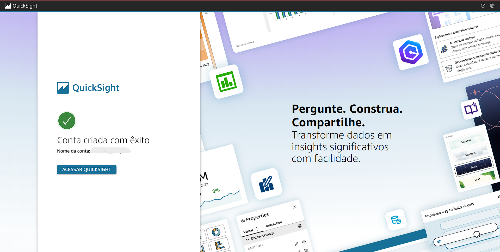
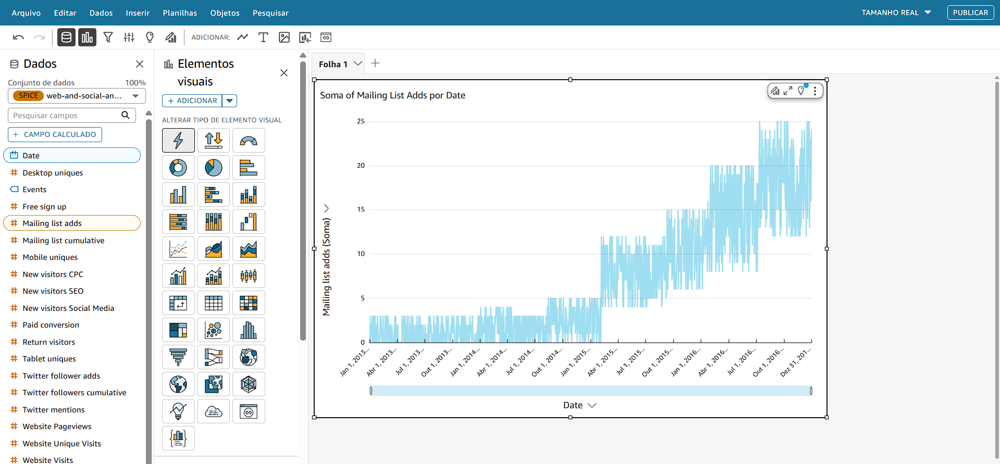

# Resumo
Durante a **Sprint 8** pude aprofundar os aprendizados do programa com cursos específicos relacionados à plataforma de BI(*Business Inteligence*) da AWS, Amazon QuickSight. Aprendi conceitos imprescídiveis sobre visualização de dados e o uso desta plataforma para este fim. 

# Desafio
* Os arquivos desenvolvidos e utilizados para a conclusão do desafio da **Sprint 8** estão disponíveis na pasta **Desafio** e a documentação do mesmo sendo apresentada no README.md do Desafio:
    
    * [Pasta Desafio](./Desafio/)
    * [README.md do Desafio](./Desafio/README.md)

# Certificados
* Nos links abaixo se encontra o certificado em PDF relacionado ao curso realizado na plataforma da AWS Skill Builder. Nesta sprint, foi concluído o curso **Amazon QuickSight - Getting Started**.

    * [Amazon QuickSight - Getting Started](./Certificados/AWS_QuickSight_Getting_Started.pdf)

# Exercícios
*  No link a seguir, está apresentado o arquivo do exercício realizado durante a sprint e logo em seguida estão suas respectivas evidências:

    ### Exercício Lab AWS QuickSight

    1. Arquivo CSV utilizado para implantar o conjunto de dados no QuickSight:

        * [Lab AWS QuickSight - Arquivo CSV](./Exercicios/Lab_QuickSight/web-and-social-analytics.csv)

# Evidências
* A seguir serão apresentadas as evidências do exercício realizado durante essa sprint:

    ### Exercício Lab AWS QuickSight

    * Abaixo segue a comprovação da criação da conta no QuickSight:

    

    * Segue o conjunto de dados importado como amostra no QuickSight:

    

    * Segue a comprovação da importação concluída com sucesso:

    

    * Em seguida, a exibição do gráfico criado sem a modificação:

    

    * Logo depois modifico a apresentação da data por mês, ficando desta maneira:

    

    * Finalizando o Lab do QuickSight, com a apresentação do gráfico e o exemplo de uma amostra de informação da inclusão de emails em certo período: 

    